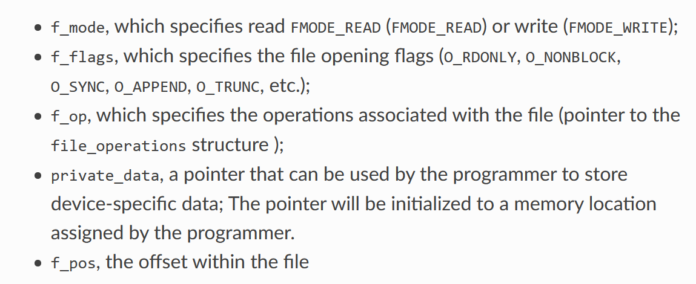

1. 写内核设备驱动并加载
   - 在用户态读取该设备信息
2. 键盘监控
   - https://github.com/GiacomoLaw/Keylogger


### ref

- https://blog.csdn.net/Devil_box/article/details/51547111
- https://linux-kernel-labs.github.io/refs/heads/master/labs/device_drivers.html


#### 笔记

- 设备驱动分为**字符设备驱动**和**块设备驱动**
  - 常见的字符设备驱动有：鼠标、键盘、串行端口、声卡……
    - 操作是以字节为单位
  - 常见的块设备驱动有硬盘、光盘、内存……
    - 操作是以数据块位单位
- 设备标识符
  - 主设备号(`Major`)
    - 标识设备的类型
      - 例如：IDE disk、SCSI disk、serial port……
  - 次设备号(`Minor`)
    - 用来标识设备
      - 例如：第一个硬盘、第二个串行端口……
  - 为新设备选择设备号时可以有两种选择
    - `static`：选择一个目前没有被用到的
    - `dynamic`：动态？
- 可以使用 `mknod` 命令创建设备文件

- 字符驱动设备的结构

  - 使用 `struct cdev` 来表示
  - 大多数驱动的操作使用以下三个数据结构
    - `struct file_operations`
    - `struct file`
    - `struct inode`

- `inode` 和 `file`

  - `inode`：从操作系统的角度来表示文件
    - 包括文件的大小、权限、时间戳等
    - ==用来确定执行操作的设备的 `major` 和 `minor`==
  - `file`：从用户的角度来看文件
    - 对应的 `inode`、文件名、文件打开的方式、文件位置
    - ==用于确定打开文件的标志、保存和访问个人数据==
    - 常见字段
      - 
  - `file` 可以看作 `inode` 的实例
    - `inode` 是无状态的，它表示了文件的静态映像
    - `file` 是有状态的，它表示了文件的动态映像

- 实现

  - 在创建设备驱动的时候，最好创建包含设备信息`cdev`的结构体

    - ```c
      #include <linux/fs.h>
      #include <linux/cdev.h>
      
      struct my_device_data {
          struct cdev cdev;
          /* my data starts here */
          //...
      };
      
      static int my_open(struct inode *inode, struct file *file)
      {
          struct my_device_data *my_data;
      
          my_data = container_of(inode->i_cdev, struct my_device_data, cdev);
      
          file->private_data = my_data;
          //...
      }
      
      static int my_read(struct file *file, char __user *user_buffer, size_t size, loff_t *offset)
      {
          struct my_device_data *my_data;
      
          my_data = (struct my_device_data *) file->private_data;
      
          //...
      }
      ```

- 注册字符设备

  - 静态注册

    - ```c
      #include <linux/fs.h>
      
      int register_chrdev_region(dev_t first, unsigned int count, char *name);
      void unregister_chrdev_region(dev_t first, unsigned int count);
      ```

  - 动态注册

    - `alloc_chrdev_region`

- 初始化和添加字符设备

  ```c
  #include <linux/cdev.h>
  
  void cdev_init(struct cdev *cdev, struct file_operations *fops);
  int cdev_add(struct cdev *dev, dev_t num, unsigned int count);
  void cdev_del(struct cdev *dev);
  ```

- 例子

  - 注册和初始化

    ```c
    #include <linux/fs.h>
    #include <linux/cdev.h>
    
    #define MY_MAJOR       42
    #define MY_MAX_MINORS  5
    
    struct my_device_data {
        struct cdev cdev;
        /* my data starts here */
        //...
    };
    
    struct my_device_data devs[MY_MAX_MINORS];
    
    const struct file_operations my_fops = {
        .owner = THIS_MODULE,
        .open = my_open,
        .read = my_read,
        .write = my_write,
        .release = my_release,
        .unlocked_ioctl = my_ioctl
    };
    
    int init_module(void)
    {
        int i, err;
    
        err = register_chrdev_region(MKDEV(MY_MAJOR, 0), MY_MAX_MINORS,
                                     "my_device_driver");
        if (err != 0) {
            /* report error */
            return err;
        }
    
        for(i = 0; i < MY_MAX_MINORS; i++) {
            /* initialize devs[i] fields */
            cdev_init(&devs[i].cdev, &my_fops);
            cdev_add(&devs[i].cdev, MKDEV(MY_MAJOR, i), 1);
        }
    
        return 0;
    }
    ```

  - 删除

    ```c
    void cleanup_module(void)
    {
        int i;
    
        for(i = 0; i < MY_MAX_MINORS; i++) {
            /* release devs[i] fields */
            cdev_del(&devs[i].cdev);
        }
        unregister_chrdev_region(MKDEV(MY_MAJOR, 0), MY_MAX_MINORS);
    }
    ```

- 用户空间与内核空间

  - 由于内核空间与用户空间的内存不能直接互访
  - `copy_to_user()`完成用户空间到内核空间的复制
  - `copy_from_user()`完成内核空间到用户空间的复制

  ```c
  #include <linux/uaccess.h>
  
  put_user(type val, type *address);
  get_user(type val, type *address);
  unsigned long copy_to_user(void __user *to, const void *from, unsigned long n);
  unsigned long copy_from_user(void *to, const void __user *from, unsigned long n)
  ```

- 常用操作

  - `open/release`
  - `read/write`