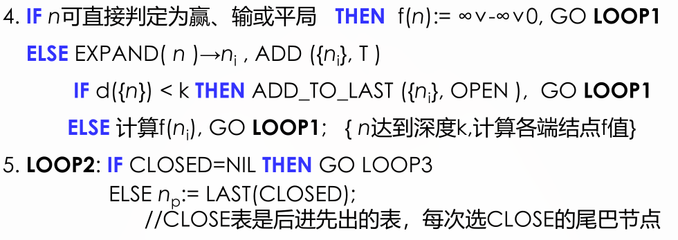

# 博弈与搜索

[Readme.md](Readme.md)

<!-- vim-markdown-toc GFM -->

* [博弈](#博弈)
    * [极大极小搜索法](#极大极小搜索法)
    * [$\alpha-\beta$剪枝](#alpha-beta剪枝)
    * [蒙特卡洛树](#蒙特卡洛树)

<!-- vim-markdown-toc -->
## 博弈

参与博弈的双方，在严格的竞争下，一方的收益必然意味着另一方的损失，博弈各方收益和损失相加总和永远为“0”，双方不存在合作的可能。

要提高博弈问题的求解程序的效率，应做到一下两点：

-   改进生成过程，使之之生成好的走步，如按棋谱的方法生成下一步。
-   改进测试过程，使最好的的步骤能及时被确认

好的博弈程序应该具备：

-   一个好的生成过程
-   一个好的静态估计函数

### 极大极小搜索法

思想：

-   极大极小搜索策略是考虑双方博弈若干步之后，从可能的步中选一步相对较好的走步，即在有限的深度范围内进行求解
-   为此要定义一个静态估计函数 f, 以便对棋局的态势做出优劣估计。这个函数可以根据棋局的优劣态势特征来定义

博弈双方的目标量化

-   MAX 方，程序方，我方目的是使每次得分最大
-   MIN 方，对手方，他方目标是最大化他的得分，相当于最小化我方得分
-   P 代表一个棋局（状态）

f(p)由棋局的优劣来决定：

-   有利于 MAX 方的态势，f(p)>0
-   有利于 MIN 方的态势，f(p)<0
-   态势均衡，f(p)=0

基本思想

-   当轮到 MIN 走步时，MAX 应考虑最坏情况，因此 f(p) 取极小值。
-   当轮到 MAX 走步时，MAX 应考虑最好情况，因此 f(p) 取极大值
-   当评价往回倒推时，相当于两位棋手的对抗策略，不同层上交替使用(1)、(2)两种方法向上传递倒推值。

极大极小搜索法的三个阶段

-   第一阶段，2-4，使用 BFS 生成规定深度的全部博弈树，然后对所有端节点计算其静态估计函数
-   第二阶段，5-7，自底向上逐级对非终节点求倒推估计值，直到求出初始节点的倒推值 f(s)为止。
-   第三阶段，根据 f(s)s 可选的相对好的走步，由 Mark(Move,T)标记走位

### $\alpha-\beta$剪枝

$\alpha-\beta$剪枝就是将后继和倒推值结合起来，及时减掉一些无用分支，以此来提高效率

$\alpha-\beta$剪枝采用有界 DFS 进行搜索，当生成节点达到规定深度时，就及时进行静态估计，而一旦某个非端节点有条件确定倒推值时，就立即赋值。

-   只要在搜索过程中记住倒推值的上下界并进行比较，当$\alpha\leq \beta$时就可以实现剪枝操作
-   $\alpha、\beta$值可以随时修改

> 1.  极大层的$\alpha$的倒推值下界永不下降，因为实际倒推值取后继节点最终确定的倒推值中的最大者。
> 1.  极小层的$\beta$的倒推值上界永不上升，因为实际倒推值取后继节点最终确定的倒推值中的最小者。

剪枝规则：

-   α 剪枝：若任一极小值层节点的 β 值小于或等于它任一先辈极大值层节点的 α 值，即 α（先辈层）≥β（后继层），则可以中止该极小值层中这个节点以下的搜索。该节点最终的倒推值就确定为这个 β 值。

-   β 剪枝：若任一极大值层节点的 α 值大于或等于它任一先辈极小值层节点的 β 值，即 α（后继层）≥β（先辈层），则可以中止该极大值层中这个节点以下的搜索。这个 MAX 节点的最终倒推值就确定为这个 α 值。

### 蒙特卡洛树

应该不会考QAQ
