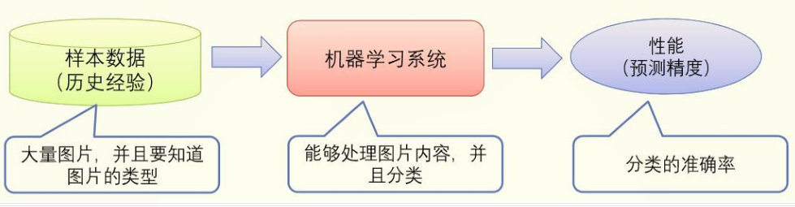
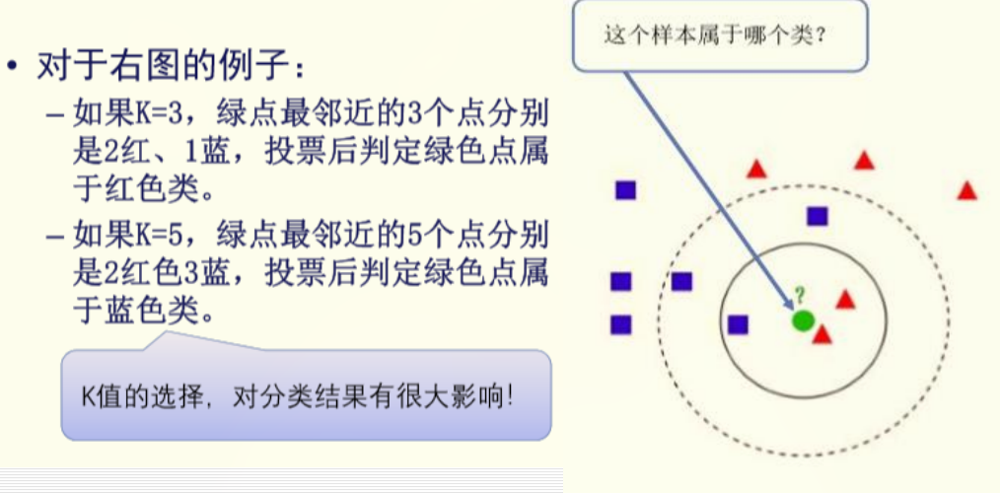
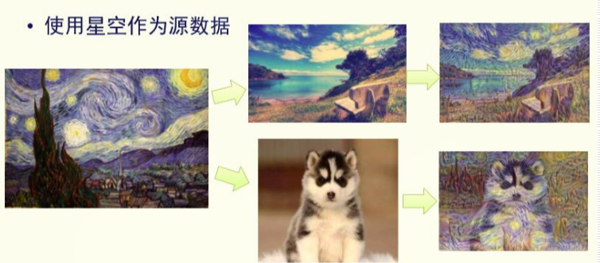
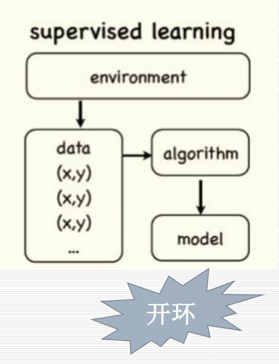
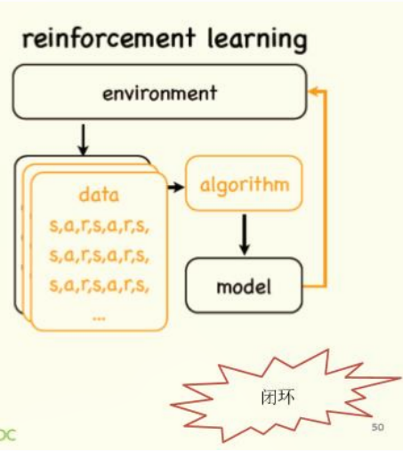
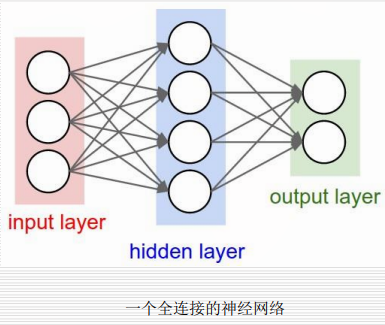

# 机器学习

[Readme.md](Readme.md)

<!-- vim-markdown-toc GFM -->

* [有监督学习](#有监督学习)
    * [k 值近邻法](#k-值近邻法)
    * [朴素贝叶斯分类](#朴素贝叶斯分类)
    * [决策树算法](#决策树算法)
    * [支持向量机](#支持向量机)
* [无监督学习](#无监督学习)
    * [聚类](#聚类)
    * [K-means 类聚](#k-means-类聚)
    * [自编码器](#自编码器)
* [半监督学习](#半监督学习)
* [迁移学习](#迁移学习)
* [强化学习](#强化学习)
* [深度学习](#深度学习)
    * [人工神经网络](#人工神经网络)

<!-- vim-markdown-toc -->
一个图像识别模型

## 有监督学习

-   模型的学习在被告知每个训练样本属于哪个类的“指导”下进行
-   新数据使用训练数据集中得到的规则进行分类

基本方法

-   K 值近邻法
-   朴素贝叶斯算法
-   决策树算法
-   支持向量机

数学描述：

给定一些训练样本：$\{(x_i,y_i),1\leq i\leq N\}$,其中$x_i$代表输入样本，$y_i$代表需要预测的目标，我们希望计算机自动寻找一个决策函数$f(\cdot)$来建立$x$和$y$之间的关系：

$$\hat{y}=f(\phi(x),\theta)$$

使得 $\hat{y}$和预测目标$y$差异尽可能小

### k 值近邻法

-   给定一个训练数据集，无需训练
-   对新输入的实例，在训练数据集中找到和该实例最邻近的 K 个实例
-   根据这 K 个实例的类别做投票，那个类别的实例多，则将输入归入那个类

### 朴素贝叶斯分类

-   设 D 是训练元组和他们相关联的类的标号的集合。通常，每个元组用一个 n 维属性向量$X=(x_1,x_2,...x_n)$表示，描述由 n 个属性对元组的 n 个测量
-   假设有 m 个类
-   给定元组 X，分类法将预测 X 属于具有最高后验概率的类
-   根据贝叶斯定理： $P(C_i|X)=\frac{P(X|C_i)P(C_i)}{P(X)}$
-   由于$P(X)$对所有类为常数，所以需要将下式最大化：$P(C_i|X)=P(X|C_i)P(C_i)$
-   各个类条件独立：$P(X|C_i)=\prod_{k=1}^{n}P(X_k|C_i)$

### 决策树算法

算法思想

-   属性在决策树中的位置不同，决策树的效率是不同的。
-   如果一个属性对于所有样本都没有区分能力（比如有是否能吃这个属性），那么对于决策毫无用处。
-   如果一个属性怡好能将样本数据一分为二，则这是一个好的属性，应该尽量在决策早期就使用。、
-   如果根据一个属性做判断，样本仍然有若干种情况，则该属性不应该出现在决策早期

### 支持向量机

-   对于二类问题，将样本数据表示为空间中的点。
-   使用平面来切割空间，实现分类。
-   如何选择平面是关键问题

## 无监督学习

-   每个训练样本的类编号是未知的，要学习的类集合或数量也可能是事先未知的
-   通过一系列的度量、观察来建立数据中的类编号或进行聚类

基本方法

-   聚类
-   K-means 聚类
-   自动编码器

### 聚类

-   人类和许多动物都有“归堆”的能力，这就是聚类
-   类聚算法就是根据某种“相似程度”或者“距离”，把距离或者相似度高的实例归为一类。
-   与分类类似，大部分类聚也需要事先指定聚类的的数目。

### K-means 类聚

思路：

-   首先设置每个类别都聚集在某个中心点附近。
-   最初时，任选三个样本作为中心点
-   逐一计算剩下的样本与中心点的距离，距离谁近，就归到哪类。
-   根据最新的类别情况，重新计算中心点。
-   循环该过程，直到中心点不再变化

关键问题：

-   初始三个点要选择两两距离最小的 3 个点，随机划分样本为三堆，以三堆的平均重心作为初始点。
-   类聚大量依赖与距离或者相似度的计算，因此确定一种合适的距离非常关键。

### 自编码器

-   原始数据经过神经网络“编码”，再根据编码信息“解码”，还原原有信息。
-   适应大量样本后，编码器本身能够表示关于问题的本质特征

应用：

-   图像抗噪

> -   原始图像添加噪声之后进入编码器，试图生成没有噪音的图片

-   数据降维

> -   原始数据生成的模型往往仍然规模较大
> -   此时可以使用自编码器进行一次降维，在不损失信息的前提下，降低空间的使用

## 半监督学习

-   全监督学习: 方法丰富，研究充分，性能好，成本高
-   无监督学习: 方法简单，数据成本低，性能难以提升
-   半监督学习: 一部分数据带有人工标识知识，另一部分无标识，通过学习有标识数据，逐渐扩展无标识数据

## 迁移学习

-   样本迁移：
    > -   寻找任务 A 标注数据中，直接能用于任务 B 的数据。
    > -   训练任务 B 的模型
-   特征迁移
    > -   估计任务 A、B 之间的差距，设计一个变换方程，将任务 A 的数据转换为 B 的数据，在进行训练
-   模型迁移
    > -   使用任务 A 训练的模型，经过某种变换直接应用于任务 B

## 强化学习

-   首先强化学习是一种机器学习模式，而不是一个独立的方法
-   强化学习任务，计算机单纯通过感知环境，和环境交互，并且从交互中获得评价反馈，就可以适应所处的环境。

基本思想

-   强化学习与之前介绍的有监督学习有类似的地方，也有区别
-   典型的有监督学习，我们可以看作是一个开环的流程。我们从环境中换的一些样例数据，数据中带有监督信息。然后我们根据这些监督信息和输入值对模型进行训练。

-   强化学习中，我们从环境中得到的是合理的行动方式、行为
-   这些行为没有监督信息。
-   经过算法计算后，模型将计算结果返回给环境，环境返回一个“奖赏”，即刚刚动作的后果。
-   我们根据这个奖赏来进行训练，更新模型。

-   强化学习和无监督学习也不一样，因为环境返回的“奖赏”相当于监督信号

## 深度学习

深度学习的概念源于人工神经网络的研究，含多隐层的多层感知器就是一种深度学习结构。深度学习通过组合低层特征形成更加抽象的高层表示属性类别或特征，来发现数据的分布式特征表示

-   是一个由线性阈值元件组成的单层（或多层）神经元的神经网络
-   当输入的加权和大于或等于阈值时，输出为 1，否则为 0
-   模型假定神经元中间的耦合程度（即加权系数 W）可变，这样，该模型可以学习
-   当感知器用于两类模式的分类时，相当于在高维样本空间中，用一个超平面将两类样本分开
-   神经网络的学习过程就是神经网络参数的设定过程
-   一个神经元网络结构确定之后，需要对一系列参数（权重、阈值等）进行有效的设定。这个过程叫做学习或训练过程，此时的方法叫学习算法

### 人工神经网络

-   神经网络就是按照一定规则连接起来的多个神经元
-   每个连接都有一个对于的权值

深度神经网络：

-   本质：通过构建多隐层的模型和海量训练数据，来学习更有用的特征，从而最终提升分类或预测的准确性。 “深度模型”是手段，“特征学习”是目的
-   与浅层神经网络区别：

> 1.  强调了模型结构的深度，通常有 5-10 多层的隐层节点；
> 1.  明确突出了特征学习的重要性，通过逐层特征变换，将样本在原空间的特征表示变换到一个新特征空间，从而使分类或预测更加容易。与人工规则构造特征的方法相比，利用大数据来学习特征，更能够刻画数据的丰富内在信息
