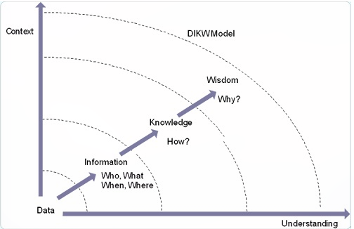
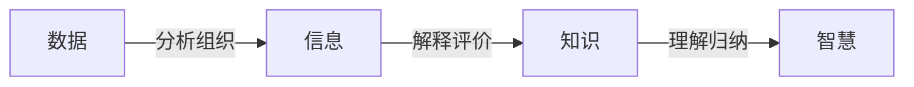
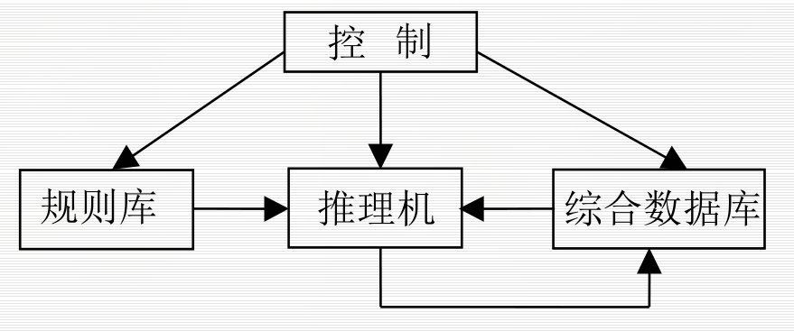
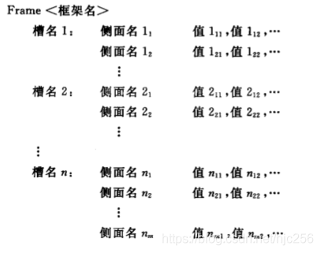
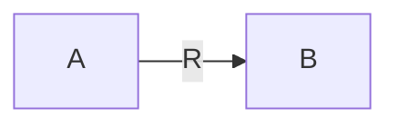

# 知识的表示方法

[Readme.md](Readme.md)
<!-- vim-markdown-toc GFM -->

* [什么是知识](#什么是知识)
* [DIKW 模型](#dikw-模型)
* [知识的特性](#知识的特性)
* [知识的表示](#知识的表示)
* [知识的表示方法](#知识的表示方法)
* [一阶谓词逻辑](#一阶谓词逻辑)
* [产生式表示法](#产生式表示法)
* [框架知识](#框架知识)
* [语义网络表示法](#语义网络表示法)

<!-- vim-markdown-toc -->
-   概述：人工智能的求解以知识为基础, 一个程序具备的知识越多, 其求解问题的能力就越强。

## 什么是知识

-   知识是人类进行一切智能活动的基础
-   知识是人类在长期的生活及社会实践中, 在科学研究以及实验中积累的, 对客观世界的认识和经验
-   将有关信息关联在一起所形成的信息结构称为知识

## DIKW 模型

-   数据：一些无关联的事实
-   信息：建立了事实间的联系后形成信息(what, who, when, where)
-   知识：当能建立模式之间的联系后, 便涌现了知识(how)
-   智慧：能描述模式之间的关系的规律(why)

## 知识的特性

-   相对正确性
-   不确定性
    > 1.  随机性
    > 2.  模糊性
    > 3.  经验导致不确定
    > 4.  不完全性
-   可表示性和可利用性

## 知识的表示

-   知识的表示是指将知识形式化或者数学描述, 以便在计算机中表示, 并能由计算机程序处理

-   知识的表示过程
    > 非形式化的自然语言描述$\to$形式化的易于被计算机理解

## 知识的表示方法

1. **谓词逻辑**
2. 产生式
3. **框架**
4. **语义网络（知识图谱）**
5. **状态空间**
6. **问题归约**
7. 遗传编码
8. 人工神经网络

## 一阶谓词逻辑

命题逻辑的局限性：

-   无法把他描述的试问的结构以及逻辑特征反映出来
-   也不能表示两个事物之间的共同特征

谓词逻辑：具体内容参见离散数学

-   优点：

    > 1.  自然性
    > 2.  精确性
    > 3.  严密性
    > 4.  容易实现

-   局限性

> 1.  不能表示不确定的知识
> 2.  组合爆炸
> 3.  效率低

## 产生式表示法

-   确定性规则知识的产生式表示

基本形式： $IF\ \ P\ \ THEN\ \ Q$

或者： $P\to Q$

-   不确定性规则性知识的产生式表示

基本形式： $IF\ \ P\ \ THEN\ \ Q\ \ (置信度)$

或者： $P\to Q\ \ (置信度)$

-   三元组表示确定性知识：$(对象,属性,值)$

或者：$(关系,对象1,对象2)$

-   四元组表示不确定性知识：$(对象,属性,值,置信度)$

或者：$(关系,对象1,对象2,置信度)$

> 1.  规则库: 用于描述相应领域内知识的产生式集合
> 1.  综合数据库(事实库、上下文、黑板等)：一个用于存放问题求解过程中各种当前信息的数据结构。
> 1.  控制系统（推理机构）：由一组程序组成，负责整个产生式系统的运行，实现对问题的求解

产生式表示法的应用：动物识别系统

-   优点：

> 1.  自然性
> 1.  模块性
> 1.  有效性
> 1.  清晰性

-   缺点

> 1.  效率不高
> 2.  不能表示结构性知识

适合产生式表示的知识

> 1.  领域知识间关系不密切，不存在结构关系。
> 1.  经验性及不确定性的知识，且相关领域中对这些知识没有严格、统一的理论。
> 1.  领域问题的求解过程可被表示为一系列相对独立的操作，且每个操作可被表示为一条或多条产生式规则。

## 框架知识

-   框架理论中，框架是知识的基本单位，把一组有关的框架连接起来便可以形成一个框架系统。框架知识表示法是一种结构化的知识表示法。

-   框架通常有描述事物各个方面的若干槽（slot）组成，每一个槽也可以根据实际情况拥有若干个侧面（aspect），每一个侧面又可以拥有若干个值（value）。

-   核心思想——“匹配与填槽”

> 1.  把问题用框架表示出来
>
> 2.  与知识库中已有的框架进行匹配，找到一个或几个预造框架
>
> 3.  针对预造框架收集信息
>
> 4.  评价预造框架，决定取舍

-   [FrameNet](https://framenet.icsi.berkeley.edu/fndrupal/)

+ 优点：

>1. 结构性
>1. 继承性
>1. 自然性

## 语义网络表示法

语义网络是知识式的一种图解表示，他由节点和弧形组成。节点用于便是实体、概念和事件等，弧线用于表示节点间的关系。

+ 语义网络的组成部分

>1. 语法部分： 决定该表示方法词汇表中允许有哪些符号，他设计各个节点和弧线
>1. 结构部分： 叙述符号排列的约束条件，指定各弧线连接的节点对
>1. 过程部分： 说明访问过程，这些过程能用来建立和修正概念的描述，以及回答相关问题
>1. 语义部分： 确定与描述相关的意义的方法，即确定有关节点和对应弧线的排列以及相互关系

+ 语义网络的结构

三元组表示：(A,R,B)

A,B为结点，R为弧线(关系)

