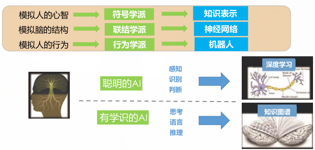
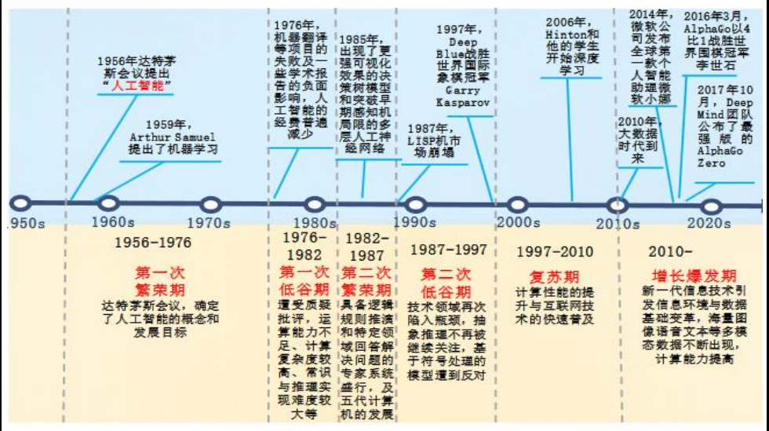
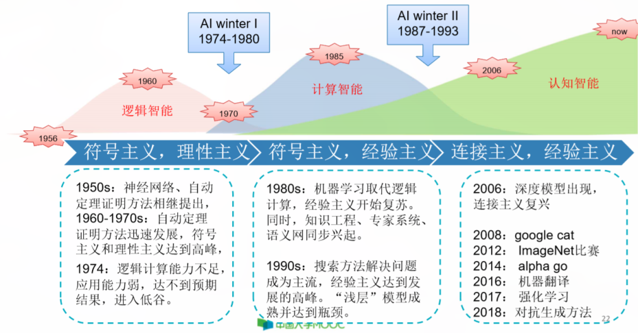
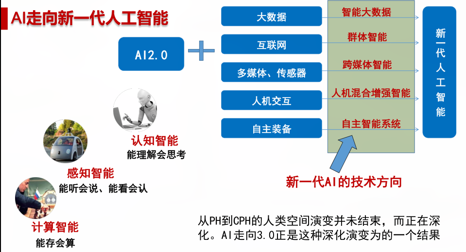
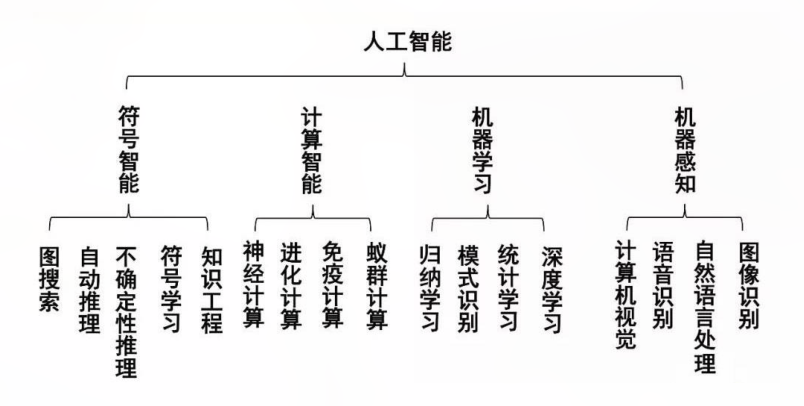

# 绪论

[Readme.md](Readme.md)
<!-- vim-markdown-toc GFM -->

* [人工智能的定义和发展](#人工智能的定义和发展)
* [人工智能的主要流派](#人工智能的主要流派)
    * [三大代表研究方向：](#三大代表研究方向)
        * [西蒙和纽维尔： 逻辑理论家](#西蒙和纽维尔-逻辑理论家)
        * [麦卡锡： 状态空间搜索法](#麦卡锡-状态空间搜索法)
        * [明斯基： 人工神经网络](#明斯基-人工神经网络)
    * [智能机器如何模拟学习的过程：](#智能机器如何模拟学习的过程)
    * [主要学派](#主要学派)
        * [符号主义](#符号主义)
        * [联结主义](#联结主义)
    * [行为主义](#行为主义)
* [人工智能的三次浪潮两次寒冬](#人工智能的三次浪潮两次寒冬)
* [人工智能的现状和发展](#人工智能的现状和发展)
* [人工智能的研究内容（前沿且交叉学科：深度&广度）](#人工智能的研究内容前沿且交叉学科深度广度)

<!-- vim-markdown-toc -->
## 人工智能的定义和发展

智能的特征：

人工智能诞生于 1956 年的达特茅斯会议，在会议上首次明确了人工智能这个概念：**让机器像人那样认知、思考和学习，即用计算机模拟人的智能。**

智能的特征：

-   认知能力
-   记忆与思维能力
-   学习能力
-   行为能力

人工智能的定义：**人工智能是用人工的方法在机器上实现的智能，或者说是人们使机器具有类似于人的智能**

促使机器实现六会：

>1. 会听
>2. 会看
>3. 会说
>4. 会思考
>5. 会学习
>6. 会行动

图灵测试：图灵测试由计算机、被测试的人、主持测试的人组成。测试过程由主持人提问，计算机和被测试的人分别做出回答，被测人在回答问题时尽可能表明他是一个“真正的”人，而计算机也将尽可能地模拟人的思维方式和思维过程。进行多次测试，如果有超过 **30%** 的测试者不能被确定是人还是机器，则认为机器通过了图灵测试。

## 人工智能的主要流派

### 三大代表研究方向：

#### 西蒙和纽维尔： 逻辑理论家

+ 研究方向：如何让机器证明数学定理
+ 成果：物理符号系统假说、语义网络、决策支持系统

#### 麦卡锡： 状态空间搜索法

+ 研究方向： 下棋
+ 思想：智能活动可以看做是若干状态之间的转移过程，当问题有多种状态可以选择时，如何快速搜索的到最优解

#### 明斯基： 人工神经网络

+ 趣事：明斯基在1969年写了一本《感知机》，完全否定了人工神经网络的作用，导致该领域20年的低谷

### 智能机器如何模拟学习的过程：

+ 理性主义认为：人类学习的得到的知识是绝对理性的，是可以精确描述的，可以通过对知识进行汇总、加工、抽象、归纳，并基于此建立某种理性思考的框架，并最终让计算机根据理性知识库展开思考。（代表：知识图谱）

+ 经验主义认为：外部世界的知识无法被准确描述，只能通过体验、经历、尝试、感受才能获得。智能机器需要不到感知外部世界，以尝试、探索的方式获得知识。

### 主要学派

#### 符号主义

符号主义又称为逻辑主义、心理学派、计算机学派，认为人工智能源于数理逻辑

一个物理符号系统就是能逐步产生一组符号的生成器。在物理符号的假设下，符号主义认为，人的认知是符号，人的认知过程是符号操作的过程。他们认为人脑和计算机都是一个物理符号系统，所以计算机可以模拟人类的认知过程。这实质认为，人的思维是可操作的。他们认为知识可以符号表示，以可以用符号进行推理。是在宏观上模拟人的思维过程。

+ 核心问题： **知识表示、知识推理、知识运用**

#### 联结主义

联结主义又称仿生学派、或者生理学派，是基于生物进化论的AI学派，是在围观上模拟人的思维过程。

+ 理论基础： **神经网络及神经网络间的连接机制与学习算法。**
+ 本质： 用人脑的并行分布处理模式来表现认知过程。

### 行为主义

行为主义又称为进化主义或正控制论学派，其基本原理是控制论和“感知-动作”型控制系统。

+ 只能取决于感知和行动
+ 人工智能可以像人类智能一样实现逐步进化
+ 智能行为只能在现实世界中与周围环境交互作用而表现出来。

AI的几大门派

## 人工智能的三次浪潮两次寒冬

## 人工智能的现状和发展

+ 人类世界由二元空间：人类社会空间（H）、物理空间（P）进入：H、P，信息空间（C）的三元空间

+ AI 2.0

## 人工智能的研究内容（前沿且交叉学科：深度&广度）

人工智能的研究内容

+ 知识表示
+ 机器感知
+ 机器思维
+ 机器行为
+ 机器学习

人工只能应用系统：
1. 问题求解系统
1. 自然语言理解和处理系统
1. 专家系统
1. 智能调度和规划系统
1. 模式识别系统
1. 智能检索系统
1. 智能机器人
1. 智能软件Agent
1. 数据挖掘和知识发现系统
1. 知识问答系统
1. 医学AI系统
1. 智能视频监控系统
1. 智能客服系统

