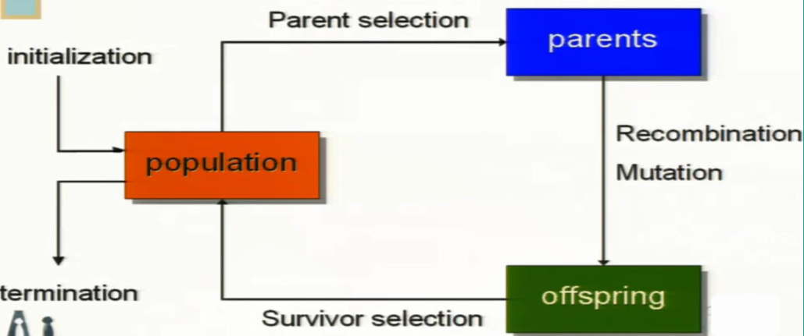
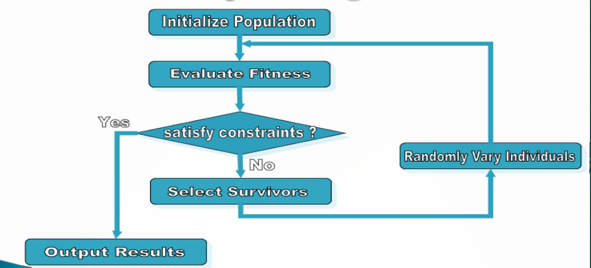
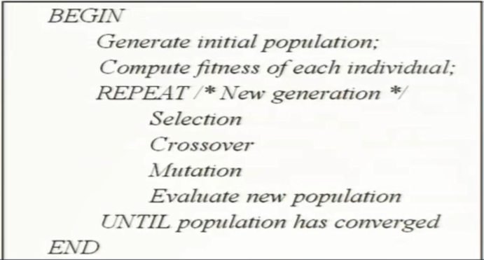

# 进化计算

[Readme.md](Readme.md)
<!-- vim-markdown-toc GFM -->

* [遗传算法](#遗传算法)

<!-- vim-markdown-toc -->

进化算法一般框架

## 遗传算法

理论基础：

+ 进化论
+ 基因学说
+ 突变学说

图解

+ 初始化种群的个体
+ 每个个体被适应性函数区别开来
+ 根据适应值，一些个体被选择去产生新的后代
>1. 适应值高的个体跟多机会产生后代
>1. 新的一代取代就的一代，旧的一代消亡
+ 后代组合父辈的特征
+ 如果设计合理，种群将收敛到一个最理想的解

算法:

+ Selection: 减少多样性，推动进化
+ Crossover & Multation： 增加多样性，推动产生新物种

