# 问题求解和搜索技术

[Readme.md](Readme.md)

<!-- vim-markdown-toc GFM -->

* [问题求解](#问题求解)
    * [问题的形式化定义](#问题的形式化定义)
* [搜索策略](#搜索策略)
    * [搜索树的构建](#搜索树的构建)
    * [无信息搜索](#无信息搜索)
        * [迭代深入搜索](#迭代深入搜索)
        * [代价一致搜索(UCS)](#代价一致搜索ucs)
    * [有信息搜索](#有信息搜索)
        * [贪婪搜索](#贪婪搜索)
        * [A\*算法（UCS+Greedy）](#a算法ucsgreedy)
    * [局部搜索](#局部搜索)
        * [爬山法](#爬山法)
    * [禁忌搜索](#禁忌搜索)
    * [模拟退火算法](#模拟退火算法)
    * [问题的归约](#问题的归约)

<!-- vim-markdown-toc -->

## 问题求解

+ 问题求解是人工智能的核心问题之一
+ 问题求解的目的： 机器自动找出某问题的正确解决策略，并能举一反三解决同类问题

### 问题的形式化定义

+ 状态之间通过执行特定的动作实现相互转化

状态及其形式化表示

>+ 状态： 问题在某一时刻所处的位置、情况...
>+ 状态的形式化表示： 根据问题所关心的因素，一般用向量形式表示，向量中的某一位表示一个因素

问题的形式化定义

+ 给定： 状态集合 $S={s_i}$，算子集合 $O={o_j}$ ，初始状态 $s_s$，目标状态 $s_t$
+ 假设： 根据实际场景设计
+ 目的：搜索一个操作序列使得初始状态转化为目标状态

解空间搜索

+ 问题求解过程转化为在状态空间图中搜索一条从初始状态到目标状态的路径

## 搜索策略

### 搜索树的构建

+ 状态空间图：包含问题的所有可能状态（状态空间爆炸）

+ 搜索树

>+ 有效削减搜索空间，提高求解效率

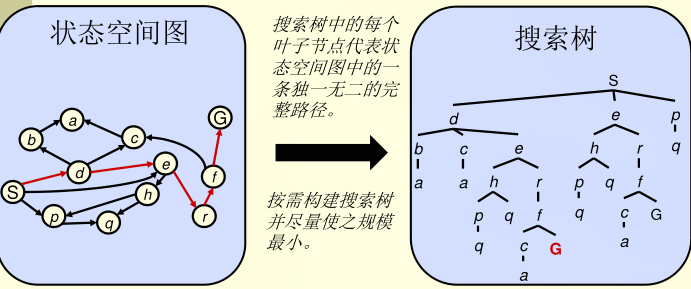

+ 一般搜索原则：

>1. 扩展出潜在的节点
>2. 记录已搜索的边缘节点
>3. 试图扩展尽可能小的树节点

### 无信息搜索

+ 广度优先搜索
+ 深度优先搜索
+ 迭代深入搜索

该类搜索策略的特点

+ 不使用任何与待求解问题相关的先验知识
+ 保证完备性（若有解，则一定可以找到解）
+ 不保证最优性
+ 时间复杂度高
+ 空间复杂度高
+ 不适合大规模状态空间的问题求解

搜索树的关键数据结构

+ 判断当前还可以探索哪些状态 `OPEN表`
+ 记录已经搜索过的状态 `CLOSED表`
+ 记录从目标状态返回初始状态的路径：搜索树中的每个节点（根节点除外）必须包含指向父节点的的指针

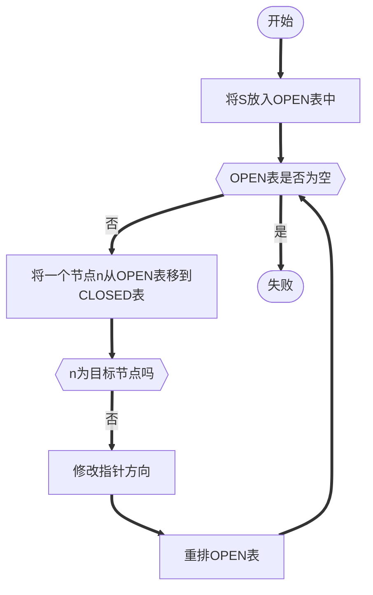

#### 迭代深入搜索

思路：结合深度优先和广度优先搜索

+ 在深度为d的范围内进行深度优先搜索，若无解
+ 在深度为2d的范围内进行深度优先搜索，若无解
+ 在深度为3d的范围内进行深度优先搜索，若无解
+ 在深度为4d的范围内进行深度优先搜索，若无解
+ ....

#### 代价一致搜索(UCS)

策略： 扩展代价最小的后继节点：边缘节点：优先队列

优点： 完备性、最优性

缺点： 没有在一个方向上进行探索、没有相关的目标信息

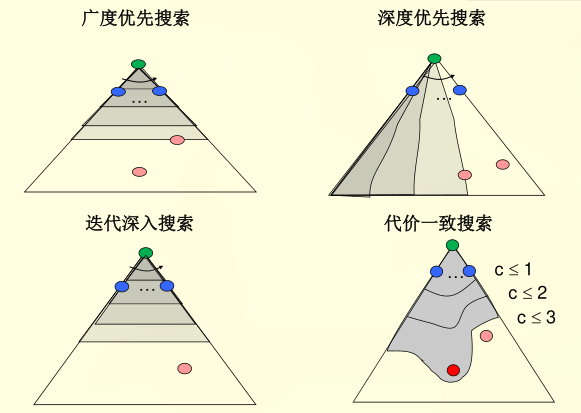

### 有信息搜索

+ 贪心算法
+ A\*算法

该类搜索策略的特点

+ 使用与待求解问题相关的先验知识：启发函数
+ 保证完备性
+ 保证最优性
+ 时间复杂度可控
+ 空间复杂度较低
+ 较为适合大规模状态空间的求解

启发策略

+ 估计一个状态到目标距离的函数
+ 问题给予算法额外信息，为特定搜索问题设计

#### 贪婪搜索

+ 策略： 扩展你认为最接近目标状态的节点

>1. 启发式：对每个边缘节点估计其到目标节点的最近距离
>2. 只使用启发函数f(n)=h(n)，来评价节点

+ 通常情况：最佳优先使你直接（很快）到达终点
+ 最坏情况：类似深搜

#### A\*算法（UCS+Greedy）

+ UCS依据初始状态S和当前状态n的路径的代价排序-后向代价
+ Greedy根据当前状态n到目标状态G的估计路径代价排序-前向代价
+ A\* 根据二者的和进行排序：$f(n)=g(n)+h(n)$

停止条件： 当目标状态出列才停止

启发函数：可采纳

+ 启发函数n是可采纳的，那么
$$0\leq h(n)\leq \hat{h}(n)$$
其中 $\hat{h}(n)$ 是当前节点n到目标节点的真实耗散

最优性

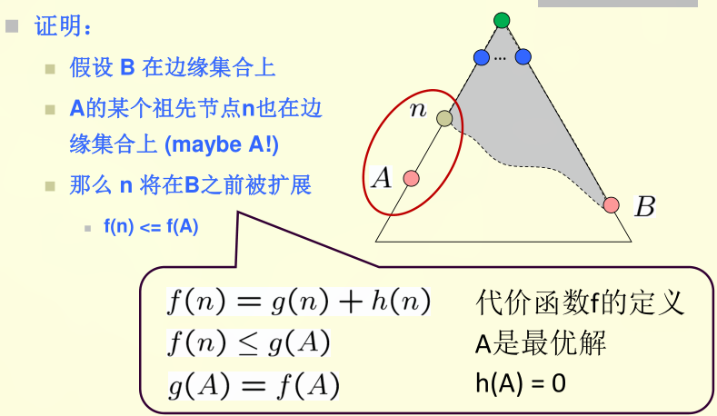

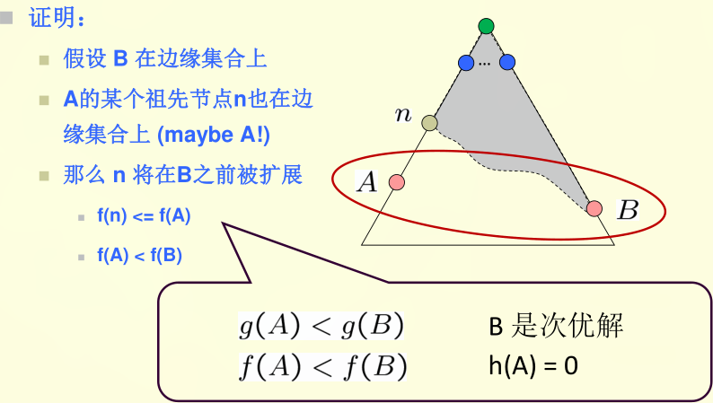

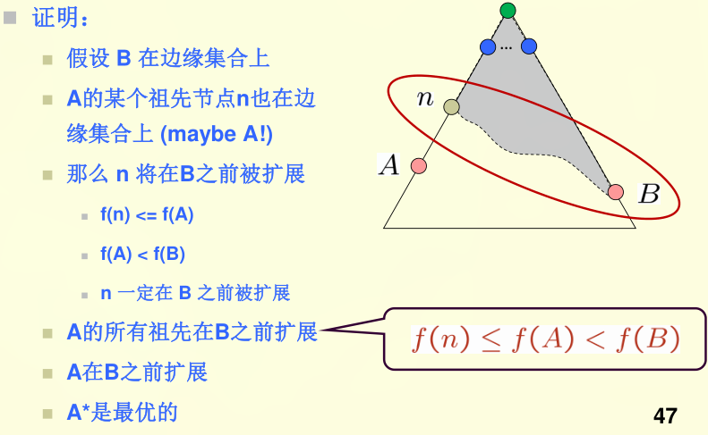

启发函数的特性

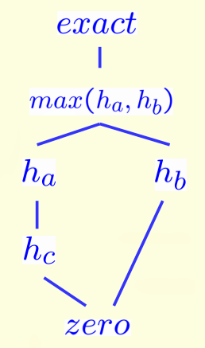

占优势：$h_a\geq h_c$ if 
$$\forall : h_a(n)\geq h_c(n)$$

可采纳的启发函数集合：

$$h(n) = max(h_a(n),h_b(n))$$

USC vs A\*

+ 代价一致搜索在所有可能的搜索方向上等概率扩展
+ A\*搜索受启发函数的引导主要朝着目标节点扩展，而且能够保证最优性。

### 局部搜索

+ 爬山法
+ 禁忌搜索
+ 模拟退火算法

#### 爬山法

特点：
+ 使用与待求解问题相关的先验知识：目标函数
+ 不保证完备性、最优性
+ 时空复杂度低
+ 适合大规模状态空间的问题的求解

主要思路：

+ 可在任意位置开始
+ 循环：移动到最好的相邻状态
+ 如果没有比当前更好的相邻状态，搜索结束

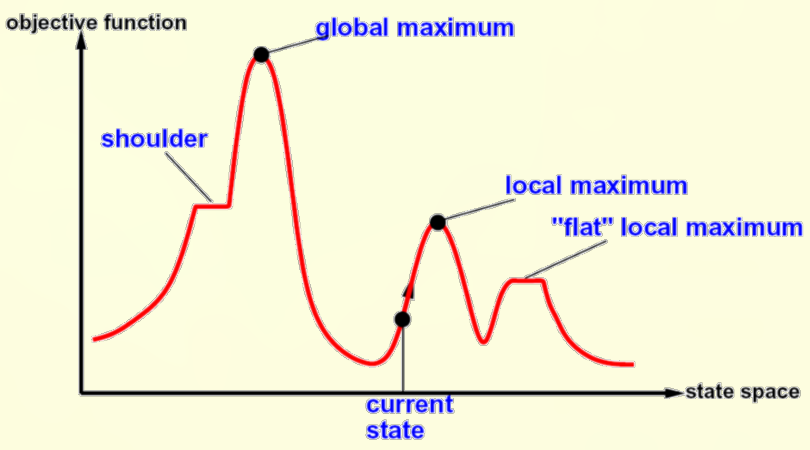

缺陷：

+ 局部最大值：由于搜索能力限制，可能被困在局部最大值
+ 高原：与局部最大值类似
+ 山脊： 一系列相邻的局部最大值
+ 结果不确定：起点依赖，目标函数选取

改进方案：

+ 多起点：选择多个不同的起始点，同时或先或后进行搜索
+ 回溯：允许回退一大步
+ 前跨：向为探索方向前跨一大步

局部领域搜索：基本流程

1. 选定一个初始可行解$x^0$,记录当前最优解：$x^{best}:=x^0,T=N(x^{best})$
2. 当$T-{x^{best}}=\emptyset$时，或者满足其他停止运算的准则时，输出计算结果，停止运算;否则从T中选取一个集合S,得到S中最好的解$x^{now}$;若$f(x^{now} < x^{best})$，则：$x^{best}:=x^{now},T=N(x^{best})$否则，$T:=T-S$,重复步骤二。(N(x)指x的领域)

例子：五城市对称TSP问题全邻域策略

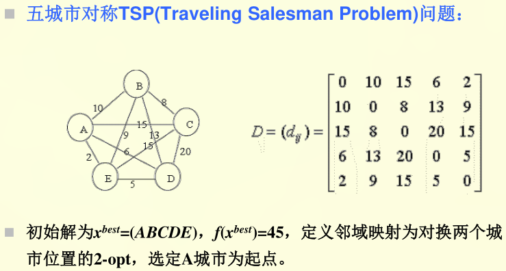

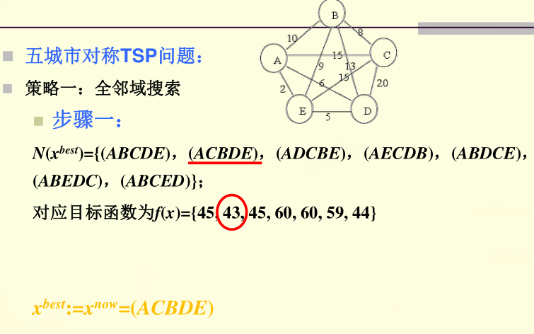

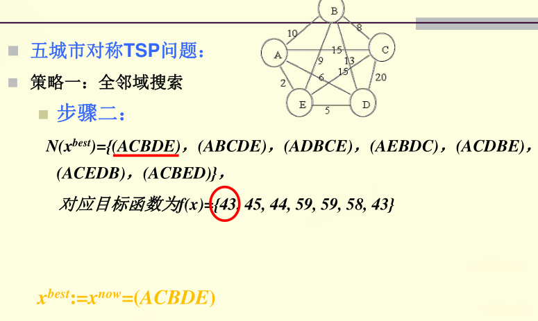

### 禁忌搜索

禁忌搜索是局部领域搜索的推广。

特点：

+ 禁忌：禁止重复前面的重复工作
+ 跳出局部最优解

变化因素

+ 禁忌表
>1. 禁忌对象：禁忌表中被禁的那些变化元素
>2. 禁忌长度：禁忌步数

+ 状态变化

>1. 解的简单变化： 假设$x,y\in D$邻域映射为$N$，其中$D$为优化问题的的定义域，则简单变化：$x\to y\in N(x)$是从一个解变化到另一个解
>1. 解向量分量的变化：第i个分量变化或者多个分量变化
>1. 目标值变化：目标值的变化隐含这解集合的变化

### 模拟退火算法

特点：
+ 克服陷入局部最小值
+ 克服初值依赖性

什么是退火：退火是指将固体加热到足够高的温度，使分子呈随机排列状态，然后逐步降温使之冷却，最后分子以低能状态排列，组体达到某种稳定状态。

+ 加温过程：增强粒子的热运动，消除系统原先可能存在的非均匀状态;
+ 等温过程：对于与环境换热而温度不变的封闭系统，系统状态的自发变化总是朝着自由能减小的方向进行，当自由能到最小时，系统达到平衡态。
+ 冷却过程：使粒子热运动减弱并逐渐趋于有序，系统能量逐渐下降，从而得到低能的晶体结构

形式化表达：

+ 数学表述：

在温度他，分子停留在状态r满足Boltzmann(波尔兹曼)概率分布

$$P(\bar{E}=E(r))=\frac{1}{Z(T)}e^{-\frac{E(r)}{k_B T}}$$

$\bar{E}$表示分子能量的一个随机变量，而$E(r)$表示状态r的能量，$k_B>0$为波尔兹曼常数。$Z(T)$为概率分布的随机化因子

$$Z(T)=\sum_{s\in D}e^{-\frac{E(s)}{k_B T}}$$

波尔兹曼概率分布：

+ 在同一温度，分子处于能量低的状态的概率更大
+ 温度越高，不同能量之间的对于的概率差距越小
+ 随温度下降，能量最低状态对于的概率越来越大，温度趋于0时，概率趋于1

模拟退火基本思想：在一定的温度下，搜索从一个状态随机地变化到另一状态，随着温度的不断下降直到最低温度，搜索过程以概率1停留在最优解。

Metropolis准则

以概率接受新状态：

+ 在高温下，可接受与当前状态能量差较大的新状态
+ 在低温下，只接受与当前状态能量差较小的新状态

基本步骤：

给定初温度$t=t_0$,随机产生初始状态$s=s_0$,令$k=0$;

Repeat 

Repeat 

产生新状态$s_j=Generate(s)$;

if $min\{1,e^{-\frac{-(C(s_j)-C(s))}{t_k}}\}\leq random[0,1]$    $s=s_j$ 
        
Until 抽样稳定准则满足;

退温$t_k=update(t_k)$并令$k=k+1$;

Until 算法终止准则满足;

输出算法的搜索结果

**关键因素**

+ 状态产生函数：

>+ 产生的候选解应遍布全部的解空间：在当前的领域结构内以一定的概率方式产生(正态、均匀、指数分布.....)
>+ 在给定的温度下接受目标函数下降的候选解的概率要大于使目标函数上升的候选解的概率;随温度下降接受使目标函数上升的解的概率要逐渐减小;当温度趋于零时，只能接受目标函数下降的解：一般采用$min\{1,e^{-\frac{-(C(s_j)-C(s))}{t_k}}\}\leq random[0,1]$

+ 初始温度

+ 温度更新函数

>+ $t_{k+1}=\alpha k_t$
>+ $t_k = \frac{K-k}{K}t_0$

+ 内循环终止准则

>+ Metroplis抽样稳定准则

+ 外循环终止准则
>1. 终止温度阈值
>1. 设置迭代次数
>1. 算法搜索到的最优值若干步保持不变
>1. 概率分析方法

优点

+ 大概率找到全局最优解
+ 初值鲁棒性强
+ 简单、易用、容易实现

缺点：

+ 优化过程较长

>1. 较高的初始温度
>1. 较慢的降温速度
>1. 较低的终止温度
>1. 同一温度下的大量采样

### 问题的归约

组成：
 
+ 一个初始的问题描述
+ 一套将初始问题变换为子问题的操作符
+ 一套原本问题的描述

特点

+ 将初始问题依照规则变换为若干子问题
+ 可直接求解的问题称为本原问题

问题的归约过程

从初始问题出发，依据变换规则以迭代方式逐层构建子问题，直至把初始问题归约为一个本原问题的集合

例子:汉诺塔、五边形求面积

与或图：

+ 与扩展

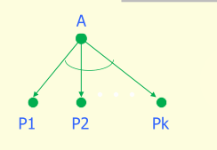

>1. 将一个问题分解为几个子问题，只有几个子问题都有解，元问题有解
>1. K-联接符

+ 或扩展

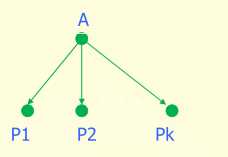

>1. 将问题分解为若干子问题，只要一个问题有解，原问题有解
>1. 单线联接符

主要思路：从代表原问题的根节点开始，按照一定的规则（归约操作）进行与或扩展，知道代表本原问题的终节点;选择合适的分支进行扩展，以求找到一个最佳的分解方案;在与或图中搜索最佳方案，即在问题空间搜索一个最佳解图。

**与或图搜索仅针对不含回路的图**

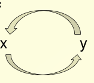

表示求了x就可以得到y,求了y就可以得到x，两者都不能求解。

