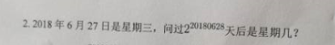
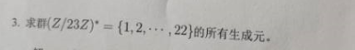
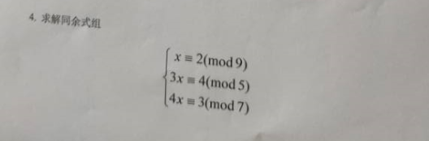

$$
\begin{align*}
&(10100101)_2=(165)_{10}=(A5)_{16}\\
&(153)_{10}=(10011001)_2=(99)_{16}\\
\end{align*}
$$

$$
\begin{align*}
&星期7天一周期;2^{20180628}\pmod7=1\\
&所以,是星期四
\end{align*}
$$

$$
\begin{align*}
&(Z/23Z*)是模23的简化剩余系,对于乘法\otimes:a\otimes b=a\cdot b\pmod {23}构成群\\
&而23是素数,所以\varphi(23)=22,而根据的原根g性质,\{g^0,g,...g^{\varphi(23)-1}\}构成模23的简化剩余系\\
&查原根表得到模23的原根有g=5,因此5是一个生成元,由于群阶22,所以(Z/23Z*)有\varphi(22)=10个生成元.\\
&生成元形如g^j,(j,22)=\frac{22}{22}=1,j=1,3 ,5, 7 ,9 ,13 ,15 ,17 ,19 ,21\\
&所以生成元是g^j\pmod{23}=5,10,20,17,11,21,19,15,7,14.
\end{align*}
$$

$$
\begin{align*}
&注意到9,5,7两两互素,但是方程左边不相同.\\
&3x\equiv4 \pmod 5,解得x\equiv 3\pmod5\\
&4x\equiv3\pmod7,解得x\equiv6\pmod7\\
&因此原方程组化为:\\
&\begin{cases}
&x\equiv2\pmod9\\
&x\equiv3\pmod5\\
&x\equiv6\pmod7
&\end{cases}
&\\
&由9,5,7两两互素,可运用中国剩余定理;\\
&M_1=35,M_1'=8,\\
&M_2=63,M_2'=2,\\
&M_3=45,M_3'=5;\\
&m=m_1m_2m_3=315\\
&原方程组的解就是x\equiv 2\cdot35\cdot8+3\cdot63\cdot2+6\cdot45\cdot5=2288\pmod {315}\\
&x\equiv83\pmod{315}\\
\end{align*}
$$
