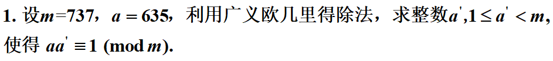
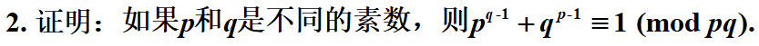
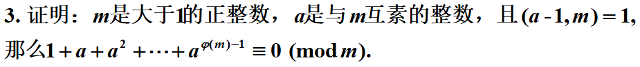
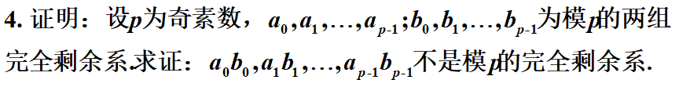
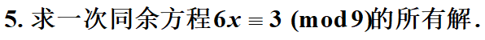

$$
\begin{equation}
\begin{aligned}
&欲求aa'=1(mod \quad m)的a';\\
&即a'a+km=1,求a',利用广义欧几里得除法可得到sm+ta=(m,a)\\
&737=1*635+102\\
&635=6*102+23\\
&102=4*23+10\\
&23=2*10+3\\
&10=3*3+1\\
&3=3*1+0\\
&一共是n+2=6项,n=4,(737,635)=1\\
\,\\
&于是q_0=1,q_1=6....q_n=3,q_{n+1}=1\\
&s_{-2}=1,t_{-2}=0\\
&s_{-1}=0,t_{-1}=1\\
&所以,s_0=-q_0s_{-1}+s_{-2}=1,t_0=-q_0t_{-1}+t_{-2}=-1\\
&进而,s_4=193,t_4=-224\\
&所以193*737-224*635=1,\\
&-224*a+193*737=1(mod\,737)\\
&a'=-224\\
\end{aligned}
\end{equation}
$$

$$
由已知,(p,q)=1,\varphi(p)=p-1,\varphi(q)=q-1\\
由欧拉定理,p^{\varphi(q)}\equiv1(mod\,q),即p^{q-1}\equiv1(mod\,q),对q同理\\
因此,p^{q-1}+q^{p-1}\equiv1(mod \,p)\\
\qquad p^{q-1}+q^{p-1}\equiv1(mod \,q)\\
而[p,q]=\frac{pq}{(p,q)}=pq;所以原式成立\\
$$

$$
(a,m)=1,
由欧拉定理,a^{\varphi(m)}\equiv\,1(mod \,m)\\
因而a^{\varphi(m)}-1=(a-1)(1+a+a^2+...+a^{\varphi{(m)}-1})\equiv0 (mod \,m)\\
所以m|a^{\varphi(m)}-1\qquad m|(a-1)(1+a+a^2+...+a^{\varphi{(m)}-1})\\
注意到,(a-1,m)=1\\
所以,根据定理,m|(1+a+a^2+...+a^{\varphi{(m)}-1})\\
简要说明:\\
由于 m|(a-1)(1+a+a^2+...+a^{\varphi{(m)}-1}),\\
(m,(a-1)(1+a+a^2+...+a^{\varphi{(m)}-1}))=m,\qquad (m,a-1)=1,所以\\
(m,(a-1)(1+a+a^2+...+a^{\varphi{(m)}-1}))=(m,(1+a+a^2+...+a^{\varphi{(m)}-1}))\\
所以,m|(1+a+a^2+...+a^{\varphi{(m)}-1})\\
原式成立
$$

$$
反证法;假设a_0b_0,a_1b_1...a_{p-1}b_{p-1}是模p的完全剩余系\\
因此,其中只有一个数模p为0,设该数为a_0b_0\\
由于p是奇素数,除去a_0b_0后,a_1b_1,....,a_{p-1}b_{p-1}就是模p的简化剩余系\\
那么a_1b_1,....,a_{p-1}b_{p-1}和1,2...,p-1是等价的,由Willson定理\\
\Pi a_ib_i=(p-1)!\equiv -1(mod \,m)\\
由题干,a_1...a_{p-1}和b_1...b_{p-1}均是模p的简化剩余系\\
\Pi a_i\equiv-1(mod\,m)\\
\Pi b_i\equiv-1(mod\,m)\\
而根据假设\Pi a_ib_i=(p-1)!\equiv -1(mod \,m)\\
与题干信息矛盾,假设错误，不是模p的完全剩余系
$$

$$
化简同余方程,(6,3,9)=3\\
原方程等价为2x\equiv1(mod\,3)\\
步骤一:验证是否有解\\
(2,3)=1|1;即原式的(6,9)=3|3;因此原式有解\\
步骤二:求解简单特解\\
(a,m)=(6,9)=3,方程左右除以3就是2x\equiv1(mod 3)\\
解得x_0=2(mod 3)\\
步骤三:根据特解求得原解\\
x\equiv\,x_0+t\frac{m}{(a,m)}=2+3t(mod \,9)\\
x\equiv2,5,8(mod\,9)
$$
