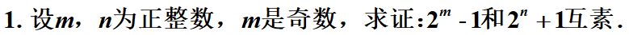
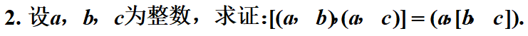
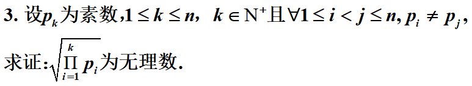
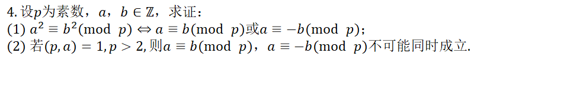
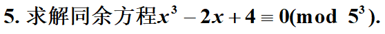

$$
要证明两个数互素,即证明(2^m-1,2^n+1)=1,设(2^m-1,2^n+1)=d\\
于是2^m=k_1d+1;\quad 2^n=k_2d-1\\
为了利用条件m是奇数,求{(2^{n})}^m\\
{(2^{n})}^m=(k_2d-1)^m\equiv (-1)^m\equiv-1(mod\,d)\\
{(2^{n})}^m=k_3d-1\\
同理{(2^{m})}^n=(k_1d+1)^n\equiv1(mod\,d)\\
{(2^{n})}^m=k_4d+1\\
因此k_3d-1-(k_4d+1)=0,(k_3-k_4)d=2\\
而d>=1;因此k_3-k_4>=1(为负数和0不可能满足上式)\\
所以d=1或者2\\
若d=2,\quad 2^m-1=k_1d=2k_1=偶数,而2^m-1是奇数,所以矛盾\\
因此d=1,两个数互素\\
$$

$$
设\\
a={p_1}^{s_11} {p_2}^{s_12}... {p_n}^{s_1n}\\
b={p_1}^{s_21} {p_2}^{s_22}... {p_n}^{s_2n}\\
c={p_1}^{s_31} {p_2}^{s_32}... {p_n}^{s_3n}\\
\ [ (a,b),(a,c) \ ]=
{p_1}^{m_1} {p_2}^{m_2}... {p_n}^{m_n}          \\
m_i=max\{min(s_{1i},s_{2i}),min(s_{1i},s_{3i}) \}\\
(a,[b,c])={p_1}^{k_1} {p_2}^{k_2}... {p_n}^{k_n}          \\
k_i=min\{s_{1i},max(s_{2i},s_{3i})\}\\
m_i=k_i\\
$$

$$
反证法:\\
假设\sqrt{\Pi{^ k}{_{i=1}} p_i}=\frac{a}{b}\\
所以a^2\Pi{^ k}{_{i=1}}p_i=b^2，而a^2\Pi{^ k}{_{i=1}}p_i的标准分解式中,由于a^2的分解式每一项次数是偶数，而\Pi{^ k}{_{i=1}}p_i每一项的次数是奇数\\
所以，整个a^2\Pi{^ k}{_{i=1}}p_i的标准分解式每一个非零次素数项的次数是奇数.\\
但是,b^2的标准分解式非零次素数项的次数必是偶数，两者不会相等，所以矛盾.原假设不成立.
$$

$$
\begin{equation}
\begin{aligned}
(1)\\
&由a^2\equiv b^2(mod\quad p)可得 	\\
&p|a^2-b^2,p|(a+b)(a-b),因此,p|(a+b)或者p|(a-b)\\
&若p|a+b，则a+b=kp,a=kp-b,所以a\equiv -b(mod\quad p)\\
&同理，若p|a-b,那么a=kp+b，所以a\equiv b(mod\quad p)\\
&证明成立\\
(2)\\
&假设同时成立，则有\\
&2a\equiv b-b\equiv 0(mod\quad p)\\
&由于p是素数，p>2，所以p是奇素数,所以(2,p)=1,2x\equiv 1(mod \quad p)有解x'\\
&x'2a \equiv x' 0\equiv 0(mod\quad p)\\
&所以a\equiv 0(mod\quad p)\\
&而(p,a)=1，与条件矛盾，因此假设不成立.\\
&同样，也可以通过p是奇素数,那么2a=2kp,a=kp,这样(p,a)=(p,kp)=p!=1,矛盾
\end{aligned}
\end{equation}
$$

$$
\begin{equation}
\begin{aligned}
&常规解法:\\
&f(x)=x^3-2x+4,\quad f'(x)=3x^2-2\\
&首先计算同余式f(x)\equiv 0(mod \quad 5)的解,有解x_1\equiv 3(mod5),x_2\equiv 4(mod5)\\
&1)\\
&考虑解x_1,以x=3+5t_1代入f(x)\equiv 0(mod \quad 5^2),有f(3+5t_1)\equiv f(3)+f'(3)5t_1\equiv 5^2\\
&解得t_1\equiv 0,1,2,3,4\equiv (mod 5)\\
&以x=(3+5t_1)+25t_2代入f(x)\equiv 0(mod \quad 5^3),等价于f(3+5t_1)+f'(3+5t_1)25t_2\equiv0(mod 125)\\
&25(9t_1 ^2+1)\equiv 125,解得t_1\equiv 1,4(mod 5),\\
&于是解为x=8+25k,23+25k\equiv0mod(125),k=0,1,2,3,4\\
&2)\\
&考虑解x_2,以x=4+5t_1代入f(x)\equiv0(mod 5^2),有60+230t_1\equiv0(mod\quad 25)\\
&解得t_1\equiv3 (mod5)\\
&以x=19+25t_2=25t_2-6代入f(x)\equiv 0(mod 5^3),有f(-6)+f'(-6)25t_2\equiv 0(mod 125)\\
&50+25t_2\equiv0(mod\quad125)\\
&解得t_2\equiv3(mod 5)=5k+3\\
&所以解为x=25(5k+3)-6=125k+69\\
&综上,解为x\equiv8,33,58,83,108,23,48,73,98,123,69\equiv0(mod\quad125)\\
\end{aligned}
\end{equation}
$$

