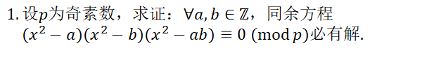
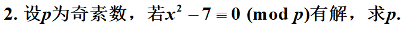
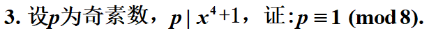
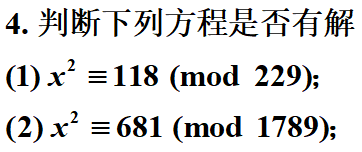
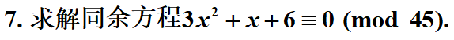

$$
分类讨论:\\
(1):a或者b是二次剩余\\
则有x^2-a\equiv 0(mod\quad p)或x^2-b\equiv 0(mod\quad p)有解x_0\\
于是(x^2-a)(x^2-b)(x^2-ab)\equiv 0(mod \quad p)有解x_0\\
(2):a和b都不是二次剩余\\
则根据勒让德符号,有:\\
(\frac{a}{p})=(\frac{b}{p})=-1\\
于是(\frac{ab}{p})=(-1)(-1)=1\\
所以x^2-ab\equiv 0(mod\quad p)有解x_0\\
于是(x^2-a)(x^2-b)(x^2-ab)\equiv 0(mod \quad p)有解x_0\\
综上,原式必有解
$$

$$
即x^2\equiv 7(mod\quad p)有解\\
于是根据勒让德符号,有(\frac{7}{p})=1\\
由于p,7是奇素数,而且根据题设,p!=7,所以(p,7)=1\\
根据二次互反律,(\frac{7}{p})=(-1)^{\frac{7-1}{2}\frac{p-1}{2}}(\frac{p}{7})=(-1)^{\frac{p-1}{2}}(\frac{p}{7})\\
分类讨论:\\
(1)\\
p=1+4k时,原式化为(\frac{p}{7})\\
(2)\\
p=3+4k时,原式化为-(\frac{p}{7})\\
而(\frac{p}{7})=1,当p=(1,2,4)+7k\\
(\frac{p}{7})=-1,当p=(3,5,6)+7k\\
根据以上讨论,有p=1+4k且p=(1,2,4)+7k时有(\frac{7}{p})=1\\
\qquad 或者p=3+4k且p=(3,5,6)+7k时有(\frac{7}{p})=1\\
通过中国剩余定理,求解6个方程组\\
\begin{cases}
p\equiv 1(mod\quad 4) \\
p\equiv 1,2,4(mod\quad 7)\\
\end{cases}

\begin{cases}
p\equiv 3(mod\quad 4)\\
p\equiv 3,5,6(mod\quad 7)\\
\end{cases}
\\
解得p\equiv 1,9,25,27,19,3(mod\quad28)
$$

$$
由p|x^4+1,所以x^4+1=kp,x^4=kp-1\\
 所以x^4\equiv-1(mod\quad p)\\
 设二次同余式(x^2)^2\equiv-1(mod\quad p),故本同余式有解\\
 根据勒让德符号,(\frac{-1}{p})=(-1)^{\frac{p-1}{2}}=1\\
 所以p=1+4k\equiv1,5(mod\quad 8)\\
 又根据(x^2)^2\equiv-1(mod\quad p),有\\
 (x^2+1)^2=x^4+2x^2+1\equiv2x^2(mod \quad p),有解\\
 根据勒让德符号,有(\frac{2x^2}{p})=1\\
 所以,(\frac{2}{p})(\frac{x}{p})(\frac{x}{p})=(\frac{2}{p})=(-1)^{\frac{p^2-1}{8}}\\
 而p\equiv1,5(mod\quad 8)\\
 所以为满足条件,p\equiv1(mod\quad 8)
$$

$$
(1)\\
根据勒让德符号(\frac{118}{229})=(\frac{2}{229})(\frac{59}{229})=(-1)^{\frac{228*230}{8}}(\frac{59}{229})\\
=-(\frac{59}{229})\\
=-1*(-1)^{29*114}(\frac{229}{59})=-1*(\frac{52=13*4}{59})=-1(\frac{13}{59})=1\\
有解\\
(2)\\
根据勒让德符号(\frac{681}{1789})=-1,无解\\
$$

$$
45=5\times9,(5,9)=1,所以原方程可以等价为:\\
\begin{cases}
f(x)\equiv0(mod\quad 5).....(1)\\
\\
f(x)\equiv0(mod\quad 9).....(2)
\end{cases}\\
将0，1，2，3，4代入(1)得到解,x\equiv1,2(mod\quad5)\\
将0-8代入(2)得到解,x\equiv3(mod\quad 9)\\
由中国剩余定理求解同余方程组:\\
\begin{cases}
x\equiv b_1(mod\quad 5)\\
\\
x\equiv b_2(mod\quad 9)\\
\end{cases}
\\
解得x\equiv36b_1+10b_2(mod\quad 45)\\
最终得到解为:\\
x\equiv36+30,2*36+30(mod\quad 45)\\
x\equiv 21,12(mod\quad 45)\\
$$
