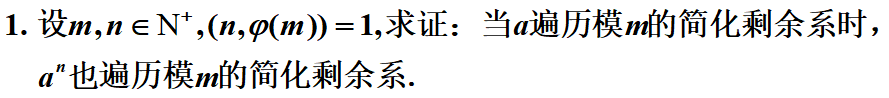
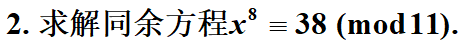
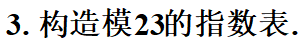
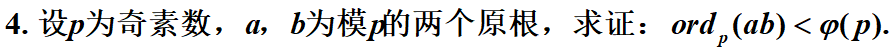
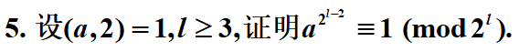

$$
\begin{equation}
\begin{aligned}
&反证法.\\
&假设模m的简化剩余系中,两个不同的元素为a_1,a_2,且有a_1^n\equiv a_2^n(mod\quad m)\\
&而模m的简化剩余系(Z/mZ)*是一个交换乘法群,a_1,a_2的逆元a_1^{-1} 、a_2^{-1}也在(Z/mZ)*中(或者\\&\qquad通过ax\equiv b(modm)有解的条件(a,m)|b来证明\\
&因此,{(a_1^{-1})}^n\equiv{(a_2^{-1})}^n\quad(mod\quad m)\\
&而:a_1^n*{(a_1^{-1})}^n\equiv1(mod\quad m),且\quad{(a_1^{-1})}^n\equiv{(a_2^{-1})}^n\quad(mod\quad m)\\
&所以,a_1^n*{(a_2^{-1})}^n\equiv(a_1a_2^{-1})^n\equiv1(mod\quad m)\\
&所以对于数a_1a_2^{-1}有其指数ord_m(a_1a_2^{-1})|n,而a_1a_2^{-1}显然与m互素,根据欧拉定理有(a_1a_2^{-1})^{\varphi(m)}\equiv1(mod\quad m)\\
&因此ord_m(a_1a_2^{-1})|\varphi(m)\\
&根据题设,(n,\varphi(m))=1,而ord_m(a_1a_2^{-1})又是两者的公因数,则ord_m(a_1a_2^{-1})只能为1\\
&因此(a_1a_2^{-1})\equiv1(mod\quad m),对于a_1,其逆元解应该是唯一存在的,因此a_1^{-1}\equiv a_2^{-1},a_1\equiv a_2,这是与假设矛盾的.\\
&因此,证明完备.
\end{aligned}
\end{equation}
$$

$$
注意到11是一个素数,有(38,11)=1,于是查原根表,模11有一个原根g=2\\
将方程指标化,得到8ind(x)\equiv ind(38)(mod\quad \varphi(m)=10)\\
而38\equiv5(mod\quad 11),因此ind(38)=ind(5)=r,有2^r\equiv5(mod\quad 11),所以r=4\\
8ind(x)\equiv4(mod\quad 10)\\
解得ind(x)\equiv3(mod\quad5)\equiv3,8(mod\quad10)\\
所以,ind(x)\equiv3,8(mod\quad10)\\
x\equiv2^{ind(x)}\equiv2^3,2^8(mod\quad11)\\
也就是x\equiv8,3(mod\quad11)
$$

$$
(1)指数表\\
\varphi(23)=22,因此模23的指数只可能是22的因数:1,2,11,22\\
对0-22依次代入这些因数次方即可\\
(2)指标表,23的原根g=5\\
$$

| 十位\个位 | 0    | 1    | 2    | 3    | 4    | 5    | 6    | 7    | 8    | 9    |
| --------- | ---- | ---- | ---- | ---- | ---- | ---- | ---- | ---- | ---- | ---- |
| 0         |      | 22   | 2    | 16   | 4    | 1    | 18   | 19   | 6    | 10   |
| 1         | 3    | 9    | 20   | 14   | 21   | 17   | 8    | 7    | 12   | 15   |
| 2         | 5    | 13   | 11   |      |      |      |      |      |      |      |

$$
\begin{equation}
\begin{aligned}
&欲求证ord_p(ab)<\varphi(p),而本有ord_p(ab)|\varphi(p),即证明(ab)不是模p的原根\\
&反证法.\\
&假设(ab)是模p的原根,ord_p(ab)=\varphi(p),于是C=\{(ab)^0,(ab),...(ab)^{\varphi(p)-1}\}构成了模p的简化剩余系\\
&由Wilson定理,对于一个素数p,有(p-1)!\equiv-1(mod\quad p),注意到:\\
&C中的每个元素c_i\equiv k(mod\quad p),k\in(0,p-1),不重不漏,因此有：\\
&\coprod_{i=0}^{\varphi(p)-1} c_i\equiv\coprod_{i=1}^{p-1}i \equiv(p-1)!(mod\quad p)\\
&由Wilson定理,\coprod_{i=0}^{\varphi(p)-1} c_i\equiv-1(mod\quad p)\\
&\because a,b是模p的原根,\coprod_{0\leq k\leq \varphi(p)-1}a^k\equiv \coprod_{0\leq k\leq \varphi(p)-1}b^k \equiv-1(mod\quad p)\\
&而\coprod c_i即 \coprod (ab)^k\equiv(-1)(-1)=1(mod\quad p)\\
&与假设推出的结论矛盾,故原命题成立\\
\end{aligned}
\end{equation}
$$

$$ {\usepackage{enumerate}
\begin{equation}
\begin{aligned}

&证明(数学归纳法):\\
&由(a,2)=1可知，a必为奇数，a\equiv1(mod\quad2)，设a=2k+1 \quad k\in Z\\
&当l=3时，a^{2^{l-2}}=a^2=(2k+1)^2=4k^2+4k+1=4k(k+1)+1,k和k+1中必有一数是偶数2n\\
&因此,原式=4k(k+1)+1\equiv1(mod\quad 8=2^l=2^3),成立\\
&当l>3时,假设l=n\geq3时,命题成立,也就是有:\\
&a^{2^{n-2}}\equiv1(mod\quad2^n)\\
&可以设a^{2^{n-2}}=k\cdot2^n+1,k\in Z\\
&那么,当l=n+1时,a^{2^{l-2}}=a^{2^{n-1}}=a^{2^{n-2}+2^{n-2}}=a^{2^{n-2}}\cdot a^{2^{n-2}}=(k\cdot2^n+1)^2=k^22^{2n}+2k\cdot2^n+1\\
&欲证:a^{2^{(n+1)-2}}\equiv2^{n+1}(mod\quad 2^{n+1})\\
&可以发现，2^{n}|2^{n+1},因此a^{2^{(n+1)-2}}=k^22^{2n}+2k\cdot2^n+1\equiv 1(mod 2^{n+1})\\
&归纳证明成立.
\end{aligned}
\end{equation}
$$

$$
注意到13是一个素数,查原根表得到,13的一个原根g=2\\
将原方程指标化为:ind_g6+x\cdot ind_g8\equiv ind_g9(mod\quad \varphi(13)=12)\\
计算指标表\\
ind_g6=5\\
ind_g8=3\\
ind_g9=8\\
因此原式可以写成：5+3x\equiv8(mod\quad 12)\\
3x\equiv3(mod\quad12)\\
解得x\equiv1(mod\quad4)\\
因此x\equiv1,5,9(mod\quad 13)
$$
