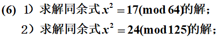

$$
(1)\\
64=2^6,\alpha=6,a=17\equiv1(mod\quad8),(a,2)=(17,2)=1,因此方程有解\\
当\alpha=3时,f(x)=x^2-17\equiv0(mod\quad2^3=8)的解是\\
x\equiv1,3,5,7(mod 8)=\pm(1+4t_3)\\
t_3\equiv\frac{17-1}{2^3}\equiv0(mod\quad2)\\
将t_3用2t_4+0替换\\
x\equiv\pm(1+8t_4)是适合方程f(x)=x^2-17\equiv0(mod\quad2^4=16)的解\\
t_4\equiv\frac{17-1}{2^4}=1(mod\quad2)\\
将t_4用2t_5+1替换\\
x\equiv\pm(9+16t_5)是适合方程f(x)=x^2-17\equiv0(mod\quad2^5=32)的解\\
t_5\equiv\frac{17-9^2}{2^5}\equiv-2\equiv0(mod \quad2)\\
将t_5用2t_6+0替换\\
x\equiv\pm(9+32t_6)是适合方程f(x)=x^2-17\equiv0(mod \quad2^6=64)的解\\
(2)\\
p=5,而125=p^{\alpha}=p^3,(3,5)=1\\
f(x)=x^2-24\equiv0(mod\quad 5)的解是x\equiv2,3(mod\quad5)\\
考虑解x_1\equiv2(mod\quad5),将x=2+5t_1代入f(x)\equiv0(mod\quad5^2=25)\\
等价于f(2)+f'(2)5t_1\equiv0(mod\quad25)\\
-20+20t_1\equiv0(mod\quad25)\\
解得t_1\equiv1(mod\quad5)\\
进而将x\equiv2+5+25t_2\equiv7+25t_2代入f(x)\equiv0(mod\quad5^3=125)\\
等价于f(7)+f'(7)25t_2\equiv0(mod\quad125)\\
25+14*25t_2\equiv25+100t_2\equiv0(mod\quad125)\\
t_2\equiv1(mod\quad5)\\
因此x\equiv7+25+125t_3是方程的解\\
考虑解x_2\equiv3(mod\quad5),将x=3+5t_1代入f(x)\equiv0(mod\quad5^2=25)\\
等价于f(3)+f'(3)5t_1\equiv0(mod\quad25)\\
-15+30t_1\equiv0(mod\quad25)\\
解得t_1\equiv3(mod\quad5)\\
进而将x=18+25t_2代入f(x)\equiv0(mod\quad5^3=125)\\
等价于f(18)+f'(18)25t_2\equiv0(mod\quad125)\\
300+36*25t_2\equiv0(mod\quad125)\\
解得t_2\equiv3(mod\quad5)\\
因此x\equiv18+25*3+125t_3是方程的解\\
所以,原式的解为x\equiv32,93(mod\quad125)
$$

