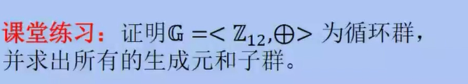
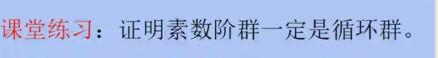
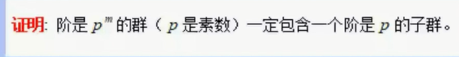
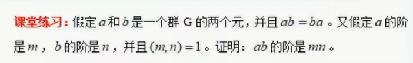
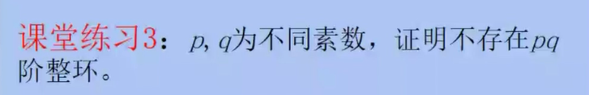

$$
封闭性:由于运算模12.封闭性显然满足\\
结合性 a+(b+c)=(a+b)+c\\
单位元:0\\
逆元:a的逆元是12-a\\
 
Z_{12}=\{0,1,2,3..11\},而1^{12}=1,Z可由生成元a=1生成,因此Z是循环群\\
12的正因数是1,2,3,4,6,12,因此有这些阶子群\\

1阶子群:生成元形如a^j,(j,12)=\frac{12}{1}=12，a^{12}=0,故为<0>=\{0\}\\
2阶子群:生成元形如a^j,(j,12)=\frac{12}{2}=6，a^{6}=6,故为<6>=\{0,6\}\\
3阶子群:生成元形如a^j,(j,12)=\frac{12}{3}=4，a^{4}=4,故为<4>=\{0,4,8\}\\
4阶子群:生成元形如a^j,(j,12)=\frac{12}{4}=3，a^{3}=3,故为<3>=\{0,3,6,9\}\\
6阶子群:生成元形如a^j,(j,12)=\frac{12}{6}=2，a^{2}=2,故为<2>=\{0,2,4,6,8,10\}\\
12阶子群:生成元形如a^j,(j,12)=\frac{12}{12}=1，a^{1}=1,故为<1>=\{0,1,2,3,4,5,6,7,8,9,10,,11\}\\
$$

$$
设素数阶群G阶为素数p,根据拉格朗日定理，群G的子群G'的阶被p整除,因此G’的阶为1或者p\\
阶为1的子群是\{e\},而素数p>1,因此G中存在元素a,a不是单位元e,\\
由a构成的子群<a>=\{a,a^2...\},y因为a不是单位元,所以<a>的阶不为1,只能为p,因此a^p=1  \\
所以<a>阶为p,<a>=G,G是循环群
$$

$$
\begin{equation}
\begin{aligned}
&设群G的阶为p^m,p是素数因而p^m>1,所以G中存在非单位元的元素a,\\
&设H=<a>,H的阶为n,即有a^n=e,\,n|p^m;\\
&由于p是素数,所以n=p^i.\\
&因此,a^n=a^{p^i}=e;\\
&而b=a^{p^{i-1}}在子群<a>中,于是以b作为生成元构建子群H_1=<a^{p^{i-1}}>\\
&显然，H_1的阶为p,H_1就是阶为p的子群
\end{aligned}
\end{equation}
$$

$$
\begin{equation}
\begin{aligned}
&设ab的阶为k,于是有(ab)^k=e,\,而a^m=e,b^n=e\\
&所以有(ab)^{mn}=e,\,k|mn\\
&(ab)^k=a^kb^k=e,因此b^k是a^k的逆元,a的逆元是a^{-1},因此a^k的逆元b^k=a^{-k}\\
&所以b^{kn}=a^{-kn}=e;所以m|kn,而(m,n)=1,因此m|k;\\
&同理,n|k\,;\\
&所以[m,n]|k,而(m,n)=1,所以[m,n]=mn;\\
&因此有mn|k,又k|mn;所以k=mn;ab的阶是mn.
\end{aligned}
\end{equation}
$$

$$
\begin{equation}
\begin{aligned}
&假设存在pq阶的整环R,所以R是交换环,有单位元,无零因子.\\
&因此,<R,+>构成一个pq阶的Abel群.\\
&p,q为不同素数,所以<R,+>有p阶元a,\,q阶元b;\\
&于是元a+b的阶为pq;所以<R,+>是循环群.生成元c=a+b,\quad pqc=e=0\\
&R=<a+b>=\{0,c,2c...(pq-1)c\}\\
&取R中元素x=pc,y=qc;于是有xy=pqcc=0c=0;而R是交换环,所以yx=0;\\
&\\
&所以,x,y均是零因子,与假设矛盾\\
\end{aligned}
\end{equation}
$$
