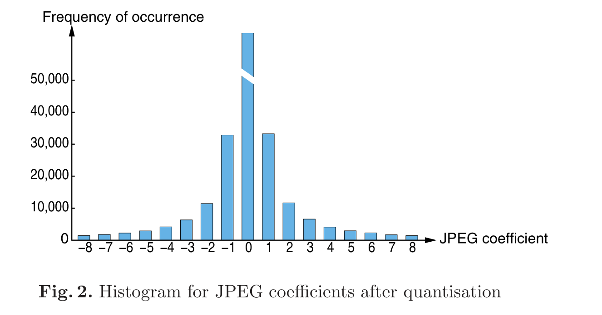
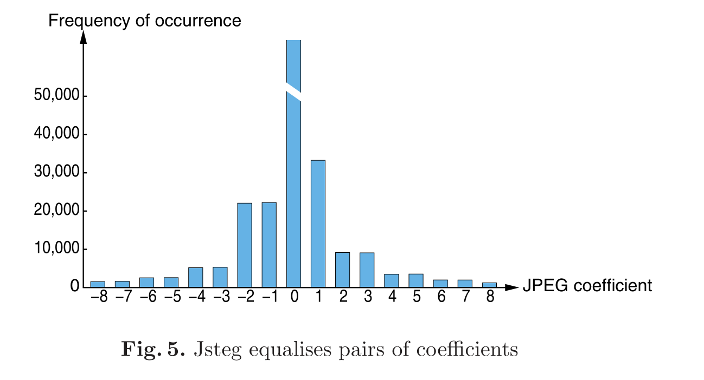
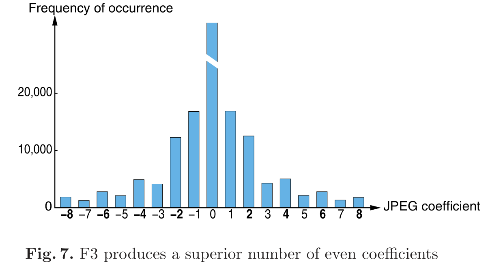

#### 正常jpeg的dct系数直方图

#### Jsteg

- 特点
  - 高容量，12%
  - 能够抵抗视觉攻击
  - 不能够抵抗统计攻击

- 实现

  - 隐藏信息在不为0、1的DCT系数的LSB里

- 缺点

  - 具有值对效应

    

#### F3

- 为了解决大量DCT系数(0, 1, -1)不隐藏信息

- 每个非零的DCT系数用于隐藏1bit信息，为0的系数不负载秘密信息

- 如果(1, -1)需要隐藏信息0，则将该位归零并视为无效

- 直方图

  

#### F4

- F3存在的问题

  - 嵌入比1更多的0，使得偶数的分布增加

- F4用负偶数、正奇数代表嵌入了消息比特1，用负奇数、正偶数代表嵌入了0

  - 仍然通过减小绝对值的方法进行修改，如果减小绝对值后系数为0则继续往下嵌入当前比特

- 直方图

  

#### F5

- 步骤
  1. Permutative Straddling
     - 将消息分散到整个介质上

#### MP3Stego & IVS-Stego

- 低容量，小于1%
- 能够抵抗视觉攻击、审计攻击、统计攻击