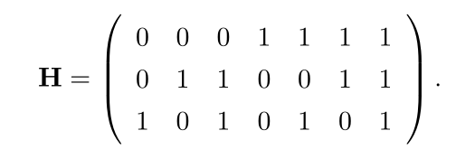
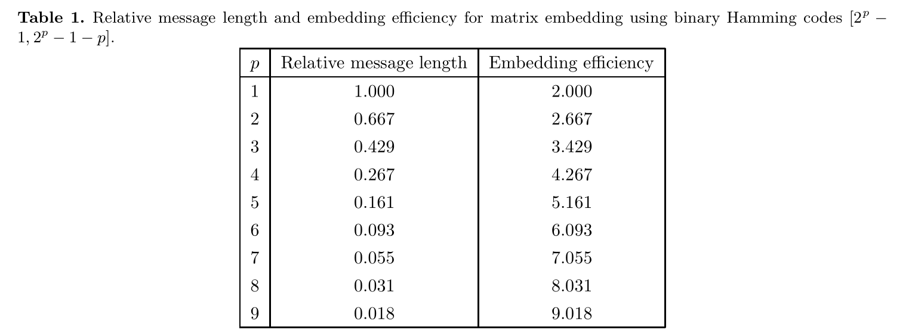
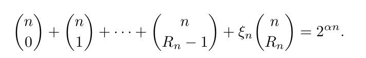

### 文献阅读报告

#### 论文信息

- 题目：Matrix Embedding for Large Payloads

- 作者：
  - Jessica Fridrich
    - 单位：宾汉顿大学电气与计算机工程系
  - David Soukal
    - 单位：宾汉顿大学计算机科学系
- 发表时间：2006.9
- 期刊：IEEE Transactions on Information Forensics and Security

#### 论文内容摘要

- 翻译：
  - 矩阵编码是一种通用的编码方法，它能被用于大多数的隐写方案以提高他们的嵌入效率，**即每次嵌入改变能够嵌入的消息位数(例如LSB中修改每个像素的概率是1/2，每个像素能够嵌入一个bit，那个一次嵌入改变能够嵌入2bit信息，也可以说该方案的嵌入效率是2)**。由于较小数量的嵌入改变更不容易破坏载体对象的统计属性，因此采用矩阵编码的方案通常具有较好的隐写安全性。这种增益对于长消息来说更加重要，因为与短消息相比，长消息更加容易被检测。然而，以前基于汉明码的矩阵编码方法对于长消息来说效率不高。在这篇论文中，我们提出了新的矩阵编码方案，能够有效的嵌入接近嵌入能力的信息。==一种是基于由单纯形码构成的码族，第二种是基于小维数的随机线性码。==根据理论上能够达到的界限对所提出方法的嵌入效率进行了评估

对该论文进行总体概要介绍，可参考论文的摘要，将其翻译成中文；也可以根据自己的阅读情况，进行归纳总结整理

#### 论文背景介绍

- 应用背景

  - 统计不可检测性是隐秘方案的主要要求

    - 四个影响隐秘安全性的因素

      - 载体媒体的类型
      - 选择载体中可能被修改位置的方法
      - 嵌入操作
      - 嵌入修改的数量

      **如果前三个因素都是一样的话，那么引入较少嵌入更改的控件将较难检测，这也是矩阵编码实用的原因**

  - 矩阵编码被用来提高嵌入效率

- 技术现状

  - ==对于大于67% 嵌入容量(relative message length)的有效载荷，基于汉明码的矩阵编码远没有达到理论上可达到的界限==

- 论文主要工作

  - 提出了两个对长消息有效的矩阵编码方案
    1. 使用[simplex codes](https://www.encyclopedia.com/computing/dictionaries-thesauruses-pictures-and-press-releases/simplex-codes)和它们的衍生物
    2. codes of small dimension with random generator matrix

#### 论文工作介绍

参考论文中间主题部分，介绍论文针对什么问题，采用什么策略，通过什么方法，实现了隐写。

#### 论文实验情况

对论文的实验部分进行总结。论文做了些什么实验，实验结果是什么，表明了论文方法的效果怎样。

#### 论文阅读总结

对本篇论文的工作进行总结，从你自己的角度分析该论文方法的优点或者缺点。

#### 编码理论基本概念

- $F_2^n$：所有的 n-bit 列向量($x = (x_1, \cdots, x_n)^t$)空间

  - linear vector space $\implies$ operations in $GF(2)$

- $C$：$F_2^n$ 的子集，$C$ 中的向量被称为 **codewords**(码字)

- **$\text{Hamming weight: } w(x) = x_1 + \cdots + x_n$**，即向量 $x$ 中 1 的个数

- 两个向量之间的距离 $d(x, y) = w(x - y)$

- $B(x, r)$ 表示与向量 $x$ 的距离不超过 $r$ 的向量的集合
  $$
  B(x, r) = \lbrace y \in F_2^n \mid d(x, y) \le r \rbrace
  $$

- 向量 $x$ 与子集 $C$ 的距离 $d(x, C) = min_{c \in C} d(x, c) = d(c, c')$

  - ==$c'$ 是 $C$ 中的一些向量==

  - $C$ 的 covering radius $R$ 定义为
    $$
    R = \max_{x \in F_2^n} d (x, C)
    $$

    - covering radius由距离 $C$ 最远的向量确定

  - average distance to code
    $$
    R_a = 2^{-n} \sum_{x \in F_2^n} d(x, C) \le R
    $$

    - $F_2^n$ 中随机选择的向量与 $C$ 的距离的平均值

- 常见的定义

  - $x + C = \lbrace y \in F_2^n \mid y = x+ c, c \in C \rbrace$
  - The redundancy $r$ of a code $C$ is defined as $r = \log_2 \frac{2^n}{|C|}$
    - $|C|$ 表示 $C$ 中的元素个数

- $C$ 是 $[n, k]$ code

  - 长度为 $n$，维度为 $k$
  - $k \le n$
    - 维度指矩阵的秩，即线性无关的向量个数

- $C$ 的生成矩阵 $G$ 

  - $k \times n$
  - 由 $C$ 中 $k$ 个线性无关的向量构成
  - $C$ 中任意向量可以表示为 $G$ 的列向量的线性组合

- $C^{\bot}$

  - $\lbrace x \in F_2^n | x \cdot c = 0 \; \forall \; c \in C \rbrace$
    - $\implies$ 在不属于 $C$ 的 $n-k$ 维上任意，在属于 $C$ 的 $k$ 维上均为零
      - $\implies $ 是 $[n, n-k]$ code
  - 称为 $C$ 的对偶码(dual code)

  - 其生成矩阵 $H$ 称作 $C$ 的奇偶校验矩阵
    - $Hx = 0 \; \forall \; x \in C$

- 陪集 $C(s)$

  - $\lbrace x \in F_2^n | Hx = s \rbrace$
    - $s = Hx \in F_2^{n-k}$
    - $s$ 称作 $x$ 的 syndrome
    
  - $C(0) = C$
  - $C(s) = x + C$
    - 这里似乎正好是陪集的定义
  - $e_L(s)$
    - 陪集 $C(s)$ 中所有具有最小汉明权重的向量被称为 coset leader

- ==公式==

  - 暂略

- **$\text{binary expansion}$**：二进制扩展

  - 即二进制表示，例如 5 的二进制扩展为 $(101)_2$

- 

#### Hamming Codes

- 是 $[2^p-1, 2^p - 1 -p]$ linear code

- 其奇偶校验矩阵 $H$ 是 $p \times (2^p - 1)$

  - **其奇偶校验矩阵的列向量是 $1, 2, \cdots 2^p - 1$ 的 binary expansion(二进制表示)**

    - 例如 $p = 3$ 的 $H$ 为

      

    - 因此 $\forall s \in F_2^p, \; s \ne 0  \implies e_L(s) = (0, \dots, 1, \dots)$

      - 其中 $1$ 位于 $dec(s)$
        - $dec(s)$ 表示 binary expansion 是 $s$ 的整数
      - $He_L(s) = s$

- 将一张图片划分为 $N/n$ 个子集，每一个子集包含 $n$ 个 pixels
  
  - 在汉明编码中，$n = 2 ^p - 1$
- 对于每一个子集，我们能够在不超过一次嵌入改变的情况下嵌入 $p$ bits 的信息
  - 假设在图像的 $n$ 个 pixels 中要嵌入的为的向量为 $x \in F_2^n$
    - 例如LSB选取每个pixel的最不重要位，则lsb组成一个 $x \in F_2^n$
  - 要嵌入的消息为 $p$ bits，记为 $m \in F_2^p$
  - 我们将原信息 $x$ 改为 $y = x + e_L(m-Hx)$
    - 由于 $w(e_L(m-Hx)) \le 1$，因此要修改的不超过一位
      - 如果 $m \ne Hx$，那么要修改的为第 $dec(m-Hx)$ 个 pixel
  - 提取时有 $Hy = m$
- $n$ 是在接受方和发送方之间共享或者嵌入到隐蔽对象中
- 嵌入效率
  - $e_p = \cfrac{p}{1-2^{-p}}$
    - 因为 $m$ 一共有 $p$ 位，那么 $2^p$ 中只有一次为全零，此时不需要修改
- **$\text{relative message length}$**
  - 个人感觉是嵌入消息与消息长度之比
  - $\cfrac{p}{2^p-1}$

- 
  
  - ==从表中可知当 Relative message length 大于 0.667 时，嵌入效率并没有提高(和lsb一样)，这应该也是这篇文章专门针对的点==

#### 编码效率的界限

- 在 $F_2^n$ 上的编码协议是一对嵌入和提取函数

  - 嵌入函数 $Emb: F_2^n \times M \rightarrow F_2^n$
  - 提取函数 $Ext: F_2^n \rightarrow M$
  - 嵌入信息 $m$
  - $Ext(Emb(x, m)) = m, \; \forall m\in M, x \in F_2^n$
    -  $M$ 是可传达的消息的集合

- 假定嵌入 $m$ 至多需要 $R$ 次嵌入改变

  - $d(x, Emb(x, m)) \le R, \; \forall m \in M, x \in F_2^n$

- 嵌入容量(embedding capacity) $h(n, R) = \log_2|M|$

  - $\underline{e} = \cfrac{\log_2|M|}{R}$ 是嵌入效率的下界
  - 对于预期嵌入修改 $R_a$，其嵌入效率为 $e = \cfrac{\log_2|M|}{R_a} \ge \underline{e}$
  - 对于汉明码来说
    - $n = 2^p - 1$
    - $R = 1$
    - $h(n, R) = p$

- 嵌入容量的上界为

  

  - 其中 $\alpha = \cfrac{h(n, R)}{n}$ 代表 relative message length
  - $R_n \in Z, \xi_n \in [0, 1)$ 满足下面的等式
    - 

#### random linear code

- **$x \in C(s) \implies d(x, C) = w(e_L(s))$**
  - $c' \in C, \; d(x, C) = d(x, c') \implies x - c'$ 是coset leader

#### ref

[^Matrix Embedding for Large Payloads]: Matrix Embedding for Large Payloads
[^关于编码的一些概念]: https://zhuanlan.zhihu.com/p/34945733

