[toc]

## 嵌入式系统概论

- 嵌入式系统安全 = 可靠 + 安全

- 嵌入式系统的**定义**

  - `IEEE`的定义

    > 嵌入式系统是用于控制、监视或辅助操作机器和设备的装置

  - 一般认为

    > 嵌入式系统是以应用为中心，以计算机技术为基础，并且软/硬件可裁剪，可满足应用系统对功能、可靠性、成本、体积和功耗有严格要求的专用计算机系统

  - 简单的讲

    > 嵌入式系统就是嵌入到对象体系中、用于执行特定功能的专用计算机系统

- 嵌入式系统的**三要素**

  - 嵌入性

    > 嵌入到对象体系中，有对象环境要求

  - 专用性

    > 软、硬件按对象要求裁剪

  - 计算性

    > 实现对象的智能化功能

- 嵌入式系统**特征**

  - 面向特定应用

    > 具有功耗低、体积小、成本低、高可靠性特点

  - ==**软硬件可裁剪**==
  
    > 最主要特征？
  
  - 较长的生命周期
  
    > 嵌入式系统与具体应用有机结合在一起，升级换代也是同步进行
  
  - 需要特定的开发工具
  
    > 嵌入式系统本身不具备自主开发能力，必须有一套开发工具和环境才能进行嵌入式开发
    >
    > 例如==仿真机==和==开发器==
  
  - 体积受限
  
    > 硬件和软件都必须高效率的设计，量体裁衣，力争在有限的硅片面积上实现高的性能，完成功能、可靠性、成本和功耗的苛刻要求
  
  - 实时性
  
    > 嵌入式可以设置实时操作系统支持。尽管嵌入式系统的应用程序可以不需要操作系统的支持就能直接运行，但是为了合理地调度多任务，充分利用系统资源，用户可以自行选配实时操作系统开发平台
  
- 嵌入式系统**组成**

  - 嵌入式系统一般由微处理器、外围支撑硬件、嵌入式实时操作系统(或调度器)、用户应用软件四个部分组成

  - 嵌入式系统由嵌入式硬件与嵌入式软件组成

    > 嵌入式硬件以芯片、模板、组件、控制器形式嵌于设备内部
    >
    > 嵌入式软件包括嵌入式操作系统(或调度器)和各种应用软件，一般固化在ROM或闪存中
    >
    > 由于嵌入式系统存储空间有限，**要求软件代码紧凑、可靠，对实时性有严格要求**

- 嵌入式微处理器

  - 特点

    - 嵌入式微处理器通常把**通用PC机中许多由板卡完成的任务集成到芯片内部**，这样可以大幅减小系统的体积和功耗，具有重量轻、成本低、可靠性的特点

    - 由于嵌入式系统通常应用于比较恶劣的工作环境中，因此嵌入式微处理器在**工作温度、电磁兼容性(EMC)、可靠性**要求方面较高

      > **电磁兼容性二要素**
      >
      > 1. 能在一定的干扰环境下工作
      > 2. 不产生不可容忍的干扰

    - 嵌入式系统芯片**分类**(8/16/32位、MPU/MCU/DSP/SOC)，8位一般是哈佛结构，成本低，可靠性高。32位一般是冯·诺依曼 /普林斯顿体系结构，成本高，灵活性好

  - 体系结构

    - 冯·诺伊曼(普林斯顿)体系结构
      - 程序存储器和数据存储器公用一个存储空间，**统一编址**
      - 采用统一的地址及数据总线，指令和数据的宽度相同
      - 使用灵活(例如代码远程更新OTA)
    - 哈佛体系结构
      - 程序存储器和数据存储器是**独立编址**的两个存储空间
      - 分离的**程序总线**和**数据总线**可允许一个机器周期内同时获取指令码(程序存储器)和操作数(数据存储器)，从而**提高执行速度和数据的吞吐率，可靠性高(大部分程序存储器是只读存储器)**

  - 指令系统

    - 复杂指令集系统(CISC)

      - 采用CISC体系结构的计算机**各种指令的使用频率相差悬殊**，大概有**20%的比较简单的指令被反复使用**，使用量约占整个程序的80%；而有80%左右的指令则很少使用，其使用量约占整个程序的20%，即**指令的2/8规律**
      - 在CISC中，为了支持目标程序的优化，支持高级语言的编译程序，增加了许多复杂的指令，用一条指令来代替一串指令，**简化了软件设计，却增加了硬件的复杂程度，而且这些复杂指令并不等于有利于缩短程序的执行时间**
      - 在VLSI制造工艺中要求CPU控制逻辑具有规整性，而**CISC为了实现大量复杂的指令，控制逻辑极不规整，给VLSI工艺造成了很大困难**

    - 精简指令集系统(RISC)

      - RISC是在CISC的基础上产生并发展起来的
      - RISC简化指令系统使计算机的结构更加简单合理，提高运算效率
      - **优先选取使用频率高的、很有用但不复杂的指令**，避免使用复杂指令
      - **固定指令长度，减少指令格式和寻址方式种类**
      - 指令之间各字段的划分比较一致，各字段的功能也比较规整
      - 采用Load/Store指令访问存储器，其余指令都在寄存器之间进行
      - 增加通用寄存器数量，算数/逻辑运算的操作数都在寄存器中存取
      - **大部分指令控制在一个或小于一个机器周期内完成**
      - **以硬布线控制逻辑为主，不用或少用微码控制**

    - CISC和RISC的主要差异

      - 指令系统

        > RISC设计者把主要精力放在那些经常使用的指令上，尽量使它们具有简单高效的特色。对不常用的功能，常通过组合指令来实现。而CISC的指令系统比较丰富，有专用指令来完成特定的功能

      - 存储器操作

        > RISC对存储器操作有限制，使控制简单化；而CISC机器的存储器操作指令多，操作直接

      - 程序

        > RISC汇编语言程序一般需要较大的内存空间，实现特殊功能时程序复杂，不易设计；而CISC汇编语言程序编程相对简单，科学计算及复杂操作的程序设计相对容易，效率较高

      - CPU

        > 由于RISC CPU包含较少的单元电路，因而面积小、功耗低；而CISC CPU包含丰富的电路单元，因而功能强、面积大、功耗大

      - 设计周期

        > RISC微处理器结构简单，布局紧凑，设计周期短，且易于采用最新技术；CISC微处理器结构复杂，设计周期长

      - 易用性

        > RISC微处理器结构简单，指令规整，性能容易把握，易学易用；CISC微处理器结构复杂，功能强大，实现特殊功能容易

      - 应用范围

        > RISC更适用于嵌入式系统；而CISC则更适合于通用计算机

- 嵌入式系统的**软件分层**

  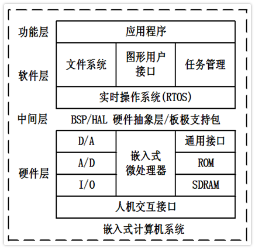

  - **嵌入式操作系统不是必须的**

    > 操作系统带来了不确定性，不可测试性，降低了系统的可靠性
    >
    > 只有对实时性有高要求时才会考虑操作系统

- 常用存储器

  |        | **==开发成本==？** | **制造成本** | **可靠性** | **可修改性** | **产品周期** | **功耗** |
  | ------ | ------------------ | ------------ | ---------- | ------------ | ------------ | -------- |
  | ROM    | 高                 | 低           | 高         | 无           | 长           | 低       |
  | OTP    | 中                 | 中           | 中         | 无           | 短           | 中       |
  | FLASH  | 低                 | 高           | 低         | 有           | 短           | 高       |
  | E2PROM | 低                 | 高           | 中         | 有           | 短           | 高       |

  - ROM(Read-Only Memory)

    > 以非破坏性读出方式工作，只能读出无法写入信息。信息一旦写入后就固定下来，即使切断电源，信息也不会丢失

  - OTP(One Time Programmable)

    > 一次性可编程存储器，程序烧入单片机后，将不可再次更改和清除

  - Flash

    > 在没有电流供应的条件下也能够长久地保持数据，其存储特性相当于硬盘

  - E2PROM

    > 电可擦除可编程只读存储器，是一种掉电后数据不丢失的存储芯片

- 嵌入式系统的**应用软件**

  - **嵌入式系统软件的要求与PC机有所不同**，其主要特点有

    - 软件**固化**存储，修改不易，要有较高的正确率与可靠性
    - 软件代码要求**精简**(受成本、体积和功耗存储空间限制)、**高效**(受主频、功耗限制)、**高可靠性**(容错)

    - **数据结构简洁**(代码优化时，数据结构占80%，编程技巧占20%)

## 硬件基础知识

- 电源电压

  > Type A: +5V;	Type B: +3.3V;	Type C: +1.8V

- 电源范围

  > 一般为 $\pm$10%，部分芯片 $\pm$5%
  >
  > 宽电压范围芯片适用性好，可简化电源设计

- 与电源相关的概念

  - 电源纹波
  
    > 电源纹波是在电源中，存在大量可以很轻松地与探针耦合的高速、大信号电压和电流波形，其中包括耦合自电源变压器的磁场，耦合自开关节点的电场，以及由变压器互绕电容产生的共模电流。
    >
    > 纹波是由于直流稳定电源的电压波动而造成的一种现象，因为直流稳定电源一般是由交流电源经整流稳压等环节而形成的，这就不可避免地在直流稳定量中多少带有一些交流成份，这种叠加在直流稳定量上的交流分量就称之为纹波。纹波的成分较为复杂，它的形态一般为频率高于工频的类似正弦波的谐波，另一种则是宽度很窄的脉冲波
    >
    > 危害
    >
    > 1. 容易在用电器上产生谐波
    > 2. 降低电源的效率
    > 3. 会干扰数字电路的逻辑关系，影响其正常工作
    >
    > 解决方法
    >
    > 1. 在成本、体积允许的情况下，尽可能采用全波或三相全波整流电路
    > 2. 加大滤波电路中电容容量，条件许可时使用效果更好的LC滤波电路
    > 3. 使用效果好的稳压电路，对纹波抑制要求很高的地方使用模拟稳压电源而不使用开关电源
  
  - 电源滤波
  
    > 对特定频率的频点或该频点以外的频率进行有效滤除，得到所需要的有效信号
  
  - 掉电检测和数据撕裂
  
    > 数据撕裂
    >
    > - 大于CPU位宽的数据、大于CPU位宽的定时器访问
    >
    > 如何解决：修改原始数据之前先建立备份
    >
    > > 需要考虑的问题
    > >
    > > - 备份区的使用寿命
    
  - 运行模式
  
    - 运行
      - 所有芯片都工作、功耗大
    - 待机
      - 让某一些部件工作，某一些部件不工作
      - 通过中断可回到运行
    - 掉电
      - 所有电路都不工作
      - 只能通过复位回到运行
  
- 振荡器
  
  - CPU 工作最原始的信号源
  
  - 分类

    - 内部
  
      - 优点：便宜、体积小
      - 缺点：不准确
  
    - 外部
  
      - 种类
  
        > - RC
        >   $$
        >   T = RC = \cfrac{1}{2\pi f_c}
        >   $$
        >
        >
        >   - 优点：**永远会工作**；成本低，不超过1角
        >   - 缺点：及其不准
        > - 陶瓷
        >
        >  - 优点：精度高；相比于晶体更便宜，2角左右
        >   - 缺点：成品率低；启动困难
        > - 晶体
        >
        >   - 缺点：成本高，6角左右
        >  - 优点：精度比陶瓷更高；成品率高；启动困难
        > - EC
  
      - 双振荡器
  
        - RC振荡器保证起振
        - 陶瓷/晶体振荡器工作
  
  - 时钟占空比 $1:1$
  
    - 采用模 $2$ 运算或者锁相环
  
  - 时钟分频与分配
  
    - 总线时钟
    - 部件时钟
  
  - 指令周期与时钟周期
  
    - 应用关心的是指令周期
  
  - 震荡器控制
  
    - 频率选择
  
    - 状态锁定位
  
    - 状态稳定位
  
      > 1. 选择振荡器
      > 2. 等待振荡器稳定
      > 3. 切换
  
- 复位电平要求
  $$
  H \ge 80\% Vcc \\
  L \le 12\% Vcc
  $$

- 通用电口电平要求
  $$
  H \ge 70\% Vcc \\
  L \le 30\% Vcc
  $$

- 信号上升时间

  > $10 \% Vcc$ 上升到 $90 \% Vcc$ 所需要的时间
  >
  > 上升时间往往更慢

- 信号下降时间

  > $90 \% Vcc$ 下降到 $10 \% Vcc$ 所需要的时间

- **好的信号要求信号上升时间和信号下降时间不超过信号周期的 $4 \%$**

- 如何解决信号不好的问题

  1. 增加信号周期(降低时钟频率)
  2. 更换硬件
  
- 推挽输出

  - 功耗大、驱动能力达、信号快
  
  - 需要考虑集肤效应
  
    > 导体中有交流电或者交变电磁场时，导体内部的电流分不均匀的一种现象，随着与导体表面的距离逐渐增加，导体内的电流密度呈指数衰减，即导体内的电流会集中在导体的表面
  
  - 常用于板内
  
    > 不容易形成短路
  
- OC/OD开漏输出

  - 常用于板间

- 推挽输出与开漏输出

  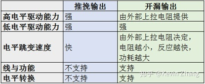

- 功耗控制
  $$
  P = K f^2
  $$

  - 对于固定硬件 $K$ 可以看作是一个常数
  - 控制功耗的方法
    1. 关闭不必要的时钟，保留中断时钟(停止时钟还可以**规避干扰**)
    2. 低电压供电

- 死机的本质

  - 只要有时钟，硬件本身不会死机
  - 程序没有按照代码流程执行(例如PC指针错误)

- 如何提高可靠性

  - 使用看门狗(WDT)

    - 实质上是一个定时计数器
    - 正常情况下可通过程序发出的清除指令清零
    - 如果出现死机会造成溢出，导致复位
    - 种类
      - 传统 WDT
        - 只有上限
      - 窗口 WDT
        - 有下限和上限

    - 硬件看门狗和软件看门狗

      > 硬件看门狗是利用一个定时器电路，其定时输出连接到电路的复位端，程序在一定时间范围内对定时器清零(俗称“喂狗”)，因此程序正常工作时，定时器总不能溢出，也就不能产生复位信号。如果程序出现故障，不在定时周期内复位看门狗，就使得看门狗定时器溢出产生复位信号并重启系统。软件看门狗原理上一样，只是将硬件电路上的定时器用处理器的内部定时器代替，这样可以简化硬件电路设计，但在可靠性方面不如硬件定时器，比如系统内部定时器自身发生故障就无法检测到。当然也有通过双定时器相互监视，这不仅加大系统开销，也不能解决全部问题，比如中断系统故障导致定时器中断失效

  - 没事时休眠

  - 利用内存可靠性高于端口的特点对

    - 输入：周期性重复配置与滤波
    - 输出：利用端口数据备份周期性刷新内容(先)与配置(后)

- 如何判断冷、热启动

  - 利用RAM特性(上电随机、复位不受影响)建立标志区，写入关键字，通过比较关键字来区分冷热启动

## ARM 架构

- Cortex 系列(ARM新的命名体系)

  - Cortex-A

    > 高性能，丰富的功能

  - Cortex-R

    > 高可靠性，高实时应用

  - Cortex-M

    > 低功耗，代替微控制器(单片机)

- SecureCore

  > 安全应用

- M3、Arm、Thumb指令集

  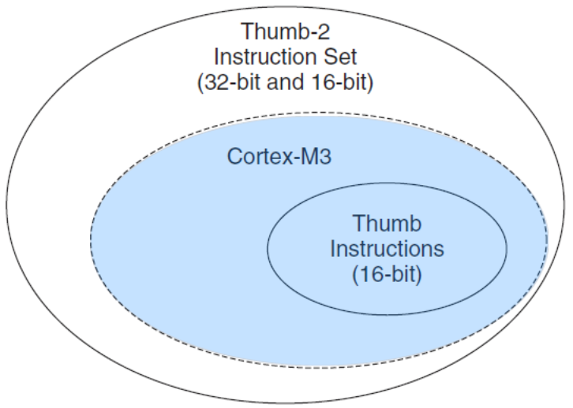

  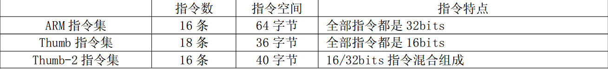

  - ARM指令集

    > 编代码全部是 32bits 的，每条指令能承载更多的信息，因此使用最少的指令完成功能， 所以在相同频率下运行速度也是最快的， 但也因为每条指令是32bits 的而占用了最多的程序空间

  - Thumb指令集

    > 编代码全部是 16bits 的，每条指令所能承载的信息少，因此它需要使用更多的指令才能完成功能， 因此运行速度慢， 但它也占用了最少的程序空间

  - Thumb-2指令集

    > 在前面两者之间取了一个平衡， 兼有二者的优势， 当一个 操作可以使用一条 32bits指令完成时就使用 32bits 的指令， 加快运行速度， 而当一次操作只需要一条16bits 指令完成时就使用16bits 的指令，节约存储空间

- Cortex-M3的

  - 架构

  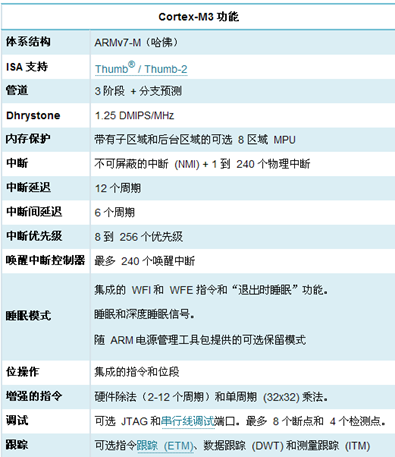

  - **==中断和异常的处理机制？==**

  - 合法的操作模式转换机制
  
  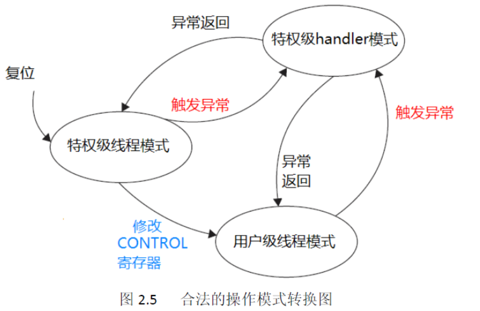
  
  - arm处理器支持两种操作模式以及两级特权操作
  
    - 操作模式
  
      - 处理者模式(handler mode)
  
        > 异常服务例程的代码，包括中断服务例程的代码
  
      - 线程模式(thread mode)
  
        > 普通应用程序的代码
  
    - 从用户级到特权级的唯一途径就是异常
  
      > 如果在程序执行过程中触发了一个异常，处理器总是先切换入特权级，并且在异常服务例程执行完毕退出时，返回先前的状态
  
- SC000、SC100、SC300的特点

  - SC000
    - 只占用 8/16 位的空间但却拥有 32 位的性能
    - 具有卓越的能效表现
    - 超低功耗
    - 容易配置
    - 向上兼容二进制的 SC300 处理器
    - 基于流行的Cortex-M0处理器
  - SC100
    - ARM 推出的第一个 SecurCore 处理器
    - 入门级安全解决方案
    - 基于ARM7TDMI
  - SC300
    - 高性能
    - 高功效
    - 容易配置
    - 适用于对安全性和性能要求较高的高端应用
    - 基于Cortex™-M3

  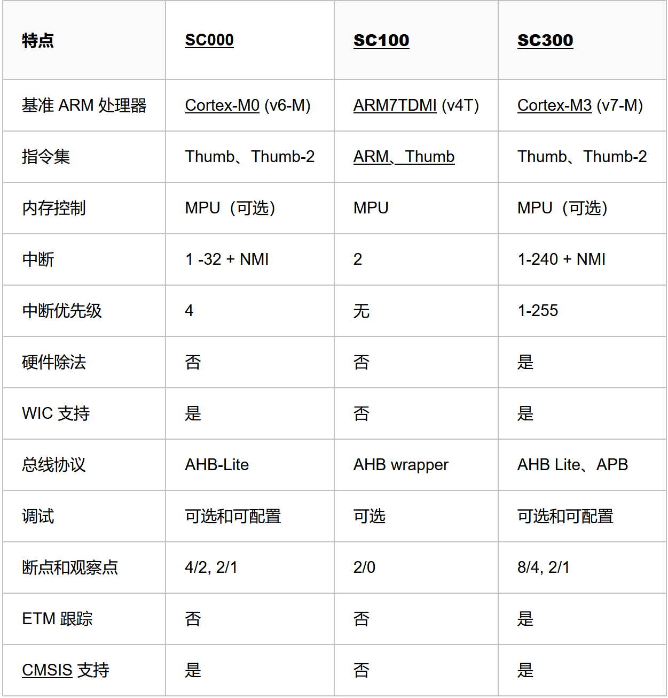

- ARM存储器
  - ARM存储器默认是小端模式，但是它也支持大端模式(P28)

    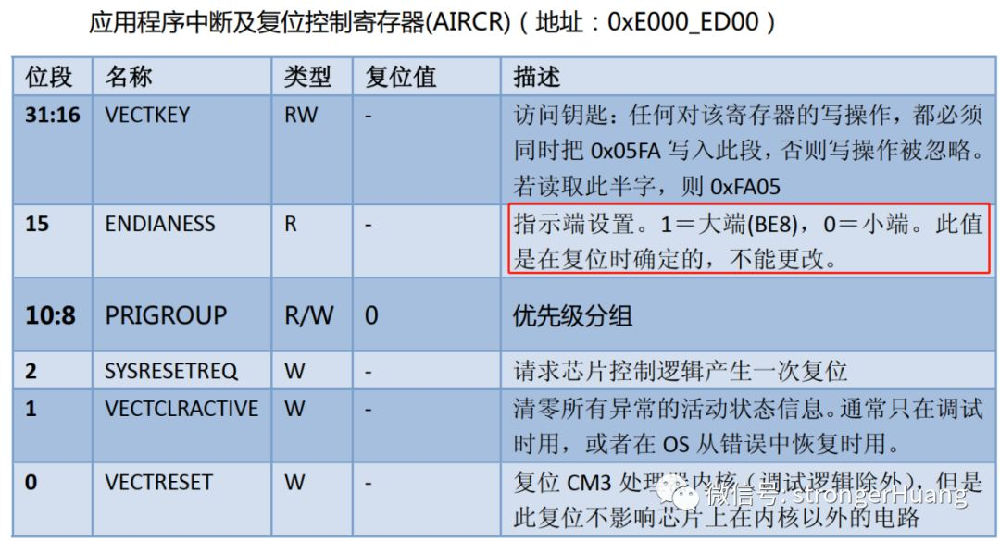

  - **==主存辅存种类？==**

- 存储系统的层次结构

  - 存储器是用来存储信息的部件，是嵌入式系统硬件中的重要组成部分。在复杂的嵌入式系统中，存储器系统的组织结构按作用可以划分为4级(寄存器、Cache、主存储器、辅助存储器)

  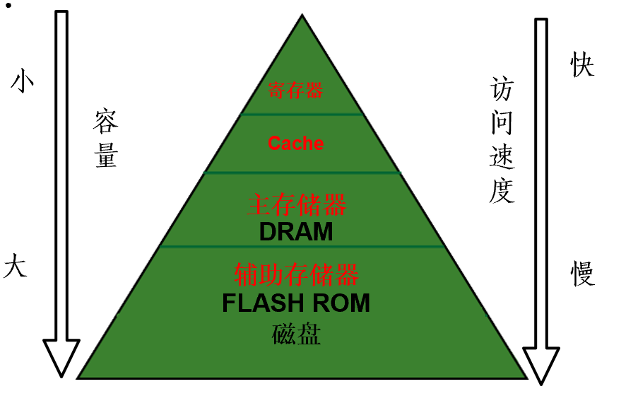

- ARM时钟及电源管理(P101)

- ARM定时技术

  - 定时器结构(P165)
  - 死区发生器作用(P170)
  - **==RTC类型？==**
  - RTC读取(P179)

- ARM中断

  - **独立向量、分组向量、统一向量**

    - 独立向量

      > 每个中断享有独立的入口地址

    - 分组向量

      > 若干中断按组共享组入口地址

    - 统一向量

      > 所有中断共享一个入口地址

  - 普通中断(IRQ)与快速中断(FIQ)(P148)

    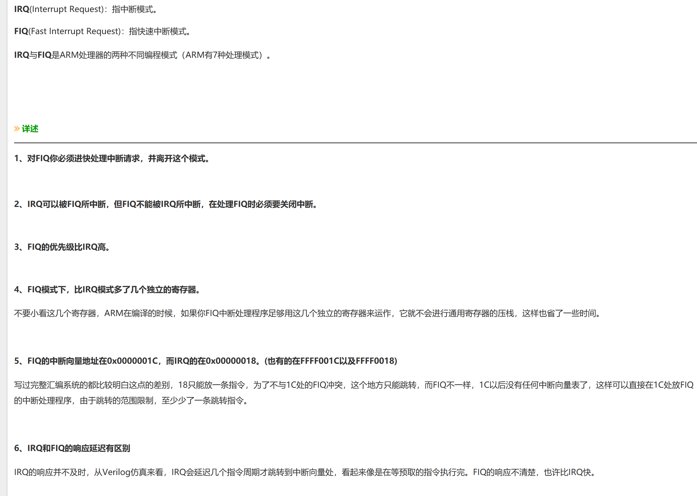

- DMA

  - 源与目的(P190)

  - **==块与字符？==**

  - 中断性能(P189)

    > 中断方式下，CPU需要执行多条指令，占用一定的时间；而DMA传输1字节只占用CPU的1个总线周期，占用CPU的时间少
    >
    > DMA的响应速度比中断快，I/O设备发出中断请求后，CPU要执行完当前指令后才给予响应并且要保护现场，而DMA请求是在总线周期执行完后即可响应

  - 对CPU时序的影响(P193)

## 接口技术

- UART

  - 按照同一时刻数据流的方向可以分为三种传输模式

    - 单工通信

      > 数据仅能从A到B进行单一方向的传输

    - 半双工通信

      > 数据可以从A到B，也可以从B到A进行传输，但不能在同一时刻进行双向传输

    - 全双工通信

      > 数据可以在同一时刻从A传输到B，或从B传输到A，即可以同时双向传输

  - 起止式异步协议

    - 数据帧格式(P205)

      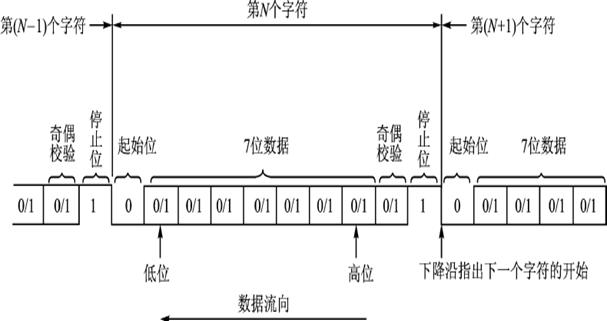

    - 异步通信是按字符传输时，每传送一个字符用起始位来通知对方，以此来重新核对收发双方同步。**起止式协议一般用在数据速率较低的场合($< 19.2 Kbps$)**

    - 每帧数据包含有起始位(0)、数据位、奇偶校验位和停止位(1)。每帧数据的传送靠起始位来同步。**一帧数据的各位代码间的时间间隔是固定的，相邻两帧的数据其时间间隔是不固定的**

    - 在异步通信的数据传输中，传输线上允许空字符。异步通信对**字符的格式、波特率、校验位**有确定的要求

    - 每个字符传送时，必须在前面加一**起始位**，后面加上1、1.5、2位**停止位**

      > 例如ASCII码传送时，一帧数据的组成是：前面1个起始位，接着7位ASCII编码，再接着一位奇偶校验位，最后一位停止位，共10位
      >
      > 停止位又叫保护时间，常用1/2位

  - 波特率(这里可以直接理解为比特率)

    > 串行通信中，每秒传送的位数即波特率(bps)
    >
    > 并行通信中，传输速率是以每秒传送传送多少个字节(Bytes/s)来表示

  - 调制与解调

    > 调制：数字信号 $\rightarrow$ 模拟信号
    >
    > 解调：模拟信号 $\rightarrow$ 数字信号
    >
    > MODEM(调制解调器)是进行数据通信所需要的设备，因此被称为数据通信设备(DCE)或数据设备(DC)

    - 调制的类型有
      - 调幅(振幅监控ASK)
      - 调频(频移键控FSK)
      - 调相(相位键控PSK)
    
  - RS232和RS485的区别
  
    - 连接方式
  
      > RS232最常用的连接方式是三根线：一条发送线、一条接收线及一条地线;RS485一般采用两线制传输
  
    - 电平信号
  
      > RS232 逻辑1为-3V～-15V，逻辑0为+3～+15V；RS485  -2V～-6V表示逻辑0，+2V～+6V表示逻辑1
      >
      > RS485接口信号电平降低了，不容易损坏接口电路的芯片，且该电平与TTL电平兼容，可方便与TTL电路连接
  
    - 传输距离
  
      > 传输距离：RS232传输距离有限，理论传输距离标准值为15米；RS485传输距离较RS232传输距离远，理论传输距离标准值为1200米
  
    - 传输数据的最大波特率
  
      > RS232 传输速率较低，最高波特率为20Kbps；RS485 传输速率比较高，可达10Mbps;传输速度也快了很多，多被运用到工程的控制信号传输
  
    - 通讯协议
  
      > RS232只支持点对点通信，RS485支持总线型式通信
  
  - **==串行通信协议应用注意事项==**
  
    - 接受与死机
      - 超时处理
      - 重新初始化
      - 接收缓冲区防止溢出
      
    - 停止位(又叫数据保护时间)位数与可靠通信(有效通信速率、保障接收方的数据处理时间)
    
    - 波特率精度($\pm 2.5\%$、外置振荡器、配置选择与通信精度)与可靠通信
      - 误差过大时需要换振荡器或者调整协议
      
    - 通信协议、帧格式、收发切换时间及校验
    
    - 帧间隔(字符帧、通信协议帧)、帧长度
    
    - 波特率与通信距离
    
      > RS485中波特率越高，能够传输的距离越短
  
- I2C

  - I2C最主要的优点是**简单性**和**有效性**

  - 总线的长度可达25英尺(约7.6米)，并且能够以100Kbps的最大传输速率支持40个组件

  - 支持**多主控**，每个设别有**唯一地址**

  - I2C总线由**数据线SDA**和**时钟SCL**构成，两个信号线必须**OC并接上拉电阻(OC开漏)**                                                                                                                                                                                                                                                                                                                                                                                                                                                                                                        

  - 格式

    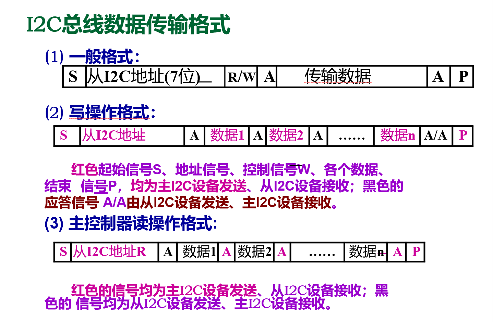

  - 总线的仲裁方式(P240)

    - **SCL线的同步**和**SDA线的仲裁**

  - **==注意事项==**

    - ACK与死机

      > 标准为永久等待，实际要加超时判错
      >
      > 帧间隔与正常通信(保护时间)
      >
      > 不是所有的芯片都支持广播地址
      >
      > 7位与10位地址
      >
      > SCL、SDA一定要开路输出(注意配置端口)
      >
      > 时钟速率与通信距离、EMC
      >
      > 结束与复位
      >
      > 方向切换时间
  
- SPI(串行外设接口总线)

  - 同步串行外设接口，用于MCU与外设以串行方式进行通信(8位数据同时同步地被发送和接受)，系统可配置为主或从操作模式
  - 最高速率5Mb/s
  - 需要四条时钟线
    - SCK(串行时钟线)
    - MISO(主机输入/从机输出数据线)
    - MOSI(主机输出/从机输入数据线)
    - CS(SS)低电平有效地从机选择线
  - **具体时序由从设备决定**
  - 对于不同的串行接口外围芯片，他们的时钟时序是不同的
  - 适用于大数据量(FLASH显示高速通信)

- 1-WIRE(单总线)

  - 略 

- 人机接口
  - 按键(P283)

    - 去抖动
    
      > 硬件方式：用R-S触发器去抖动
      >
      > 软件方式：软件延时，即从检测到有键按下，执行10~20ms的延时程序，去抖动
    
    - 延时时间：10-20ms
    
      > 前提是开关质量好，工业上一般30-40ms
    
    - 如何设计通用架构
    
      > 产测(上电计时器)
      >
      > 短按和长按
      >
      > 组合
      >
      > 按下起作用还是松开起作用
    
    - 连接方法
    
      - 独立式键盘
      - 矩阵式键盘
        - OC输出
      - AD键盘
        - 不容易做复合键
        - 需要使用金属触点开关
    
    - 常用机械种类
    
      - 机械开关
    
      - 导电橡胶
    
        > 生命周期中变化比较大
    
      - 锅仔片
    
        > 薄，按键手感较导电橡胶好
    
      - PVC按键(锅仔片，三层PVC)
    
        > 寿命短(油墨容易脱落)、老化变脆
    
      - 触摸按键
    
        - 电容式触摸按键
    
      - 触摸屏(电阻式、电容式、红外、声波表面)
    
  - LED显示(P288)

    - 独立、扫描(P289)

    - **==消隐？==**

    - 散热

      > 小部分转化为光能($\text{30%}$)，大部分转化为热能

    - 延长寿命(工作时间5000-8000h)

      > 不需要时减少亮度

    - 衰减补偿

      > 灯光变暗

    - 调光原理

      - 脉冲控制恒压调光
      - 恒流电源调光
      - 分组调控

    - 多色LED控制

      > 单色(RG)、三色(RGB)、四色(RGBW)、呼吸灯
      
    - [呼吸灯](https://baike.baidu.com/item/%E5%91%BC%E5%90%B8%E7%81%AF)

      > 呼吸灯是指灯光在微电脑的控制之下完成由亮到暗的逐渐变化，感觉好像是人在呼吸

  - 蜂鸣器

    - 一体化结构的电子讯响器

    - 分类

      - 按驱动原理分类

        - 有源蜂鸣器(自激式蜂鸣器)
        - 无源蜂鸣器(他激式蜂鸣器)

      - 按构造方式分类

        - 电磁式蜂鸣器

          > 音色好、电压低、电流大
          >
          > 多用于语音、音乐等设备

        - 压电式蜂鸣器

          > 简单耐用
          >
          > 音色差、电压高、电流小

      - 按封装不同分类

        - 插件蜂鸣器
        - 贴片式蜂鸣器

      - 按电流不同分类

        - 直流蜂鸣器
        - 交流蜂鸣器

    - 驱动电路

      - 包括一个三极管、一个蜂鸣器、一个续流二极管、一个电源滤波电容

        - 蜂鸣器

          > 其主要参数是外形尺寸、发声方向、工作电压、工作频率、工作电流、驱动方式（直流/方波）等

        - 续流二极管

          > 蜂鸣器本质上是一个感性元件，其电流不能瞬变，因此必须有一个续流二极管提供续流。否则，在蜂鸣器两端会产生几十伏的尖峰电压，可能损坏驱动三极管

        - 滤波电容

          > 滤波电容的作用是滤波，滤除蜂鸣器电流对其它部分的影响，也可改善电源的交流阻抗，如果可能，最好是再并联一个220uF的电解电容

        - 三极管

          > 三极管起开关作用

      - 安装方向与寿命

        - **垂直向下**

    - **==保护？==**

    - **==电磁干扰？==**

      - http://www.china-hudz.com/aspcms/news/2020-1-6/484.html

  - 功率驱动

    - 功率晶体管

      - 电流型、可靠性高、直流、变化速度慢

      - 工作性能高、寄生电容小、易于集成等特点。特别适合在集成电路中作功率器件

      - 应用

        > 模拟放大、开关（开关电源、电机驱动）

    - 场效应管

      - 电压型、速度快、直流、发热少
      - 输入电阻高（$10^8～10^9$Ω）、噪声小、功耗低、动态范围大、易于集成、没有二次击穿现象、安全工作区域宽等优点。现已成为双极型晶体管和功率晶体管的强大竞争者

    - 晶闸管(可控硅整流器)

      - 它有三个极:阳极，阴极和门极; 能在高电压、大电流条件下工作，且其工作过程可以控制、被广泛应用于可控整流、交流调压、无触点电子开关、逆变及变频等电子电路中
      - **==交流、单/双向、隔离（脉冲变压器、光耦）、过压/流、过零、周期/导通角控制、电压电流同步==**

    - 继电器

      - 电磁继电器

        - 动作频率： ≤5次/秒
        - 驱动及保护（保护二极管、灭弧）

      - 磁保持继电器

        - 磁保持继电器的常闭或常开状态完全是依赖永久磁钢的作用；其开关状态的转换是靠一定宽度的**脉冲电信号**触发而完成的
        - 省电、性能稳定、体积小、承载能力大

      - 固态继电器

        - 控制端与负载端的隔离用光电耦合或脉冲信号。固态继电器的**输入端用微小的控制信号，达到直接驱动大电流负载**
        - **耐振耐机械冲击**，具有良好的**防潮防霉防腐蚀**性能，在**防爆**方面的性能也极佳，输入功率小，**灵敏度高**，控制功率小，电磁兼容性好，**噪声低**和工作频率高等特点。固态继电器专用的固态继电器可以具有**短路保护，过载保护和过热保护**功能，与组合逻辑固化封装就可以实现用户需要的智能模块，直接用于控制系统中

        - 组成

          > 固态继电器由三部分组成：输入电路，隔离（耦合）和输出电路

          - 输入电路

            > 输入电路可分为**直流输入电路，交流输入电路和交直流输入电路**三种。有些输入控制电路还具有与TTL/CMOS兼容，正负逻辑控制和反相等功能，可以方便的与TTL,MOS逻辑电路连接

          - 隔离(耦合)

            > 光电耦合和变压器耦合两种

          - 输出电路

            > 大功率晶体三极管、单向可控硅、双向可控硅、功率场效应管、绝缘栅型双极晶体管（IGBT）。固态继电器的输出电路也可分为直流输出电路，交流输出电路和交直流输出电路等形式

        - 类型

          > 按**负载类型**，可分为**直流固态继电器**和**交流固态继电器**。交流固态继电器又可分为单相交流固态继电器和三相交流固态继电器。交流固态继电器，按导通与关断的时机，可分为随机型交流固态继电器和过零型交流固态继电器

    - 马达

      - 步进电机

        > **步进电机是将电脉冲信号转变为角位移或线位移的开环控制元件**。在非超载的情况下，电机的转速、停止的位置只取决于**脉冲信号的频率和脉冲数**，而不受负载变化的影响，当步进驱动器接收到一个脉冲信号，它就驱动步进电机按设定的方向转动一个固定的角度，称为"步距角"，它的旋转是以固定的角度一步一步运行的。可以通过控制脉冲个数来控制角位移量，从而达到准确定位的目的;同时可以通过控制脉冲频率来控制电机转动的速度和加速度，从而达到调速的目的

        - 时序

          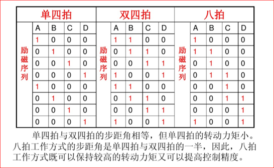

        - 失步

          - what

            > 步进电动机正常工作时，每接收一个控制脉冲就移动一个步距角，即前进一步。若连续地输入控制脉冲，电动机就相应地连续转动。**步进电动机失步包括丢步和越步**。丢步时，转子前进的步数小于脉冲数；越步时，转子前进的步数多于脉冲数。一次丢步和越步的步距数等于运行拍数的整数倍。丢步严重时，将使转子停留在一个位置上或围绕一个位置振动，越步严重时，机床将发生过冲。步进电动机是开环进给系统中的一个重要环节，其性能直接影响着数控系统的性能。电动机失步会影响数控系统的稳定性和控制精度，造成数控机床加工精度下降

          - why

            > 电机负载能力差、高速运转中电压不稳，造成输出扭矩下降，最终导至失步。转速设置过高，力矩不够。外部阻力过大、速度上升或下降过快

        - 注意事项

          > 缓升缓降、齿轮间隙、皮带张紧

      - BLDC马达

        - 接口

          > Vm（电机动力电源）、Vp（电机控制电源）、Vsp（PWW占空比调速、频率）、FG（转速脉冲，n个/转）

        - 加载时序

          > Vp加载→ Vm加载→ Vsp加载 

        - 卸载时序

          > Vsp卸载→ Vm卸载→ Vp卸载

## 嵌入式软件设计及操作系统

- 嵌入式软件设计的演变

  - **顺序**程序设计

    - 顺序调用任务，执行完一个任务后再执行下一个任务
    - 若任务长时间占用CPU，那么其他任务对外部事件的响应全部停止

  - 基于**状态机**的程序设计

    - 在主程序和任务之间增加一个接口：**任务状态控制器**。主程序只与任务的状态控制器打交道，由状态控制器负责调用任务的片段以及控制阶段的变换

    - 优点

      > 占用资源少、执行效率高

    - 缺点

      > 任务被拆离的支离破碎，流程不直观

  - 基于**简易任务调度器**的程序设计

    - 任务切换与任务调度

      - 与**顺序执行不同**的是，在执行完每个任务后，任务释放CPU，调度器分派下一个任务接管CPU

      - 与**状态机不同**的是，**状态机及主程序是任务调用者，是主动调用者，任务片段是受调用者**而任务调度器中，**任务调度者是被调用者**

        > 这种调用关系决定了任务又可以像从前顺序流程那样写成直观的任务函数

    - 任务调度的核心：**堆栈迁移**

      - 每个任务都设有一个**私有任务堆栈**，用于保存任务被折断(任务切换)时的现场

      - **堆栈迁移**

        > 堆栈是上下文切换时最重要的切换对象，这种对堆栈的切换叫**堆栈迁移**

      - 堆栈迁移有两种方式

        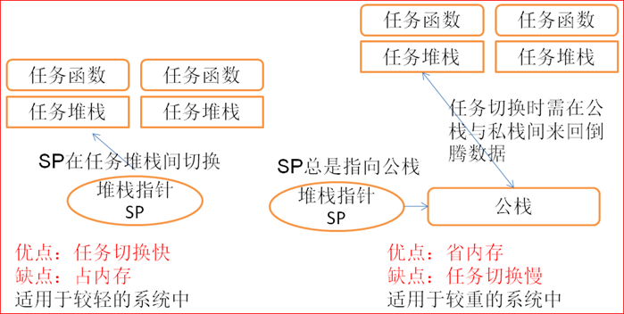

        - 栈指针切换

          > 左图使用**私栈**作为堆栈，发生任务切换时只需要将栈指针指向新任务的栈顶即可

          - 堆栈迁移速度快，只需要修改SP
          - 私栈需支撑调子函数、寄存器、局部变量、中断等
          - 使用较多内存

        - 堆栈搬移

          > 右图使用**公栈**作为堆栈，每切换一个任务就要将公栈的内容搬向私栈，并将新任务从私栈搬至公栈，然后修改栈指针指向新的栈底

          - 速度较慢，每次需要计算栈深/栈顶位置，需要搬若干字节
          - 只支撑调子函数、寄存器、局部变量、**与中断深度无关**

      - 调度器种类

        - 合作式调度器

          

          - 实时性不好

        - 抢占式调度器

          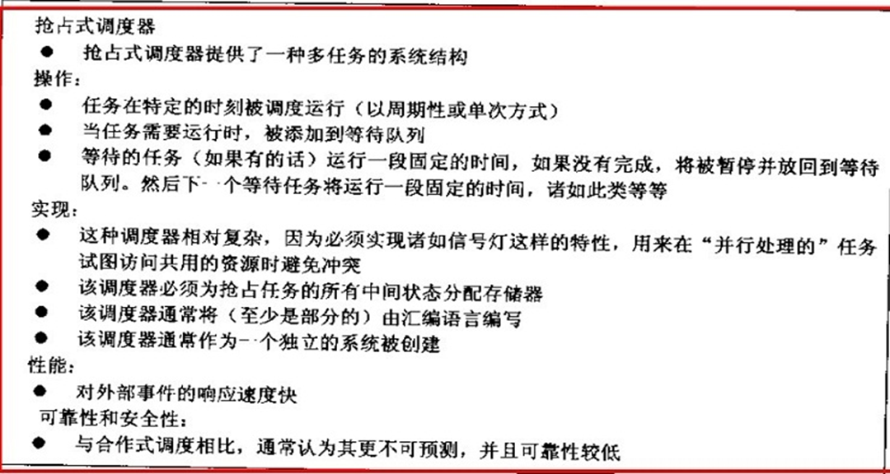

          - 调试困难

        - 混合式调度器

          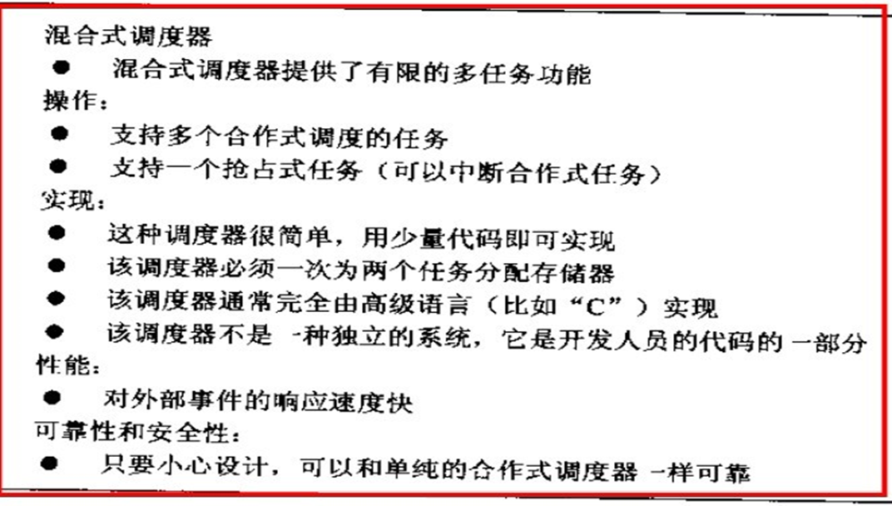

          - 在满足条件的情况下，应当尽量减少抢占任务

  - 基于**操作系统**的程序设计

    - 嵌入式操作系统简介

      - 分时系统

        > 软件的执行在时间上的要求并不严格，时间上的错误一般不会造成灾难性的后果

      - 实时系统

        > 虽然事件可能在无法预知的时刻到达，但是软件上必须在事件发生时能够在严格的时限内作出响应（系统响应时间），即使是在尖峰负荷下，也应如此，**系统时间响应的超时就意味着致命的失败**。另外，实时操作系统的重要特点是具有**系统的可确定性**，即系统能对运行情况的最好和最坏等的情况能做出精确的估计

        - 基本概念

          - 两种类型

            - 软实时系统

              > 各个任务运行得越快越好，并不要求限定某一任务必须在多长时间内完成

            - 硬实时系统

              > 各个任务不仅要执行无误而且要做到准时

          - 大多数系统是二者的结合

          - 实时应用软件的设计一般比非实时应用软件设计难

        - 时钟节拍

          > 时钟节拍是特定的周期性中断。这个中断可以看作是系统心脏的脉动。周期取决于不同应用，一般在10ms到200ms之间。时钟的节拍式中断使得内核可以将任务延时若干个整数时钟节拍，以及当任务等待事件发生时，提供等待超时的依据。时钟节拍率越快，系统的额外开销就越大

        - 实时操作系统中的重要概念

          - 系统响应时间

            > 系统发出处理要求到系统给出应答信号的时间

          - 任务切换时间

            > 任务之间切换而使用的时间

          - 中断延迟

            > 硬件接收到中断信号到操作系统作出响应，并转入中断服务程序的时间

        - 代码的临界段

          > **代码的临界段也称为临界区，指处理时不可分割的代码**。一旦这部分代码开始执行，则不允许任何中断打入。为确保临界段代码的执行，在进入临界段之前要关中断，而临界段代码执行完以后要立即开中断

          - 代码的临界段要防止**数据撕裂**(例如：避免大于CPU位宽的数据、大于CPU位宽的定时器访问)
          - **临界段代码影响中断响应时间**(需要关中断)

        - 资源

          > 任何为任务所占用的实体都可称为资源

          - 资源可以是硬件设备，也可以是软件、存储空间

            > 例如打印机、键盘、显示器、函数、变量、结构体或数组等都可以是资源

          - 共享资源

            > **可以被一个以上任务使用的资源叫做共享资源**。为了防止数据被破坏，每个任务在与共享资源打交道时，必须独占该资源。这叫做互斥（*mutual exclusion**）*

        - 任务

          > 任务，也称作一个线程，是一个简单的程序，该程序可以认为CPU完全只属于自己。实时应用程序的设计过程，包括如何把问题分割成多个任务，每个任务都是整个应用的某一部分，每个任务被赋予一定的优先级，有自己的CPU寄存器映射空间和栈空间

          - 任务优先级

            > 每个任务都有其优先级。任务越重要，赋予的优先级应越高

            - **静态优先级**

              > 应用程序执行过程中诸任务优先级不变，则称之为静态优先级。在静态优先级系统中，诸任务以及它们的时间约束在程序编译时是已知的

            - **动态优先级**

              > 应用程序执行过程中，任务的优先级是可变的，则称之为动态优先级。**实时内核应当避免出现优先级反转问题**

            - **优先级反转**

              > **优先级反转问题是实时系统中出现最多的问题**。为防止发生优先级反转,内核能自动变换任务的优先级,这叫做优先级继承(Priority inheritance) 

            - 优先级分配

              - **给任务定优先级是复杂的事**，因为实时系统相当复杂。许多系统中，并非所有的任务都至关重要。不重要的任务自然优先级可以低一些。实时系统大多综合了软实时和硬实时这两种需求。**软实时系统**只是要求任务执行得尽量快，并不要求在某一特定时间内完成。**硬实时系统中**，任务不但要执行无误，还要准时完成

              - **单调执行率调度RMS(Rate Monotonic Scheduling)**,用于分配任务优先级。这种方法基于哪个任务执行的次数最频繁,执行最频繁的任务优先级最高

          - 5种状态

            - 休眠态

              > 该任务驻留在内存中，但并不被多任务内核所调度

            - 就绪态

              > 任务准备运行，但优先级比运行任务低，暂时不能运行

            - 运行态

              > 任务是指该任务掌握了CPU的控制权，正在运行中

            - 挂起态(等待事件态)

              > 指该任务在等待某一事件的发生，（例如等待某外设的I/O操作，等待某共享资源由暂不能使用变成能使用状态，等待定时脉冲的到来或等待超时信号的到来以结束目前的等待，等等）

            - 被中断态

              > 发生中断时，CPU提供相应的中断服务，正在运行的任务暂不能运行，就进入了被中断状态

          - 切换(Context Switch)

            > 当多任务内核决定运行另外的任务时，它保存正在运行任务的当前状态（Context），即CPU寄存器中的全部内容。这些内容保存在任务的当前状况保存区（Task’s Context Storage area），也就是任务自己的栈区之中。入栈工作完成以后，就是把下一个将要运行的任务的当前状况从该任务的栈中重新装入CPU的寄存器，并开始下一个任务的运行。**这个过程叫做任务切换**

            - 任务切换过程增加了应用程序的额外负荷。CPU的内部寄存器越多，额外负荷就越重

            - 做任务切换所需要的时间取决于CPU有多少寄存器要入栈。**实时内核的性能不应该以每秒钟能做多少次任务切换来评价**

        - 调度

          > 这是内核的主要职责之一，就是要决定该轮到哪个任务运行了。**多数实时内核是基于优先级调度法的**。每个任务根据其重要程度的不同被赋予一定的优先级

          - 基于优先级的调度算法

            > CPU总是让处在就绪态的优先级最高的任务先运行

          - 不可剥夺型内核(**中断返回时操作系统不进行调度**)

            - 不可剥夺型内核要求每个任务**自我放弃CPU的所有权**，也称作合作型多任务，各个任务彼此合作共享一个CPU。异步事件还是由中断服务来处理。中断服务以后控制权还是回到原来被中断的任务，直到该任务主动放弃CPU的使用权时，那个高优先级的任务才能获得CPU的使用权
            - 不可剥夺型内核的一个优点是**响应中断快**。不可剥夺型内核**允许使用不可重入函数**。因为每个任务要运行到完成时才释放CPU的控制权。任务级响应时间取决于最长的任务执行时间
            - 不可剥夺型内核的另一个优点是**几乎不需要使用信号量保护共享数据**。运行着的任务占有CPU，而不必担心被别的任务抢占。但这也不是绝对的。处理共享I/O设备时仍需要使用互斥型信号量。例如，在打印机的使用上，仍需要满足互斥条件
            - 不可剥夺型内核的**最大缺陷在于其响应时间**。高优先级的任务已经进入就绪态，但还不能运行，要等，也许要等很长时间，直到当前运行着的任务释放CPU。与前后系统一样， 不可剥夺型内核的任务级响应时间是不确定的
            - **商业软件几乎没有不可剥夺型内核**

          - 可剥夺型内核(**中断返回时操作系统进行以此调度**)

            - **可剥夺型内核总是让就绪态的高优先级的任务先运行**，中断服务程序可以抢占CPU，到中断服务完成时，内核让优先级最高的就绪任务运行（不一定是被中断了的任务）。任务级系统响应时间得到了最优化且是可知的。**使用可剥夺型内核使得任务级响应时间得以最优化**
            - 使用可剥夺型内核时，应用程序不应直接使用不可重入型函数。**调用不可重入型函数时，要满足互斥条件**，这一点可以用互斥型信号量来实现。如果调用不可重入型函数时，低优先级的任务CPU的使用权被高优先级任务剥夺，不可重入型函数中的数据有可能被破坏

          - 可重入性

            - **可重入型函数可以被一个以上的任务调用**，而不必担心数据的破坏。可重入型函数任何时候都可以被中断，一段时间以后又可以运行，而相应数据不会丢失。**可重入型函数或者只使用局部变量**，即变量保存在CPU寄存器中或堆栈中。**如果使用全局变量，则要对全局变量予以保护**
            - **应用程序中的不可重入函数引起的错误很可能在测试时发现不了**，直到产品到了现场问题才出现。如果在多任务上您还是把新手，**使用不可重入型函数时，千万要当心**

          - 时间片调度

            - **给任务分配优先级相当困难**
            - 两个或两个以上任务有同样优先级，内核允许一个任务运行事先确定的一段时间，叫做**时间额度**（quantum），然后切换给另一个任务。也叫做**时间片调度**。内核在满足以下条件时，把CPU控制权交给下一个任务就绪态的任务
              - 当前任务已无事可做
              - 当前任务在时间片还没结束时已经完成
              - 当前任务时间片时间到

        - 死锁

          > 指两个任务无限期地互相等待对方控制着的资源。设任务T1正独享资源R1，任务T2在独享资源R2，而此时T1又要独享R2，T2也要独享R1，于是哪个任务都没法继续执行了，发生了死锁

          - 最简单的防止死锁的方法是让每个任务都
            1. 先得到全部需要的资源再做下一步的工作
            2. 用同样的顺序去申请多个资源
            3. 释放资源时使用相反的顺序
            4. 内核大多允许在申请信号量时定义等待超时，以化解死锁

        - 中断

          - 中断响应时间、中断处理时间、中断恢复时间(**PPT 实时操作系统基础知识P40**)
          - 非屏蔽中断(**PPT 实时操作系统基础知识P45**)
          - 影响中断事件的处理方法(**PPT 实时操作系统基础知识P46**)
          - **==相对时间和绝对时间？==**
          - 对存储器的需求(**PPT 实时操作系统基础知识P48**)

        - 实时内核的优缺点(**PPT 实时操作系统基础知识P50**)

        - 什么时候使用RTOS(**PPT 实时操作系统基础知识P52**)

        - **==嵌入式Linux(种类、启动、存储及文件系统、写均衡)？==**

- 嵌入式软件架构与层次

  > 分层便于在不同的CPU、不同OS间移植，节省开发时间，提高软件可靠性

  - 硬件层

    > 处理器，存储器、通用设备接口（例如通信模块）和I/O接口、扩展设备接口以及电源等

  - 驱动层

    > 包含硬件抽象层HAL、板级支持包BSP和设备驱动程序

  - 系统层

    > RTOS、文件系统、GUI、网络系统及通用组件模块组成

  - 应用层

    > 基于实时系统开发的应用程序组成

- 代码优化(**嵌入式软件设计PPT P4**)

  - 优化永远是追求一种平衡，而不是走极端

  - 充分利用硬件

    - 最大可能地利用各种硬件设备自身地特点来减小其运转开销
    - 减少中断次数(例如通信Buf)
    - 利用DMA传输方式

  - 变量类型

    - 变量类型选取地范围越小运行速度越快，占用地内存越少

    - 应该按照实际需要合理地选用数据类型

      > 能够使用字符型(char)定义地变量，就不要使用整型(int)变量来定义
      >
      > 能够使用整型变量定义的变量就不要用长整型(long int)
      >
      > 能不使用浮点型(float)变量就不要使用浮点型变量

    - 相同类型的数据类型，有无符号对机器代码长度也有影响

    - 在定义变量后不要超过变量的作用范围

  - 算法优化

    > 算法优化指对程序时空复杂度的优化

    - 在 PC 机上进行程序设计时一般不必过多关注程序代码的长短，只需考虑功能的实现，**但嵌入式系统就必须考虑系统的硬件资源**，在程序设计时,应尽量采用生成代码短的算法，在不影响程序功能实现的情况下优化算法
    - 减少运算强度
      - 查表
      - 求余运算
      - 平方运算
      - 用移位实现乘除法，避免不必要的整数除法
      - 提取公共的子表达式

  - 使用宏提高程序的时间效率

  - 内嵌汇编

    > 对时间要求苛刻的部分可以用内嵌汇编来写，以带来速度上的显著提高和**确定的时间要求**

  - 80-20原则

    > **即20%的程序消耗了80%的运行时间**,因而我们要改进效率,最主要是考虑改进那20%的代码

  - 提高循环语言的效率

    - 在多重循环中，应将最长的循环放在最内层，最短的循环放在最外层。这样可以减少CPU跨切循环的次数
    - 充分分解小的循环
    - 公共表达式放在循环外
    - 使用指针，减少使用数组
    - 判断条件用0(利用自减延时函数)
    - do...while编译后的代码长度短于while
    - for(;;)编译后的代码长度短于while(1)
    - 循环展开
    - 相关循环放到一个循环里

  - 提高switch的效率

    > Switch 可能转化成多种不同算法的代码。其中最常见的是**跳转表**和**比较链/树**

    - 当switch用比较链的方式转化时，编译器会产生if-else-if的嵌套代码，并按照顺序进行比较，匹配时就跳转到满足条件的语句执行。所以可以对case的值**依照发生的可能性进行排序，把最有可能的放在第一位**，这样可以提高性能

    - 在case中推荐使用小的连续的整数（枚举），因为在这种情况下，编译器可能会把switch 转化成**跳转表**
    - 将大的switch语句转为**嵌套switch语句**，当switch语句中的case标号很多时，为了减少比较的次数，明智的做法是把大switch语句转为嵌套switch语句。**把发生频率高的case标号放在一个switch语句中，并且是嵌套switch语句的最外层，发生相对频率相对低的case标号放在另一个switch语句中**

  - 其他

    - **用 $\ge$ 和 $<$ 来做判断，充分利用PSW标志位**
    - 使用自增、自减和复合赋值运算符
    - 避免浮点运算
    - 优化赋值语句
    - 使用Thumb指令集

  - 函数优化

    - inline 函数

      > 这个关键字请求编译器用函数内部的代码替换所有对于指出的函数的调用

      - 省去了调用指令需要的执行时间
      - 省去了传递变元和传递过程需要的时间

      > 使用这种方法程序长度变大了，因此需要更多的ROM。使用这种优化在Inline函数频繁调用并且只包含几行代码的时候是最有效的

    - 不定义不使用的返回值

    - 减少函数调用参数

    - 所有函数都应该有原型定义

    - 参数及返回值参数尽量同MCU字宽

    - 临时变量要少，可使用寄存器

    - 尽可能使用常量

    - 把本地函数声明为静态的

  - 变量

    - 使用寄存器变量
    - 在最内层循环避免使用全局变量和静态便令
    - 同时声明多个变量由于单独变量声明
    - 短变量名优于长变量名，应尽量使变量名短一点
    - 在代码开始前声明变量
    - 使用尽量小的数据类型

  - **尽量避免使用标准库**

    - 使用标准库可以加快开发进度,但由于标准库需要处理用户所有可能遇到的情况,**所以很多标准库代码很大**
    - **很多标准库使用资源情况不清晰**（比如栈、执行时间和效率）

  - 采用数学方法优化程序

    - 数学公式
    - 减少除法和取模运算
    - 使用位操作代替除法，与操作代替取模
    - 优化算法和数据结构对提高代码的效率有很大的帮助。**有时候时间效率和空间效率是对立的**,此时应分析哪个更重要, 做出适当折中
    - 在进行优化的时候不要片面的追求紧凑的代码,因为紧凑的代码并不能产生高效率的机器码
    - 避免递归计算

  - 存储器分配

    - 全局变量和静态变量可直接寻址，速度快；动态变量一般间接寻址，速度慢
    - **提高内存使用效率**在程序中应尽量使用局部变量
    - **提高时间效率**在程序中应尽量使用全局变量和静态变量
    - 使用 malloc 函数申请内存之后一定要用 free 函数进行释放
    - 充分利用**结构体和联合**类型

  - 平衡

    - 代码长度/内存使用/执行效率需要平衡
    - 现在的 C 编译器会自动对代码进行优化,但这些优化是对执行速度和代码长度的平衡，**不同编译器代码优化策略不同，效果差异大**
    - 若要获得更好代码优化,需要**手工对代码进行优化**
    - **一般来说编程技巧对代码的优化贡献是20%；算法和数据结构对代码的优化贡献是80%**
    - 代码优化可能**影响代码可读性和可维护性**
    - **能量优化**嵌入式代码优化的新方向

- 嵌入式软件的可靠性(**嵌入式软件设计 PPT P19**)

  - 程序存储器
    - **复位区分**
      - 上电复位、WDT复位、软件复位、欠压复位
      - 根据标志位做到**透明恢复**
    - 自减测试
      - 开机自检、周期自减、接线检查
    - 参数入口/出口检查
    - **代码入口/出口执行队列检查**
    - **代码陷阱与错误捕获**
      - 关键位置和未用空间使用NOP来避免PC错误
    - 临界代码
    - WDT
      - 硬件WDT、软件WDT、窗口WDT
    - **SLEEP降低功耗、躲避干扰**
    - **时钟变频抗干扰**(一定程度上抵御测信道攻击)、**内部时钟校准与同步**
    - 周期性校正与标定(特别是传感器)
    - **外设复位**与控制(复位延时)
    - **时间限制(超时处理)**与延时(**绝对时间与相对时间**)
  - RAM
    - 采用**数据单元**(数据+校验码)存储关键的数据，存储密文
    - **多编码备份**(降低全错的概率)
      - 物理空间应相隔尽可能远
    - **冷热启动**
      - 标志位与内存特征字
    - 内存清理
      - 申请与释放、碎片管理
    - **堆栈与通信区防止溢出**
    - 临界代码
  - 不挥发存储器EEPROM/FLASH
    - **数据单元**
    - **多编码备份**(注意距离)
    - **密文存储**
    - **==放拔处理==？**
    - **==寿命与页面管理==？**
  - 输入
    - **周期性重复配置**
    - 周期性输入与**滤波**
      - 程序判断、算术平均、加权平均、去极值算数平均、低通/高通/带通滤波
    - 寿命管理(例如按键次数)
    - 时间限制(超时处理)与延时(绝对时间与相对时间)
  - 输出
    - **内存可靠性高于端口**
      - 利用端口数据备份周期性刷新**内容与配置**(**注意先刷新内容再刷新端口**)
      - 寿命管理(例如LED、马达、喇叭)
      - 输出与反馈
      - 时间限制(超时处理)与延时(绝对时间与相对时间)

## 旁路攻击SCA及防御

- 密码攻击

  - 数学攻击

    - 以**线性攻击**和**差分攻击**为代表的传统密码分析方法，利用加密算法的统计特性，通过分析选择的明密文对来获取密钥
    - **实施这类攻击通常需要俘获和处理异常巨大的数据量，在现实中并不总是可行**

  - 实体攻击

    > 通过去除芯片或电路的封装，观察、操纵和干预系统内部芯片的某些点的状态及芯片与外围电路之间的通讯来获得信息；或者通过改变电路结构，直接获取存储数据等

    - 攻击方法

      - 微探针技术

        > 攻击者通常在去除芯片封装之后，通过恢复芯片功能焊盘与外界的电气连接，最后可以使用微探针获取感兴趣的信号，从而分析出电路的有关设计信息和存储结构，甚至直接读取出存储器的信息进行分析 

      - 版图重构

        > 利用高倍光学及射电显微镜研究电路的连接模式，可以迅速识别芯片上的一些基本结构，如数据线、地址线、控制线 、RNG等。其结果是存储内容被攻击者非法获得，旁路某些敏感电路 

  - 实现攻击

    > 加密算法的实现电路经常会泄露一些有用信息，这些信息能够被用来分析加密算法的敏感数据或密钥，这即是实现攻击

    - 分类

      - 主动攻击(失效分析攻击)

        - 是一种侵入式攻击，通过**引入故意错误**如数据抖动、电源或时钟突变来影响加密电路的正常运算过程，从而分析出密钥

        - 已知干扰方式

          - 时钟信号短暂扰动；电源供应短暂扰动；外部电磁场短暂扰动；光、温度、射线等扰动

          - **时钟信号扰动**是目前最容易和最有效的干扰方式

        - 干扰攻击目的(**PPT 旁路攻击SCA及防御 P11**)

        - 干扰攻击机理(**PPT 旁路攻击SCA及防御 P12**)

      - 被动式攻击(旁路攻击SCA)

        > 它是指加密系统能够以各种形式泄漏信息，比如**温度、声波、能量耗散、执行时间、电磁泄漏和光信号等**，通过提取加密电路中的泄漏物理量，分析泄漏物理量变化规律来从而分析出密钥

        - 旁道攻击不同于传统经典的、专注于数学理论而对密码系统进行研究的方式，而是一种针对密码系统实现上的物理攻击方式。**但它既没有系统的攻击方式，也没有系统的解决方法**

        - 常用攻击方法

          - 利用电磁辐射的**电磁攻击方法**

            > 电磁信号的噪声比能量信号的噪声小，保留了泄露的秘密密钥的模式

          - 利用能量消耗的**能量攻击方法**

            > 能量信号暴露了芯片在该位置的的电位差

          > 电磁攻击和能量攻击这两种攻击方法可以互相补充，有时可以联合使用

        - 旁路攻击是基于**统计理论**的**物理攻击方法**

        - **旁路攻击的必要条件**

          - **有足够多的采样样本**
          - 各密钥相关状态的**准确采样值**

        - 攻击可分为两个阶段

          - 泄露信息的**采集**阶段
          - 密钥**分析**阶段

        - **旁路攻击分类**

          - 时间攻击
          - 故障攻击
          - 功耗攻击
          - 电磁攻击
          - 声音攻击
          - 可见光攻击
          - 组合分析攻击

          > 在诸多旁路攻击手段中，**能量攻击和电磁攻击最为强大和高效**

        - **旁路攻击分析技术**

          - 故障分析技术
          - 侵入分析技术
          - 时间分析技术
          - 简单功耗分析技术
          - 差分功耗分析技术
          - 电磁辐射分析技术
          - 高阶差分技术
          - 汉明差分技术
          - 模板分析技术

      - **对旁路攻击的防御技术**

        - **防御立足点就是破坏旁路功耗分析的两个必要条件**

          - **消除**密码算法实现中的信息**泄露**
          - **增加**攻击的**难度**
            - 增加噪声
            - 减少有效信息量

        - **关于旁路信息泄露的几条公理**

          - 计算并且只有计算才能产生泄漏信息
          - 相同的计算在不同的计算机上泄漏的信息不同
          - 信息泄漏与选择的测量方法密切相关
          - 所有的旁路泄漏信息都与计算机内部配置相关

        - **已有的抗攻击研究**

          > 已有的抗攻击研究主要可以分为**算法级和电路级**。现有的比较有效的方法是算法级掩码和电路级的双轨和掩码技术

          - **电路级抗攻击**

            - 目前电路级的安全措施主要利用了3个技术

              - **互补电路**
              - **电路级Masking**
              - **预充电**

            - **利用噪声发生器产生随机的噪声**

              > 加入到可能会被攻击的信号端，以降低功耗分析的信噪比，从而使得功耗分析的攻击方法变得更加困难。但是该方法存在一些缺陷，攻击者可以通过更多的采样和信号处理等方法完成对硬件的攻击

            - **异步电路**

              > 由于其在平均功耗、能量信号的峰值以及电磁辐射等方面的优势，使得它在抵御功耗分析方面也有作用，但由于芯片设计中异步电路本身运用的不是很广泛，相关的设计软件也不是很齐全，这为异步电路在安全芯片中的应用带来了不小的麻烦

            - **双轨技术**

              > 通过加入一个互补电路，平衡了逻辑0 和逻辑1 的功耗，从而破坏了第一个必要条件；而掩码技术通过内部引入随机数，使得内部数据也具有随机特性，从而破坏了第二个必要条件

          - **对旁路攻击的软件防御**

            - 使用软件方法应对硬件攻击的关键就是要看到

              - **任何硬件攻击都不能随意改变自身的运行方式，这也是"软件防御"思想的基本内涵**

            - 主要方法

              - 数据冗余

                > **使用数据单元、多备份**
                >
                > 为防止硬件攻击行为修改存储体上的静态数据和程序代码, 可以**在存储数据(及程序代码)的时候增加一定长度的冗余数据, 用来保证数据的完整性**。一种简单的方法就是在每组数据的后面增加**循环冗余码**。如果对于数据完整性有着更加严格的要求, 可以采用一个简单的哈希函数计算出每组数据的杂凑值。**通过数据冗余, 还可以有效地防止主动攻击对关键数据的修改**(比如安全位、指令下载控制位等), 并且由于仅仅是对数据存储格式的变化, 这种措施可以在不影响程序结构的情况下, 加固安全性

              - 控制冗余

                > **前序执行顺序、入口检查**
                >
                > **控制冗余的主要思想就是在包含有关键代码的函数中添加多重控制, 以最大程度上保证程序执行是处于完全安全、可信的环境之中。比如, 设置多个状态位, 在程序的执行过程中不断检查这些状态位的状态, 如果有一个发生了改变, 程序马上退出执行**

              - 执行冗余

                > 对密码算法中**独立**的(逻辑上没有继承关系、时间上没有先后关系)的代码**按随机顺序执行**
                >
                > **对同一个功能构造多个不同但是等价的实现**，实现随机选择执行
                >
                > **随机延时和随机功耗插入**
                >
                > 未用资源的随机介入
                >
                > SLEEP躲避
                >
                > 数据单元的等价实现、同步及随机访问

              - 特定加密算法的安全实现

            - **软件防御技术关键是代码分块的粒度粗细和等价实现的数量**

## 工业控制系统信息安全

- 工业控制系统(ICS)是综合集成了计算机、网络、现代通信、微电子以及自动化技术、是对多种控制系统的总称，包括

  - 可编程逻辑控制器(PLC)

    > PLC单纯的实现逻辑功能和控制，不提供人机界面，实现操作需借助与按钮指示灯、HMI以及SCADA系统，PLC实现单机及简单控制

  - 监控和数据采集(SCADA)系统

    > SCADA是对分布距离远，生产单位分散的生产系统的一种数据采集、监视和控制系统，SCADA作为生产管理级上位监控

  - 分布式控制系统(DCS)

    > nDCS兼具PLC和SCADA二者功能，但是基本上用在比较大的系统中和一些控制要求高的系统中，实现复杂控制；（Honeywell等）

- 工业控制系统的特点

  - **实时性**要求高，强调I/O能力
  - **可用性**要求高，系统一旦上线，不能接受重新启动之类的响应，中断停机必须有计划(例如检修)
  - 工控硬件要求**寿命长、可靠性高**，放电磁干扰，防爆，防尘等要求非常严格
  - **协议私有**，不同厂商控制设备采用不同通信协议，很多协议不公开
  - 工控系统上线生产后，一般不会调整
  - 工控系统要求**封闭性**比较强

- 工业控制系统功能层次

  > 从上到下分为5个层级，不同层级实时性要求不同

  - **企业资源层**

    > 包括ERP系统功能单元，用于为企业决策层员工提供决策运行手段

  - **生产管理层**

    > 包括MES系统功能单元，用于对生产过程进行管理，如制造数据、生产调度管理等

  - **过程监控层**

    > 包括监控服务器与HMI系统功能单元，用于对生产过程数据进行采集与监控，并利用HMI系统实现人机交互

  - **现场控制层**

    > 包括各类控制器单元，如PLC、DCS控制单元等，用于对各执行设备进行控制

  - **现场设备层**

    > 包括各类过程传感设备与执行设备单元，用于对生产过程进行感知与操作

- 工控系统安全威胁

  - 震网病毒

    > 世界上首个专门针对ICS编写的病毒

  - 工业控制系统安全事件(**PPT工业控制新系统信息安全 P18**)

  - **"两化"融合**

    - 信息化带动了工业化，工业化促进了信息化，产生了新型工业化，同时也把传统IT风险延伸到了工控系统

    - 使工控系统面临来自经营管理网和互联网的威胁

  - **来自于工控系统内网的威胁**

    - 操作系统漏洞已知与**无法修复的尴尬**
    - 病毒木马横行与**无法杀毒的尴尬**
    - 非工控应用软件的存在，带来的**未知风险**
    - **移动介质**的随意使用带来的风险
    - **移动笔记本**随意接入带来的风险
    - 工业**无线网络**边界不可见与非法接入不可控风险

- 工控系统的脆弱性

  > 工业控制应用系统几乎是传统IT信息系统的拷贝，但**安全防护远远落后于传统IT系统**的安全防护

  - 由于**兼容性**问题，系统补丁和杀毒软件等安全措施不到位，使系统的脆弱性得以放大
  - 相对于传统IT软件，工业控制系统组态软件、PLC嵌入式系统等**在设计过程中主要考虑可用性、实时性，对安全性考虑不足**
  - 工控系统通信协议**缺乏授权与加密**、**缺乏对用户身份的鉴别和认证等安全机制**
  - 相对于信息系统用户来说，**工控系统用户安全意识更加薄弱**
  - **缺乏完善的管理**，工业控制系统安全不仅是一个技术问题，更是一个**管理问题**，需要完善的工业控制系统安全政策、标准、制度和安全意识来支撑

- 工控系统安全理念(**PPT工业控制系统信息安全 P40**)

  - 白名单
  - 层次化
  - 边缘化
  - 透明化

- 工控系统安全策略(**PPT工业控制系统信息安全 P46**)

  - 纵向分层

    - 三层架构、二层防护
      - 经营管理层与生产控制层之间的防护
      - 生产控制层与生产过程层之间的防护

  - 横向分域

    - 不同的车间、不同的生产线进行逻辑隔离

    > **分层分域的目的就是进行安全隔离防护**

  - 可用性监控

  - 网络行为监控

  - 工控系统指令监控

- **国际上有两种不同的工控系统信息安全解决方案**

  - **主动隔离**式解决方案

    > 即**相同功能和安全要求的设备放在同一区域内**，区域间通信靠**专有管道**执行，通过对管道的管理来阻挡非法通信，保护网络区域及其中的设备。
    >
    > 其典型代表是加拿大 Byres Security 公司推出的 Tofino 工控系统信息安全解决方案

  - **被动检测**式解决方案

    > 被动检测式解决方案**延续了 IT 系统的网络安全防护策略**。由于 IT 系统具有结构、程序、通信多变的特点，所以除了身份认证、数据加密等技术以外，多采用病毒查杀、入侵检测等黑名单匹配的方式确定非法身份，通过**多层次的部署**来加强网络信息安全。
    >
    > 其典型代表是美国 Industrial De-fender 公司的工控系统信息安全解决方案

  - 比较

    > 相比较而言，**主动隔离式方案主要对网络交通进行管理**，而**被动检测式方案更侧重于对应用程序的监控**。二者都可以达到较好的安全防御效果，需要根据不同的行业领域或应用场景来选择应用

- **安全不是一个结果，而是一个过程**

  > 总之，21 世纪工业文明的特征是数字化、网络化和信息化，网络的快速发展为各种信息安全威胁打开了方便之门。面对越来越频繁发生的工业信息安全事件，当前首要的任务是充分认识到问题的迫切性和后果的严重性。同时，更要认识到工控系统信息安全不是一个单纯的技术问题，而是涉及到多方面的动态系统工程，需要在整个工业基础设施生命周期的各个阶段中持续实施

## TrustZone 技术

- **尽量不影响原有处理器设计的情况下提高系统的安全性**

- **ARM TrustZone技术是系统范围的安全方法**

- ** 从ARMv7架构(PPT上有误)**的处理器就已经集成了TrustZone技术，**主要应用于Cortex-A和Cortex-M系列处理器**

- 硬件架构

  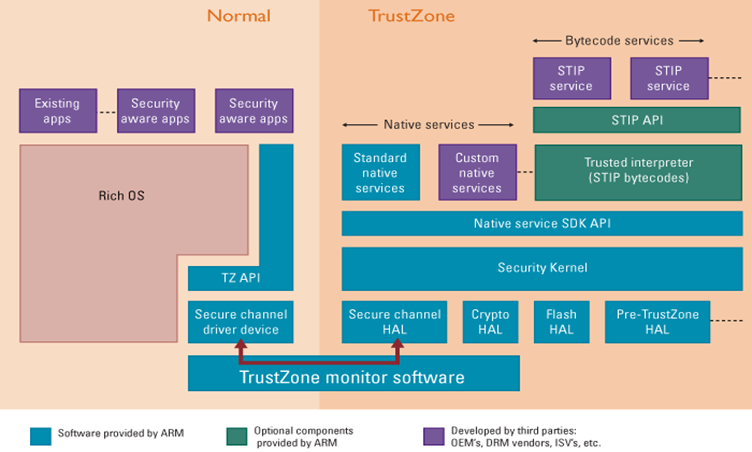

  - **将CPU内核隔离成安全和普通两个区域**，即单个的物理处理器包含了两个虚拟处理器核：**安全处理器核和普通处理器核**
  - **高性能安全软件与普通区域操作环境如何同时运行？**
    - 引入一个特殊的机制——**监控模式**，监控模式是管理安全与普通处理器状态切换的一个强大的安全网关。在大多数设计中，它的功能类似传统操作系统的上下文切换，确保切换时能安全的保存处理器切换前的环境，并且能够在切换后的环境正确的恢复系统运行
  - **普通环境和安全环境如何进入监控模式？**
    - 普通环境想要进入监控模式是被严格控制的，仅能通过以下方式
      - **中断、外部中断、直接调用SMC(Secure Monitor Call)指令**
    - 安全环境进入监控模式则更加灵活，可以通过直接写**程序状态寄存器**，也可通过**异常机制**切换到普通环境

- 软件架构

  - 为了实现安全性的要求，TrustZone形成了TOS和ROS同时运行在CPU上的两套操作系统。TrustZone启动时，**安全引导程序**从SoC的Rom中运行，进入TEE执行环境初始化，并启动TOS，逐级检查TOS各阶段的关键代码以保证TOS完整性；随后运行REE的引导程序，并启动ROS，至此完成整个系统的安全引导过程

- **TrustZone完整性安全策略**

  > 该技术针对攻击方式提供3种方式的完整性安全策略

  1. **首先**，它会从片内执行引导程序完成系统安全状态的配置才启动操作系统，只有通过安全验证的模块才允许被加载
  2. **其次**，在系统运行期间，由TrustZone技术提供的安全代码区会处理普通代码区的安全请求，在处理之前把安全请求保存在共享内存中，当安全检测通过后请求会被处理
  3. **最后**，一组受限的、可信的进程可以在远离ROS的私有空间内安全地执行

- **TrustZone架构存在的问题**

  - TrustZone镜像未加密存储
  - 物理指针使用频繁
  - 缺少严格的IO输入输出控制与检测
  - 缺少ASLR、DEP机制

- **TrustZone采取的安全机制不完善**

  - 在安全功能实现中加入部分验证

  - 部分厂商实现时使用位掩码屏蔽不再使用的功能

## 芯片操作系统与嵌入式软件安全

- GP(Global Platform)包含的规范
  - TEE Client API Specification，规范主OS的应用与TEE的可信应用如何通信
  - TEE Systems Architecture，TEE下的软硬件体系结构描述
  - TEE Internal API Specification，规范如何开发能在TEE内部运行的可信应用
  - TEE Secure Element API Specification，规定TEE安全元素API的语法语义，适合开发可信apps的软件开发者，为客户端应用提供一个外部可视接口
  - Trusted User Interface API Specification，规范可信GUI，用户能配置，TEE能安全控制
  - TEE TA Debug Specification，规范GlobalPlatform TEE debug接口和协议
- **==嵌入式不同角色的安全责任？==**
- **==GP的主要安全通道协议？==**
- **==如何统筹考虑密码算法在安全SoC实现中的安全性、成本、功耗和性能？==**

- **==错误注入攻击、功耗攻击、时间攻击的概念以及主要防范方法？==**

- **TEE**

  > TEE是Trusted Execution Environment的缩写，意为可信执行环境，在目前常见的手机系统构架中，TEE和RichOS（Android、iOS）一起运行，功能为隔离Rich OS及其应用程序对硬件和软件安全资源的访问，从而保证安全

  - **==特点？==**
  - **==不同安全级别的技术需求？==**

- **安全审计**

  > 嵌入式软件应提供方法来记录安全相关的事件，以便帮助管理者发现潜在的攻击和由于嵌入式软件的安全特性的错误配置使之陷入易被攻击的状态

  - 审计功能给嵌入式软件管理者提供一个机会回顾之前的操作信息以确定嵌入式软件是否受到一系列的攻击
  - 这些数据提供潜在系统攻击的早期的指示以便准备适当的响应
  - 这些记录数据可能包括芯片和操作系统的详细的历史信息，还有一些操作信息如开启和关闭环境传感器，checksum 校验失败，装载和删除应用等

