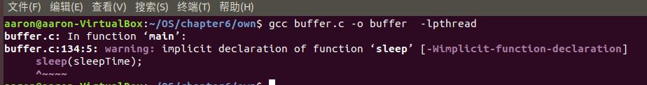
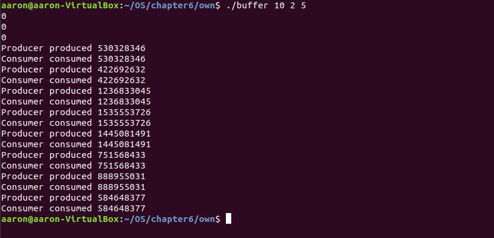

##   **武汉大学国家网络安全学院课程实验报告**  

**沈思源**      **2018级信安2班**     

**实验日期 2020/4/18**

### 生产者-消费者问题编程

实验内容:为线程同步问题:生产者-消费者问题编写程序执行。

实验环境:  Ubuntu  18.04.2虚拟机环境Oracle  VM VirtualBox  

工具: gcc7.0编译器，vim  

### 实验步骤

1. 了解Pthreads的条件变量和互斥锁等工具，为编写程序做准备

   **`pthread_mutex_t mutex;`**

   函数原型:

   `int pthread_mutex_init(pthread_mutex_t \*restrict mutex,const pthread_mutexattr_t \*restrict attr);`

   函数作用:

   该函数用于C函数的多线程编程中，互斥锁的初始化。
   pthread_mutex_init() 函数是以动态方式创建互斥锁的，参数attr指定了新建互斥锁的属性。如果参数attr为空，则使用默认的互斥锁属性，默认属性为快速互斥锁 。互斥锁的属性在创建锁的时候指定，在LinuxThreads实现中仅有一个锁类型属性，不同的锁类型在试图对一个已经被锁定的互斥锁加锁时表现不同。
   pthread_mutexattr_init() 函数成功完成之后会返回零，其他任何返回值都表示出现了错误。
   函数成功执行后，互斥锁被初始化为未锁住态。
   **`sem_t`**

   信号量的数据类型为结构sem_t，它本质上是一个长整型的数

   **`sem_wait`**

   sem_wait( sem_t *sem )被用来阻塞当前线程直到信号量sem的值大于0,解除阻塞后将sem的值减一,表明公共资源经使用后减少.类似PV原语中的P原子操作

   **`sem_post`**

   函数sem_post( sem_t *sem ) 用来增加信号量的值当有线程阻塞在这个信号量上时,调用这个函数会使其中的一个线程不再阻塞,选择机制同样是由线程的调度策略决定的.类似V操作

   **`pthread_mutex_lock`**

   函数原型：

   `int pthread_mutex_lock(pthread_mutex_t *mutex);`

   函数作用：

   当pthread_mutex_lock()返回时,该互斥锁已被锁定，线程调用该函数让互斥锁上锁,如果该互斥锁已被另一个线程锁定和拥有,则调用该线程将阻塞,直到该互斥锁变为可用为止.

2. 设计问题解决框架

   ```c
   缓冲区buffer,信号empty=N,full=0;
   进程Producer:										进程Consumer:
   	|													|
     生产一件产品;										P(full);
       |												P(mutex);
     P(empty);												|
     P(mutex);											从缓冲区buffer中取出一件产品;
     将一件产品送入buffer;								    |
     V(mutex);											V(mutex);
     V(full);											V(empty);
    													消费产品;
   
   
   ```

3. 编写头文件

   ```c
   /*buffer.h*/
   /*缓冲区内的固定大小数组,元素类型声明*/
   typedef int buffer_item;
   /*数组大小定义*/
   #define BUFFER_SIZE 5
   
   /*缓冲区内的操作,分别用于生产者和消费者线程*/
   int insert_item(buffer_item item);
   int remove_item(buffer_item *item);
   
   ```

4. 设计函数

   缓冲区插入元素

   ```c
   int insert_item(buffer_item item)
   {
       /**
        *sem_wait( sem_t *sem )被用来阻塞当前线程直到信号量sem的值大于0,
        *解除阻塞后将sem的值减一,表明公共资源经使用后减少.
        *类似PV原语中的P原子操作
        */
       /* Acquire Empty Semaphore */
       sem_wait(&empty);
       
       /**
        * 当pthread_mutex_lock()返回时,该互斥锁已被锁定.
        * 线程调用该函数让互斥锁上锁,如果该互斥锁已被另一个线程锁定和拥有,
        * 则调用该线程将阻塞,直到该互斥锁变为可用为止.
        * /
       
       /* Acquire mutex lock to protect buffer */
       pthread_mutex_lock(&mutex);
   
       buffer[insertPoniter++]=item;
       insertPoniter=insertPoniter % 5;
   
       /* Release mutex lock and full semaphore */
       pthread_mutex_unlock(&mutex);
       
       
       /**
        * 函数sem_post( sem_t *sem )
        * 用来增加信号量的值当有线程阻塞在这个信号量上时,
        * 调用这个函数会使其中的一个线程不再阻塞,
        * 选择机制同样是由线程的调度策略决定的.
        * 类似V操作
       */
       sem_post(&full);
   
       return 0;
   }
   ```

   缓冲区移出元素

   ```c
   int remove_item(buffer_item *item)
   {
       /*Acquire Full Semaphore*/
       sem_wait(&full);
   
       /* Acquire mutex lock to protect buffer */
       pthread_mutex_lock(&mutex);
   
       *item=buffer[removePointer];
       buffer[removePointer++]=-1;
       removePointer=removePointer % 5;
   
       /* Release mutex lock and empty semaphore */
       pthread_mutex_unlock(&mutex);
       sem_post(&empty);
   
       return 0;
   }
   ```

   生产者&消费者线程调用的函数

   ```c
   void *producer(void*param)
   {
       buffer_item random;
       int r;
       while(TRUE)
       {
           r=rand()%5;
           sleep(r);
           random=rand();
           if(insert_item(random))
               fprintf(stderr,"Error");
           
           printf("Producer produced %d \n",random);
       }
   }
   
   void *consumer(void *param)
   {
       buffer_item random;
       int r;
       while(TRUE)
       {
           r=rand() % 5;
           sleep(r);
           if(remove_item(&random))
               fprintf(stderr,"Error Consuming");
           else
               printf("Consumer consumed %d\n",random);
       }
   }
   ```

   main主体函数设计

   ```c
   /**
    * 需传入3个参数
    * <sleep time> <producer threads> <consumer threads>
   */
   int main(int argc,char*argv[])
   {
       int sleepTime,producerThreads,consumerThreads;
       int i,j;
       if(argc!=4)
       {
           fprintf(stderr,"Useage: <sleep time> <producer threads> <consumer threads>\n");
           return -1;
       }
   
       sleepTime=atoi(argv[1]);
       producerThreads=atoi(argv[2]);
       consumerThreads=atoi(argv[3]);
   
       /* Initialize the synchronization tools */
       printf("%d\n",pthread_mutex_init(&mutex,NULL));
       printf("%d\n",sem_init(&empty,0,5));
       printf("%d\n",sem_init(&empty,0,5));
       srand(time(0));
   
       /* Create the producer and consumer threads */
       for(i=0;i<producerThreads;i++)
       {
           pthread_t tid;
           pthread_attr_t attr;
           pthread_attr_init(&attr);
           pthread_create(&tid,&attr,producer,NULL);
       }
   
       for(j=0;j<consumerThreads;j++)
       {
           pthread_t tid;
           pthread_attr_t attr;
           pthread_attr_init(&attr);
           pthread_create(&tid,&attr,consumer,NULL);
       }
   
       /* Sleep for user specified time */
       sleep(sleepTime);
       return 0;
   }
   ```

5. 编译测试

   编译：

   

   运行测试:

   

### 总结

1. 利用信号量可以解决一系列的线程同步问题，但是设计算法时需要仔细考虑，避免造成死锁等情况
2. P,V操作必须成对出现，
   1. 用于互斥操作时：P,V位于同一进程内
   2. 用于同步操作时：P,V,交错出现在合作进程内
3. 多个P操作次序不可颠倒，否则可能造成死锁，多个V操作可以任意安排顺序
4. 对于同步信号量的P操作一般先于对互斥量的P操作.