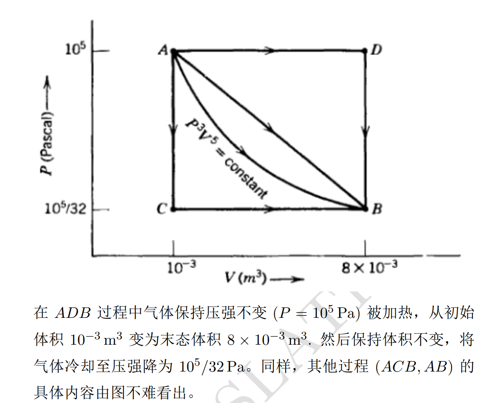
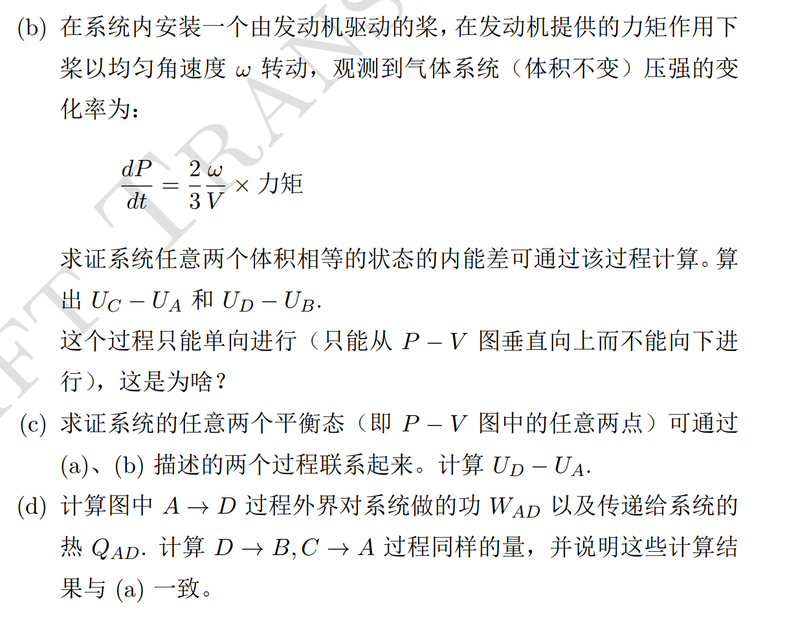
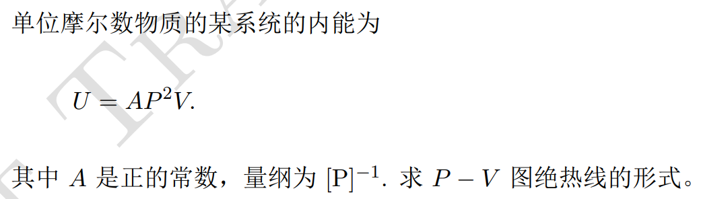

# 热力学简介

## 基础概念

1. 系统，指的是研究的对象
2. 环境，指的是系统之外的自然空间，或者是完成测量的地方。
   1. 敞开指随意交换
   2. 封闭指能量可交换而物质不交换
   3. 隔离系统指都不交换
3. 功，是在对抗外力下运动的情况下释放的能量
4. 除了对系统做功以外，能够提高系统做功能力的方式称为热。
5. 系统的总能量称为内能U，但不包括系统的宏观动能与势能。
6. 广度性质，指与系统的物质的量相关的性质，一般与物质的量成正比。
7. 强度性质，与系统的物质的量无关，可以由广度性质除以物质的量导出。
8. 可逆过程。本文以及后文所指的可逆过程其实是准静态过程，并非真正的可逆过程，不过因为国内的教科书的缘故，我们也使用可逆过程

## 热力学第一定律

完美气体，是指分子间没有相互作用的气体。1mol完美气体内能为 $\frac{1}{2}RT$

**完美气体的内能与体积无关**
热力学第一定律的数学表达

$$
\Delta U = q+w
$$

值得指出的是内能U也是一个多元函数，即由多个因素决定的函数，只要其他状态定下来，就可以。
即

$$
U:\mathbb{R}^n \to \mathbb{R}
$$

这个定律给出两个性质

1. 做功和传热是外界等价的
2. 隔离系统的内能守恒

### 看一道例题

#### (a).

为了算出w和q，首先应该考虑算出 $\Delta U$ ，而内能变化与路径无关。功好算而热不好算。故

$$
\begin{aligned}
\Delta U = U(B)-U(A) = w_{ad} + q = w_{ad} \\
P =(\frac{c}{V^{5}})^{\frac{1}{3}}\\
w_{ad} = -\int_A^BP\mathrm{d}V = -c^{\frac{1}{3}}\cdot \int_A^B \frac{1}{V^{\frac{5}{3}}}\mathrm{d}V = -c^{\frac{1}{3}}\cdot -\frac{3}{2}\cdot [V^{-\frac{2}{3}}]_A^B \\
 = -112.5 J\\
\end{aligned}
$$

有了内能变化后就可以有单独的做功了。对于ADB段，AD段做功，而DB段没有做功，而整个ADB段都有热量变化，所以计算做功比较简单

$$
w_{AD} = -P\cdot \Delta V = -10^5\cdot(8\times 10^{-3}-10^{-3})=-700J
$$

当然需要注意的是这是向外做功，故而压强应该用负号。
然后通过加减法

$$
\begin{aligned}
w_{AD} +q = \Delta U \\
q = \Delta U - w_{AD} = -112.5 - (-700) = 587.5J
\end{aligned}
$$

ACB不算了，算个AB。注意，没必要算出式子，毕竟你只是要积分，算面积就可以，梯形面积

$$
w_{AB} = 10^5(1+\frac{1}{32})\cdot 7\times 10^{-3}\cdot \frac{1}{2} = -360.9J\\
q_{AB} = \Delta U - w_{AB} = -112.5 + 360.9 = 248.4J
$$

注意，虽然这些线都从A到B，但事实上只有绝热曲线的 线下面积恰好与内能变化相等，其他的或多或少有热的影响，which在图中难以直观表现。

#### (b).

b问事实上提供了体积不变升压的条件，螺旋桨做功可以增加内能，而暂时忽略螺旋桨的发热。
$\mathrm{d}U = M\times \theta = M\times \omega\mathrm{d}t$ 故而有

$$
\mathrm{d}P = \frac{2}{3}\frac{1}{V}\mathrm{d}U
$$

所以 $U_c - U_a = \frac{3}{2}V\cdot (P_c-P_a) = 143.5J$ ，单向进行是因为发动机只能加压。

#### (c).

一般地，只需要通过一个绝热过程的线把功算出来，再通过一条等容线即可

#### (d).

略

留一道有意思的题目

答案是 $P = \frac{1}{\sqrt{V}} + 1$ 这种形式

注意，以上的讨论均是对于准静态过程，也就是说每次移动都会等到内压外压相等，不会出现内压外压不等的移动。这种过程也叫可逆过程。

### 完美气体的可逆膨胀

这是热力学第一定律的重点，由于完美气体非常完美的性质，我们有等温膨胀公式

$$
w = -\int p\mathrm{d}V = -nRT\ln \frac{V_f}{V_i}
$$

注意，这只是做功曲线，基本上不是绝热曲线，不要以为求这个可以直接获得内能变化。
一般，膨胀功又称非有用功。

### 热容

#### 定容热容

如果系统体积不变，则可以记录系统的内能随温度变化的关系，例如，我们可以通过对其作固定的功提供内能，然后记录温度的变化。定义为

$$
C_{V} = (\frac{\partial U}{\partial T})_V
$$

单原子分子的摩尔定容热容为 $C_V = \frac{3}{2}R$ ，双原子则为 $\frac{5}{2}R$ ，三原子以上为 $3R$ 。均是对完美气体的幻想
有了热容就可以简单的算出内能变化

$$
\mathrm{d}U = C_V \mathrm{d}T
$$

## 焓

如果不是定容，而是定压，那么事实上在对系统加热时系统通常会膨胀，把吸来的热又吐回环境中，也就是 $\mathrm{d}U<\mathrm{d}q$，于是我们不能知道精确的内能变化。
不过，我们可以通过以下手段定义新的量在恒压下等于吸热量，认为压力恒定

$$
\begin{aligned}
H: =U+pV\\
\mathrm{d}H = \mathrm{d}U + p\mathrm{d}V\\
\mathrm{d}U = \mathrm{d}w + \mathrm{d}q \quad(\mathrm{d}w<0)\\
\mathrm{d}w = -p\mathrm{d}V\\
\mathrm{d}H = dq \\
\end{aligned}
$$

对于凝聚相来说 $p\mathrm{d}V$ 通常很小可忽略不计，然而气体不能忽略，对于完美气体 $\Delta H = \Delta U + \Delta nRT$

#### 定压热容

$$
C_p = (\frac{\partial H}{\partial T})_p
$$

有了定压热容也可以很容易的求出焓变
对于完美气体有更好的性质 $C_V + R = C_p$
焓变符合盖斯定律
标准焓变是指标准状态下物质转变的焓变，而标准状态指的是某温度下1bar压力下的纯物质状态，不过一般用298.15K的标准焓变。

### 标准反应焓

$$
\Delta_rH^{\ominus} = \Sigma_J\nu_J\Delta_fH^{\ominus }(J)
$$

即用生成焓相减。
与温度T的关系

$$
\begin{aligned}
H(T_2) = H(T_1) + \int_{T_1}^{T_2}C_p\mathrm{d}T\\
\Delta_rH^{\ominus }(T_2) = \Delta_rH^{\ominus }(T_1) + \int_{T_1}^{T_2}\Delta_rC_p^{\ominus }\mathrm{d}T \\
\end{aligned}
$$

### 全微分和状态函数

状态函数之前讲过，就是一种多元函数，至于不是状态函数，一定要指定路径的物理量，本质是其微分是一个向量函数，并且不满足与路径无关的条件

内能是一个多元函数

$$
\begin{aligned}
U = U(V,T)\\
\mathrm{d}U = (\frac{\partial U}{\partial V})_T\mathrm{d}V + (\frac{\partial U}{\partial T})_V\mathrm{d}T \\
\end{aligned}
$$

我们看到，后一项是熟知的定容热容，而前一项，由于完美气体内能与体积无关所以之前忽略了，对于非完美气体和凝聚相，这一项叫内压

同样的，焓也是一个多元函数，具有另一项偏导数叫焦耳汤姆孙系数，不过完美气体中可以忽略。

## 绝热过程

绝热过程非常重要，以至于在一般的计算中都会直接考虑绝热过程。

### 绝热膨胀

$$
\begin{aligned}
\Delta U = w_{ad}\\
\mathrm{d} U = \mathrm{d}w_{ad} = -p\mathrm{d}V = C_V\mathrm{d}T\\
-\frac{RT}{V}\mathrm{d}V = C_{V,m}\mathrm{d}T\\
\frac{C_{V,m}}{R}\ln \frac{T_f}{T_i} = -\ln \frac{V_f}{V_i}\\
V_i T_i^c = V_f T_f^c \\
\end{aligned}
$$

而绝热线可以用

$$
\begin{aligned}
p_{i}V_i^\gamma = p_f V_f^{\gamma}\\
\gamma = \frac{C_{p,m}}{C_{V,m}} \\
\end{aligned}
$$
