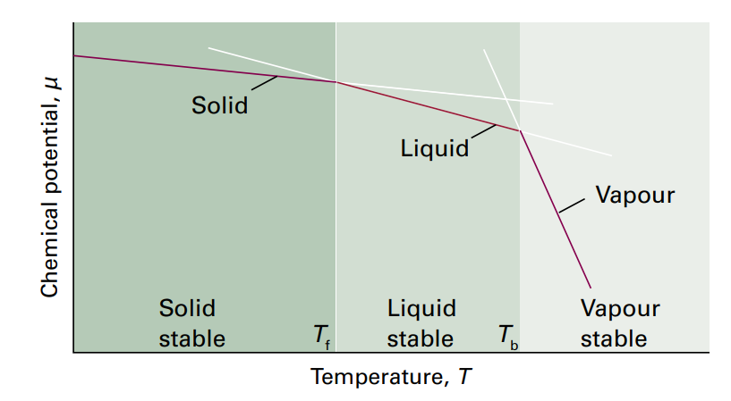

# 相
相是一种化学组成和物理状态都均匀的物质存在形式。
相数指的是不同相的个数。文石与方解石是两种相。但是气体均一混合物是一相。
相变是一种相自发的变成另一种相的过程，在转变温度下，两相平衡。
## 相稳定性的热力学判据
我们使用一种叫化学势的东西。其实就是物质的摩尔吉布斯能。一般，如果对于一个物质来说一相的化学势高于另一相，那么就会自发转变过去。所以，两个相平衡时化学势一定处处相同，否则两相并未平衡。
简单验证一下，如果一个系统中，一个物质在1处具有化学势 $\mu_1$ ，在位置2有化学势 $\mu_2$ ，平衡时如果有无穷小量的物质从1移出到位置2，就有

$$
\Delta G = -\mu_1\mathrm{d}n+\mu_2\mathrm{d}n
$$

然而此时平衡，自由能应该不变，所以只能是化学势处处相等。
# 相律
## 基础概念
1. 变量F，指的是不改变平衡相数时能独立变化的强度变量的数目
2. 物种，指系统中存在的化学物质
3. 组分，指系统中化学独立的物种
4. 组分数C，指确定系统组成所需的最少独立物种数。

例如，乙醇和水是两个物种，氯化钠溶液有三个物种，但只有两个组分。
先考虑单组分系统单相，P=1，p,T都可以自由变化，F=2。
两相系统中，因为需要平衡，所以有一个等式约束，p，T只有一个变量可随意变化。
三相系统，有两个等式约束 

$$
\mu(\alpha) = \mu(\beta) = \mu(\gamma)
$$

故没有自由变量。
而对于任意组分数，我们首先算出强度变量的总数目，先算外界变量，只有pT就是2，如果还有磁场什么的就再加上。再算组分数的组成摩尔分数，显然独立的有C-1个。这些组分可以分布在P个相里，所以现在有P(C-1)个变量。强度变量总数为P(C-1)+2
但是还要满足各种条件，就是化学势条件，每个组分在所有相中化学势相同，所以有P-1个等式，一共C个组分，最终得到

$$
F = P(C-1)+2-C(P-1) = C-P+2
$$

+2可以换成加其他的。
由相律，可以解释三相点。
# 相变热力学
之前已经提到吉布斯能如何等压升温，以及等温升压情况下变化，这些表达式自然适用于摩尔吉布斯能或者说，化学势我们有

$$
\begin{aligned}
\frac{\partial \mu}{\partial T} = -S_{m} \\
\frac{\partial \mu}{\partial p} = V_m
\end{aligned}
$$

因此我们可以考虑一些好玩的
## 温度对相的影响
只要T>0，都有Sm>0，故温度升高，化学势下降。但是，如果液体化学势下降的更快，且在某一点降的比固体低，那么在那一点物质就会从固体变为液体。

## 压强对相的影响
增加压强会使化学势升高，如果液体化学势升的的更快，那么就有机会把液体压成固体。之后我们会提到增加压强使液体沸点升高的计算。
## 相界线的位置
需要两相共存，则会有一个方程联系p与V（或者T），这就是相界线在pT图中的表示。我们关心相界线的斜率。
1. 两相共存，有

$$
\begin{aligned}
\mu(\alpha,p,T) = \mu(\beta,p,T) \\
\mathrm{d}\mu(\alpha) = \mathrm{d}\mu(\beta)
\end{aligned}
$$

2. 根据基本方程

$$
\begin{aligned}
\mathrm{d}\mu(\alpha) = V_m(\alpha)\mathrm{d}p-S_m(\alpha)\mathrm{d}T
 \\
 \mathrm{d}\mu(\beta) = V_m(\beta)\mathrm{d}p-S_m(\beta)\mathrm{d}T
\end{aligned}
$$

3. 数学化简

$$
\begin{aligned}
(V_m(\alpha)-V_m(\beta)) \mathrm{d}p = (S_m(\alpha)-S_m(\beta))\mathrm{d}T\\
\frac{\mathrm{d}p}{\mathrm{d}T} = \frac{\Delta S_m}{\Delta V_m} = \frac{\Delta_{trs}S}{\Delta_{trs}V}
\end{aligned}
$$

这就是克拉珀龙方程。
### 气液相界线
可以做一些有趣的近似，考虑完美气体

$$
\frac{\mathrm{d}p}{\mathrm{d}T} = \frac{\Delta_{trs}H}{T\Delta_{trs}V} \thickapprox \frac{p\Delta_{trs}H}{RT^{2}}
$$

或者

$$
\frac{\mathrm{d}\ln p}{\mathrm{d}T} = \frac{\Delta_{trs}H}{RT^{2}}
$$

这是克劳修斯-克拉珀龙方程
当然，这里解出的T是相变温度，p是相变压力（气体中是蒸气压）
#### 估算压力对沸点的影响
只需要知道液体的蒸发焓即可。已知水的蒸发焓在373.15K为40.17kJ/mol，则有

$$
\frac{\mathrm{d}\ln p}{\mathrm{d}T} = \frac{40170}{8.314\cdot 373.15^{2}} = 0.0347
$$

或者取其倒数，有lnp增加1，沸点增加28.8K