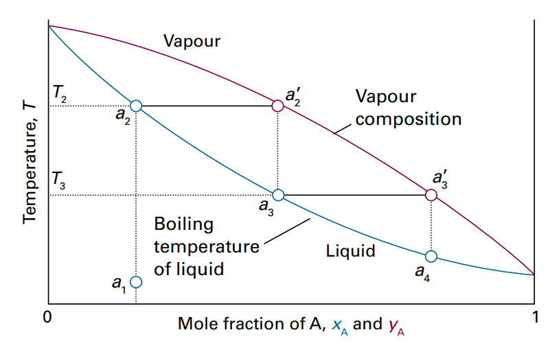
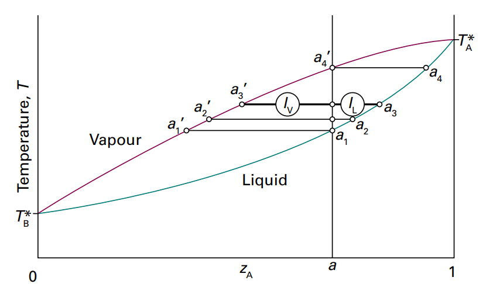

# 描述混合物
首先考虑双组分混合物
## 偏摩尔量
我们发现，20ml水加20ml乙醇在一起并不是40ml混合物，因此提出偏摩尔体积，即在大量混合物中加入单位物质的量A引起的体积变化。注意偏摩尔量并不是定值，而是根据混合物的变化而变的，简单来说是个经验量，需要实验测得。
定义为

$$
V_J = (\frac{\partial V}{\partial n_{J}})_{p,T,n'}
$$

n'指其他物质不变。
如果是双组分系统是通过加入一定量的A与一定量的B制备的，同时A与B总以恒定的比例加入，那么其偏摩尔体积不变(因为对于待加物而言，混合物没变化)，有

$$
\begin{aligned}
\mathrm{d}V = V_{A}\mathrm{d}n_{A} + V_{B}\mathrm{d}n_{B}
 \\
 V = V_{A}n_{A}+V_{B}n_{B}
\end{aligned}$$

然后，因为V是多元函数，所以无论真实制备是怎么样的，都可以用该公式来算总体积，或者反推偏摩尔体积。
## 偏摩尔吉布斯自由能
又叫化学势，定义为

$$
\mu_{J} = (\frac{\partial G}{\partial n_{J}})_{p,T,n'}
$$

最后提出完善的基本方程
## 基本方程

$$
\mathrm{d}G = V\mathrm{d}p-S\mathrm{d}T+\mu_{A}\mathrm{d}n_{A}+\mu_{B}\mathrm{d}n_{B}+ \cdots 
$$

## 吉布斯-杜亥姆公式
由于多组分混合物总吉布斯自由能可以由 $G = \Sigma n_{J}\mu_{J}$ 给出，则有等温等压下

$$
\begin{aligned}
\mathrm{d}G = \Sigma (\mu_{J}\mathrm{d}n_{J}+n_{J}\mathrm{d}\mu_{J}) \\
\Sigma n_{J}\mathrm{d}\mu_{J}=0
\end{aligned}
$$

# 混合过程
如果混合是自发的，必然伴随着吉布斯自由能降低。
之前算过吉布斯能随压力的变化，现在代入化学势

$$
\mu = \mu^{\ominus }+RT\ln \frac{p}{p^{\ominus }}
$$

其中标准状态是1bar。可以简记为

$$
\mu = \mu^{\ominus }+RT\ln p
$$

两个组分在一起无论是否混合都有

$$
G = n_{A}\mu_{A}+n_{B}\mu_{B}
$$

但是两个状态下的 $\mu$ 并不相同。

$$
\begin{aligned}
G_i =  n_{A}(\mu_{A}^{\ominus }+RT\ln p)+n_{B}(\mu_{B}^{\ominus }+RT\ln p)\\
G_f = n_{A}(\mu_{A}^{\ominus }+RT\ln p_{A})+n_{B}(\mu_{B}^{\ominus }+RT\ln p_{B})\\
\Delta_{mix}G = nRT(x_{A}\ln \frac{p_{A}}{p}+x_{B}\ln \frac{p_{B}}{p})
\end{aligned}
$$

其中n是总物质的量，而x代表占其中的百分数。对于气体来说，恰好有分压定律，所以

$$
\Delta_{mix}G = nRT(x_{A}\ln x_{A}+x_{B}\ln x_{B})
$$

## 完美气体的混合熵

$$
\Delta_{mix}S = -\frac{\partial \Delta_{mix}G}{\partial T} = -nR(x_{A}\ln x_{A}+x_{B}\ln x_{B})
$$

## 完美气体的混合焓

$$
\Delta  H = \Delta G+T\Delta S=0
$$

# 顺带一提浓度的度量
- 物质的量浓度是指溶质的物质的量除以体积
- 质量摩尔浓度指溶质的物质的量除以质量
- 摩尔分数是物质的量除以总物质的量
# 液体混合物
如果在表示纯净物，那么我们带上*标记。
## 理想溶液
先考虑一个封闭的容器内有两相混合物平衡。组分A的蒸气压表示为 $p_{A}^{*}$ ，那么气相和液相中A的化学势相等

$$
\mu_{A}(l) = \mu^{\ominus }_{A}(g)+RT\ln p_{A}
$$

如果是纯A，就有

$$
\mu_{A}^{*}(l) = \mu^{\ominus }_{A}(g)+RT\ln p_{A}^{*}
$$

所以有混合后的

$$
\mu_{A}(l) = \mu_{A}^{*}(l)+RT\ln \frac{p_{A}}{p_{A}^{*}}
$$

拉乌尔发现这样一个事实

$$
p_{A} = x_{A}p_{A}^{*}
$$

这叫拉乌尔定律，如果混合物在所有组成范围内服从这个定律，称为理想溶液

$$
\mu_{A}(l) = \mu_{A}^{*}(l)+RT\ln x_{A}
$$

有了这个式子，我们就可以算不同浓度溶液的化学势了
## 理想稀溶液
理想稀溶液不是稀的理想溶液，而是符合另一定律的溶液，称为亨利定律。

$$
p_{A} = x_{A}K_{A}

$$

一般用拉乌尔定律计算溶剂的化学势，而用亨利定律算溶质的化学势。
有的时候不用摩尔分数，而用质量摩尔浓度

## 溶液的性质
由于是理想溶液，所以其混合吉布斯能和混合熵与完美气体一样。

$$
\begin{aligned}
G_i = \Sigma n_{J}\mu_{J}^{*}
 \\
 G_f = \Sigma n_{J}(\mu_{J}^{*}+RT\ln x_{J})\\
 \Delta _{mix}G = nRT(\Sigma x_{J}\ln x_{J})\\
 \Delta _{mix}S = -nR(\Sigma x_{J}\ln x_{J})\\
 \Delta_{mix}H = 0
\end{aligned}
$$

理想溶液混合体积也为0，因为dG/dp=V，而混合G与p无关。
## 依数性
依数性是只与系统中存在的溶质粒子的数目有关的物理性质。针对**稀溶液**
记溶质为B，溶剂为A。依数性的原理通常是因为溶液加入粒子后溶剂化学势降低。
### 沸点升高
我们研究1atm下溶剂蒸气与溶剂之间的平衡。

$$
\mu_{A}^{*}(g) = \mu_{A}^{*}(l)+RT\ln x_{A}
$$

接下来是数学推导，借助之前提到的吉布斯亥姆赫兹公式

$$
\begin{aligned}
\ln x_{A} = \frac{\Delta_{vap}G}{RT}  \\
\frac{\mathrm{d}\ln {x_{A}}}{\mathrm{d}T} = \frac{1}{R}\frac{\mathrm{d}\Delta_{vap}G/T}{\mathrm{d}T} = -\frac{\Delta_{vap}H}{RT^{2}}\\
\ln x_{A} = \frac{\Delta_{vap}H}{R}(\frac{1}{T}-\frac{1}{T^{*}}) = \ln (1-x_{B})\\

\end{aligned}
$$

有了上面的式子就可以知道给多少B，T会变成多少了。顺带一提，上面的数学处理纯粹是为了使用吉布斯亥姆赫兹公式。所以才先求导再积分。继续近似可以得到更简洁的表达式，因为是稀溶液，可以利用泰勒级数近似ln

$$
\begin{aligned}
x_{B} = \frac{\Delta_{vap}H}{R}(\frac{1}{T^{*}}-\frac{1}{T}) \thickapprox\frac{\Delta_{vap}H}{RT^{*2}}(T-T^{*}) \\
\Delta T_{b} = Kx_{B}
\end{aligned}
$$

即沸点升高与溶质百分数成正比。当然，实际使用中也常用质量摩尔浓度。K称为沸点升高常数
### 凝固点降低
使用了同样的技巧，具有同样的表达式

$$
\Delta T_{f} = K'x_{B}
$$

### 渗透压
渗透现象指的是纯溶剂自发进入被半透膜隔开的溶液中。为了阻止它进入，需要施加压力，这就是渗透压。
平衡时，纯溶剂和施加压力的溶液化学势相同，这是我们的起点

$$
\begin{aligned}
\mu_{A}^{*} = \mu_{A}^{*}(p+\Pi)+RT\ln x_{A} \\
\mu_{A}^{*}(p+\Pi) = \mu_{A}^{*}+\int_{p}^{p+\Pi} V_m\mathrm{d}p\\
-RT\ln x_{A}\thickapprox V_m\Pi\\
\frac{x_{B}}{V_m}RT = \Pi\\
x_{B}\thickapprox \frac{n_{B}}{n_{A}}\\
\Pi = [B]RT
\end{aligned}
$$

## 相图阅读
简单的双组分液体相图，温度组成图

液体线表示该组成会在该温度下达到气液平衡，水平线延伸到的气体组成表示达到气液平衡时气体的组成。
低于液体线的所有点表示低于沸点的某种混合物液体，组成为xA，高于气体线的所有点表示高于沸点的某种混合物气体，组成与初始混合物相同。
如果横坐标代表了混合物的整体组成，那么一条竖线就是等组成线，位于气体线与液体线之间的点不给出直接信息，而是通过作一条水平线告诉你此时的液体组成与气体组成分别是什么。

而中间的点到两边点的距离则给出了气相总分子数和液相总分子数的比例，通过杠杆规则。

$$
\frac{n_{L}}{n_{V}} = \frac{l_{V}}{l_{L}}
$$

给出比例。
# 活度
使用活度是因为真实溶液并不是理想的，不服从拉乌尔定律或者亨利定律，因此需要一个经验系数来帮忙

$$
\mu_{A} = \mu_{A}^{*}+RT\ln a_{A}
$$

这里的a就是活度，拉乌尔做的简化是 $x_{A} = \frac{p_{A}}{p_{A}^{*}}$ ，而活度是代替百分数的。可以引入活度系数的概念

$$
\gamma x= a
$$

## 溶质的活度
溶质满足亨利定律的话可以用

$$
\begin{aligned}
K_{B}x_{B} =p_{B}  \\
\mu _{B} = \mu_{B}^{*}+RT\ln \frac{K_{B}}{p}+RT\ln x_{B}\\
\mu_{B} = \mu_{B}^{\ominus }+RT\ln x_{B}
\end{aligned}
$$

这里的*表示纯物质，而 $\ominus $ 表示一种标准状态。
而对于真实溶液来说依旧用活度a代替x
## 逸度
类溶液的活度，是气体的活度。参考气体跟压力有关的化学势即可。
## 离子的活度
以后再讲
# 活度总结
固体或者液体，活度始终为1，标准状态为纯净物，1bar
溶剂的活度为蒸气压比纯蒸气压，标准状态为纯溶剂，1bar
溶质的活度为活度系数乘以百分数，标准状态是某浓度下符合亨利定律的溶液。

