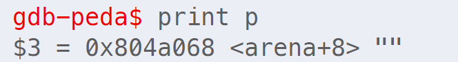
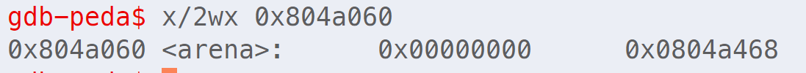
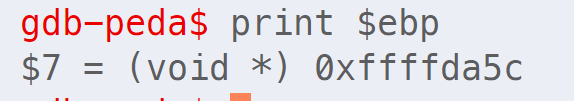
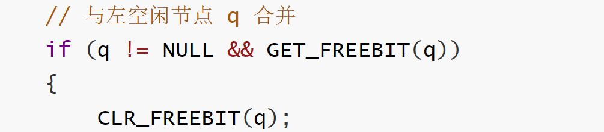

大家好，我这里来讲一下缓冲区溢出的第四个实验。这是一个比较典型的堆溢出造成任意内存写入的漏洞

首先我们来看一下漏洞的原因。漏洞代码如图所示。我们可以看到它主要有以下几个步骤

1. 首先分别申请了500字节和300字节的内存
2. 释放了这两篇内存区域
3. 再次申请了1024字节的内存
4. 将用户的输入拷贝到这篇内存
5. 重复释放q指向的内存区域

造成这段代码有漏洞的原因主要有以下几点

1. tfree后的堆块指针q仍然指向原来的位置

2. 指针p第二次tmalloc申请的内存覆盖了堆块q的堆首

3. 用户可以对堆块p写入任意数据

4. 再次释放指针q

在讲解漏洞利用之前，我们首先来看一个由双向链表的删除操作造成任意内存写入的例子

双向链表节点的定义如图所示

假设现在已经有三个节点$p, q, r$，连接关系如图，我们需要将节点 $q$ 从链表中删除

在删除节点 $q$ 之前，我们修改 $q$ 的左右指针如下

- 让 $q$ 的左指针等于我们要写入的值
- 让 $q$ 的右指针指向要写入的地址

当执行 Remove 操作时，左指针的值就会写入右指针指向的地址

这样就造成了任意内存写入

这里有一个简单的例子来验证我们的猜想

首先我们的节点定义在这里，可以看到这是一个非常简单的双向链表节点的定义，它有左指针和右指针

然后在main函数里面可以看到我们新建了三个节点 p，q，r，并且将它们连接起来。其中p是第一个节点，q是第二个节点，r是第三个节点

接着我们创建了一个大小为4的数组，它的值为1，2，3，4

然后我们将节点q的右指针指向数组的地址，左指针等于我们希望写入的值

接着执行remove操作，从双向链表中删除节点$q$

可以发现arr的第0个元素的值已经变成了q的左指针的值

有了上面的基础我们再来看看如何利用漏洞

1. 首先我们需要清楚堆块的管理方式。在该程序的实现中，堆块由堆首和数据部分组成，其中堆首占据8个字节，并且各个堆块的堆首通过一个双向链表连接起来
2. 接着在tfree操作中有类似我们上面讲到的双向链表中删除节点的操作。那么漏洞利用的方法就很显然了。如果我们能够控制被删除堆堆首的左右指针，那么我们就可以修改返回地址的内存，并将其修改为shellcode的地址

源程序实际上是自己实现了一个简单的堆的管理，接下来我们来看看它是怎么做的

一个比较重要的数据结构是chunk，它的定义如图所示。他是一个联合体，大小为8个字节，既可以用来表示堆首也可以用来表示一片8字节的数据区域。如果用来表示堆首，则指针s.r的最后一位用来表示当前chunk的状态，为1表示空闲，为0表示已经分配

另一个比较重要的结构是arena，他是一个由chunk组成的数组，也可以理解为堆的大小。不知道大家会不会对arena这个名字感到困惑，他的中文意思是竞技场，我从stackoverflow中找到的解释是，arena可以理解为从操作系统中申请的(例如malloc或者静态数组)一块大的、连续的内存区域，并且手动管理这部分的内存空间

接下来是两个被用到的函数tmalloc和tfree

tmalloc的步骤如下

1. 首先计算要分配的大小
   - 该大小需要按照 chunk 大小对齐，本实验中即8个字节
   - 并且需要留 1 个 chunk 存放堆首信息
2. 找到双向链表中第一个足够大的空闲节点
3. 设置该节点的状态为已分配
4. 插入新空闲节点至双向链表

tfree的步骤如下

1.  首先是节点 $p$ 与左空闲节点 $q$ 合并
   - 判断左节点是否不为空以及空闲
   - 从双向链表中 **==删除 $p$ 节点==**
     - 回顾我们之前讲的例子，这里可能存在任意内存写入的漏洞
   - $p = q$
2. 类似的，与右空闲节点合并

接下来我们来分析一下漏洞代码

1. 首先是申请了$p, q$两块内存区域，他们的内存布局如右图所示，这里图画的有点不标准，其实 $p, q$ 分别指向各自堆块起始数据区域，即黄色和蓝色开头的区域，红色的区域是8字节的堆首信息
2. 接着释放了$p,q$，这里需要注意的是，$p,q$指针仍然指向原来的位置
3. 之后又申请了内存区域$p$，由于之前已经释放了$p,q$，因此这次仍然是从arena的开始位置进行分配，由于1024>512，因此用户写入的数据可以覆盖堆块$q$的堆首(504字节-512字节)，即我们能够修改堆首q的左右指针
4. 最后重复释放了堆$q$，即可能存在节点从双向链表删除的操作，从而造成任意内存写入

最后我们来看一看怎么构造exploit

1. 首先是使用nop指令覆盖缓冲区

2. 在缓冲区的相应位置写入shellcode，这里我们设置为缓冲区起始偏移32字节处

3. 在gdb中确定p的起始内存地址和返回值的内存地址

   - 在

   - 这里可以讲一下p的内存地址是arena+8的原因前8个字节用来存放堆首信息

   - 并且可以看到头指针的s.r指向了p

     

   - 返回值的内存地址是ebp+4

     

4. 构造p堆首的左右指针

   - 这里需要注意的是我们并没有直接将返回地址修改为shellcode的地址，这是因为与左节点的合并操作需要满足左节点空闲，即左节点的s.r(第5~8个字节对应的数为奇数)，而shellcode的第5-8位是偶数(大端编址)。

     

   - 因此我们将返回地址修改为 buf 的起始地址，并将 buf+4开始的四个字节用 ff 填充，这样我们就能够正确跳转到buf

   - 此外，还需要注意一点，由于 buf+4 开始的四个字节不是nop，因此我们需要跳过这几个字节，这里我们令 buf 开始的前两个字节为相对跳转的机器码 eb 6，正好可以跳过 buf+2-buf+8 这六个字节，从而通过 nop 滑动到 shellcode 处