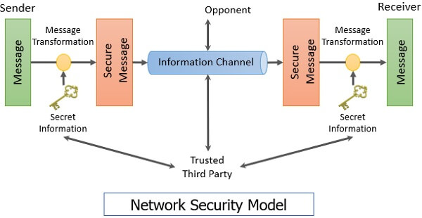

[toc]

## 实验平台

- 10.201.202.51
- 用户名：学号
- 实验课不考勤，无平时成绩

## 信息通讯环境

- 基本的通讯模型

  - $\text{sender} \rightarrow \text{receiver}$

    > 信源编码
    >
    >
    > 信道编码
    >
    > 信道传输
    >
    > 通信协议

  - 

常见的验证方式

    > 哈希
    >
    > 奇偶校验
    >
    > CRC

- [COMSEC](https://en.wikipedia.org/wiki/Communications_security)

  - 假定通信双方可信、信道不安全

- 现在的网络安全模型

  

## 网络安全技术

### 安全内核技术

- 安全等级制

### 身份鉴别技术

- [Kerberos](https://en.wikipedia.org/wiki/Kerberos_(protocol))

### web 安全技术

- SSL

- SHTTP

  > ==和HTTPS啥关系？==

### socks 协议

### 网络反病毒技术

### 防火墙技术

- 动态IP过滤
- IP分片过滤
- $\cdots$

### 保密网关技术

- 堡垒机

### 应用层安全协议

- PEM
- MIMA
- PGP
- $\cdots$

## 从信息安全到信息保障

### 信息保障

- PDRR模型

  > 保护(Protect)
  >
  > 检测(Detection)
  >
  > 反应(Reaction)
  >
  > 恢复(Restore)

### 中国发展趋势

- **党管密码**
- [中国密码种类](https://webencrypt.org/guomi/)
- [密码法](http://www.npc.gov.cn/npc/c30834/201910/6f7be7dd5ae5459a8de8baf36296bc74.shtml)

## 步骤

- 准备和防范
- 检测与响应
- 建立牢固的根基

## 课外引申

- [多方安全计算](https://zhuanlan.zhihu.com/p/100648606)

- 分散密钥
  - 常用于 IC 卡加密