[toc]

## 第二章 网络攻击行径分析

### 课后习题

1. ==利用向目标主机**发送非正常消息**而导致目标主机崩溃的攻击方法有哪些？==

   > 书P9、P69

   - Ping of Death(原理见书P69)
     - 向目标端口发送大量的超大尺寸的ICMP包
   - **TearDrop**(原理见书P70)
     - 基于UDP的病态分片数据包的攻击方法
     - 可以理解为通过构造具有**重叠位移**的伪造分片数据包使得计算出包的**长度为负数**，导致在使用 `memcpy` 时分配过大内存(可参见书P71例子)
   - 畸形消息攻击
     - 利用操作系统上服务存在的安全隐患，即处理消息之前没有进行适当正确的错误校验，导致收到畸形消息时崩溃

2. ==破坏性攻击的原理及其常用手段==

   > 书P9

   - 破坏性攻击以**破坏对方系统为主要目标**
   - 破坏的方式包括
     - 使对方系统拒绝系统服务
     - 删除有用数据库甚至操作系统
     - 破坏硬件系统
   - 常用的手段
     - 病毒攻击
     - 拒绝服务攻击

3. ==扫描的作用和常见的扫描方法==

   > 书P12

   - 扫描是指
     - **仔细逐个检查远程或本地系统中的各种信息，以为己用**

   - 作用是
     - **通过收集系统信息来自动检测远程或本地主机的安全性弱点**
   - 常见的扫描方法(书P12)

4. ==网络欺骗的原理以及常用的欺骗方法==

   > 书P13

   - 网络欺骗是**用来攻击目标配置不正确的消息**
   - 常用的方法(详细见书P156)
     - DNS欺骗、电子邮件欺骗、Web欺骗、IP欺骗

5. ==IP欺骗的原理与过程==

   > 书P169

   - 通过配置 `.hosts` 文件可以实现两台主机之间的**信任关系**，使得一台主机(hosta)上的用户可以无需输入口令验证就可以登录到另一台主机(hostb)上
   - IP欺骗的原理
     - **利用hosta和hostb基于IP地址建立的信任关系，如果能够冒充hostb的IP，就可以使用rlogin登录到hosta，而不需要任何口令验证**
   - IP欺骗的过程(书P172)

6. ==攻击的一般目的==

   > 书P16

7. ==攻击的一般过程和注意事项==

   > 书P17

   - 一般的攻击都分为三个阶段
     - 攻击的准备阶段
       - 确定攻击目的、准备攻击工具、收集目标信息
     - 攻击的实施阶段
       - 隐藏自己的位置、利用收集到的信息获取账号和密码，登陆主机、利用漏洞或者其他方法获得控制权并窃取网络资源和特权
     - **攻击的善后阶段**
       - 善后的重要性(书P20)
       - 善后的方法(书P21)

8. ==口令猜测的方法和步骤==

   > 书P23

   - 获取账号
   - 获取密码

### PPT 问题

1. ==安全威胁分类==

   > 书P8

## 第三章 网络侦查技术

### 课后习题

1. ==什么是网络扫描？什么是扫描器？==

   - 网络扫描
     - 通过网络进行扫描，收集信息
   - 扫描器(书P30)

2. ==扫描的类型和功能==

   > 省略(书P12)、详细(书P30)

3. ==什么是网络监听==

   > 书P39

4. ==简述以太网的网络监听==

   - 共享以太网(书P40)
     - 以太网的结构、通信方式、数据传输方式、网卡模式
   - 交换式以太网(书P44)
     - 通信方式、监听方法
   - 防范方法(书P45)
   - 检测方法(书P46)

5. ==简述sniffer的工作原理==

   > 书P43

6. ==如何防范网络监听？==

   > 书P45

7. ==什么是字典文件？在攻击中的作用？==

   > 书P47

### PPT 问题

1. ==ping的优缺点==

   > 书P30

## 第四章 拒绝服务攻击

### 课后习题

1. ==什么是拒绝服务攻击？如何分类？==

   - 定义(书P56)
   - 分类(书P57)
     - 内部、外部
     - 一个位置、多个位置

2. ==外部用户针对网络连接发动拒绝服务攻击有哪几种模式？并举例==

   - 模式(书P57)
   - 举例(书P58-P60)

3. ==**同步包风暴(SYN Flooding)**拒绝服务攻击的原理、特点、如何防止==

   - 原理(书P63)
   - 特点(书P66)
   - 如何防止(书P66)

4. ==简述**smurf**攻击的原理、特点、怎样防止==

   - 原理(书P67)

   - 特点(百度+书P68)

     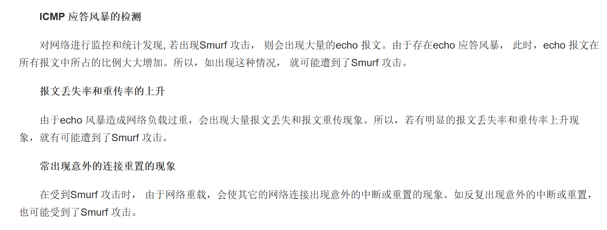

   - 如何防止(书P68)

5. ==简述Ping Of Death原理、怎样防止==

   - 原理(书P69)
   - 如何防止
     - 向重组过程添加检查，以确保在数据包重组后不会超出最大数据包大小限制
     - 另一个解决方案是创建具有足够空间来处理超出准则最大值的数据包的内存缓冲区

6. ==简述TearDrop原理、怎样防止==

   - 原理(书P70)
   - 如何防止
     - 网络安全设备将接收到的分片报文先放入缓存中，并根据源IP地址和目的IP地址对报文进行分组，源IP地址和目的IP地址均相同的报文归入同一组，然后对每组IP报文的相关分片信息进行检查，丢弃分片信息存在错误的报文
     - 为了防止缓存溢出，当缓存快要存满时，直接丢弃后续分片报文

7. ==简述Winnuke原理、怎样防止==

   - 原理(书P71)
   - 怎样防止
     - 适当配置防火墙设备或过滤路由器(丢弃发往139端口的数据包)
     - 对这种攻击进行审计（记录事件发生的时间，源主机和目标主机的MAC地址和IP地址MAC）

8. ==简述Land原理、怎样防止==

   - 原理(书P71)
   - 怎样防止
     - 配置防火墙，拦截类似的攻击包，以保护系统
     - 更新补丁，修复了漏洞
     - 路由器应同时配置上行与下行筛选器，屏蔽所有源地址与目标地址相同的数据包

9. ==简述电子邮件轰炸拒绝服务攻击的原理、造成的危害、如何防止==

   - 原理(书P72)
   - 危害(书P72)
   - 应对方法(书P73)

10. ==什么是DDOS攻击？特点？为什么危害性更强？==

    - 定义(书P74)
    - 特点(书P74克服传统的缺点+P75现象+危害性更大+曹越第4章PPT34页)
    - 为什么危害性更大(书P74克服了传统的缺点)

11. ==如何应对ddos攻击，并举例==

    > 书P76

### PPT 问题

1. ==反弹技术==(曹越PPT 48)
2. ==如何发现自己正在受到消耗网络资源的dos攻击==
   - 网站离线，或请求响应很慢
   - 打开网站带宽统计信息。如果发现带宽激增或者出现流量拥堵
   - 源站 Web 服务器日志中有奇怪的请求，与正常的访问者行为不符

## 第五章 缓冲区溢出攻击

### 课后习题

1. ==什么是缓冲区==

   > 书P78

2. ==描述一个具体程序的执行过程了解栈帧的结构==

   > 书P79例子

3. ==缓冲区溢出的基本原理==

   > 书P79

4. ==缓冲区溢出攻击的一般目标==

   > 书P82+单纯的缓冲区溢出并不能达到攻击的目的(曹越PPT第9页)

5. ==要让程序跳转到安排好的地址空间执行，有哪些方法==

   > 书P83

6. ==为什么缓冲区溢出会成为操作系统、数据库等应用最普遍的漏洞之一==

   > 书P84

### PPT 问题

1. ==什么程序会发生缓冲区溢出==

   > 根据缓冲区溢出的原因来回答

   - 曹越PPT第7页
   - 使用C等不是**类型安全**的语言
   - 使用不安全的函数库
   - 不采取防御措施(例如缓冲区长度、内存检查等)

## 第六章 程序攻击

暂略

## 第七章 欺骗攻击

### 课后习题

1. ==常见的欺骗攻击方式、共同特点、其他欺骗攻击==

   - 欺骗攻击方式(P156)
   - 共同特点
     - 欺骗实质上就是一种冒充身份**通过认证骗取信任**的攻击方式。
     - 攻击者针对认证机制的缺陷，将自己伪装成可信任方，从而与受害者进行交流，最终攫取信息或是展开进一步攻击
   - 其他欺骗攻击
     - ARP欺骗
       - ARP欺骗攻击就是利用ARP协议本身的缺陷进行的一种非法攻击，目的是为了在全交换环境下实现数据监听。**当主机收到一个ARP应答包后，它并不会去验证自己是否发送过这个ARP请求，而是直接将应答包里的MAC地址与IP对应的关系替换掉原有的ARP缓存表里的相应信息**。ARP欺骗正是利用了这一点
     - 短信欺骗
       - 短信欺骗是指诈骗者伪装成他人的电话号码发送短信，诈骗者用字母数字的发送者ID掩盖自己的身份，通常会包括恶意软件下载或钓鱼网站的链接
     - GPS欺骗
       - 当GPS接收器通过广播类似于真实信号的虚假信号来欺骗GPS接收机时，就会发生GPS欺骗攻击。换句话说，诈骗者假装在一个地方，实际上却在另一个地方。诈骗者可以用它来侵入汽车的GPS系统，把你发送到错误的地址，甚至干扰船舶、建筑物或飞机的GPS信号

2. ==DNS的工作原理、DNS解析的过程中可能被欺骗的地方==

   - 工作原理(书P156-158 + 曹越PPT第7页)
     - 从定义、实现、查询方式来回答
   - 可能被欺骗的地方(曹越PPT第11页)
     - 中间人攻击(拦截用户和DNS服务器之间的通信)
     - DNS服务器危害(直接劫持DNS服务器)

3. ==DNS欺骗攻击的原理和过程==

   - 原理(书P158)
   - 过程(书P159)
     - 嗅探DNS查询ID
     - 干扰DNS服务器
     - 发送欺骗包

4. ==假如你的主机在面临DNS欺骗攻击，应该采取什么样的策略和解决方案==

   - 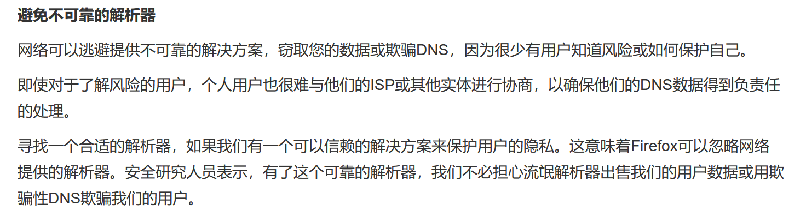
   - 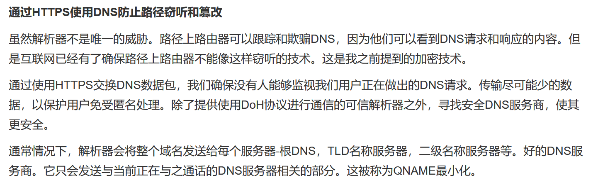
   - 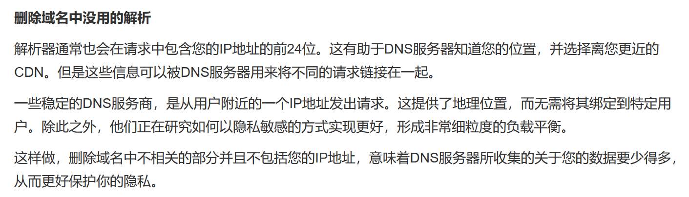
   - 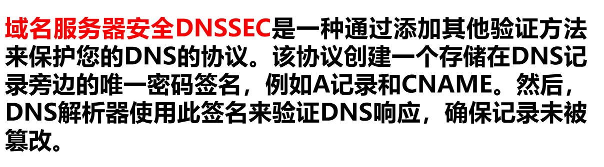
   - 直接使用IP访问站点
   - 对DNS的数据包进行检测，如果同时受到两个响应，则认为受到了DNS欺骗

5. ==E-mail欺骗攻击的原理和过程==

   - 原理(书P161)
   - 过程(书P162-P163)

6. ==加入你是一名网络管理员，对于邮件欺骗攻击你的忠告==

   - 即如何应对邮件欺骗攻击(见曹越PPT第14页)

7. ==Web欺骗攻击有哪些具体形式、原理==

   - 具体形式(P165-P167+曹越PPT第16-19页)
     - 改写URL、特殊的网页假象、劫持Web会话
   - 原理(见曹越PPT第15页+书P163)

8. ==如果你是开发者，采用何种手段避免你的网站受到潜在的Web欺骗攻击==

   **如何回答？**

9. ==简述tcp建立连接的过程==

   - 书P170

     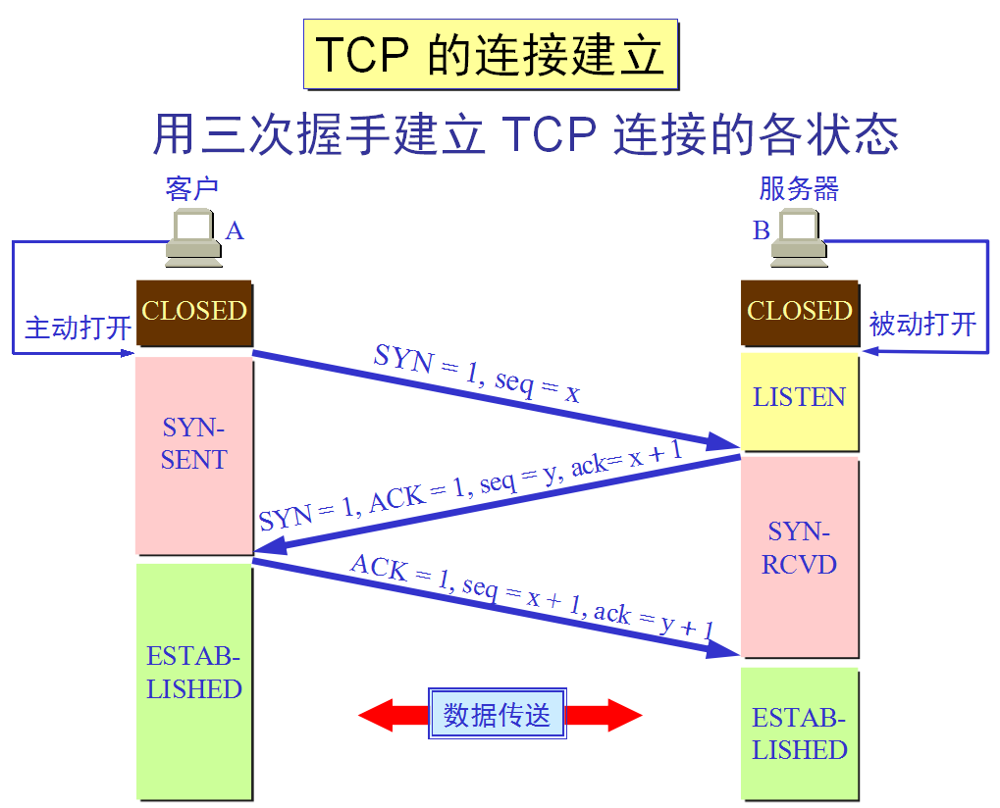

10. ==IP欺骗的原理和过程==(同第二章第5点

11. ==TCP、Ipv4协议在安全性欠缺考虑的地方，如何改进==

    - TCP安全性

      - ISN号不是随机的，有规律可循
      - 可能存在TCP ACK风暴
      - 存在SYN Flooding攻击

    - TCP改进

      - 增加ISN的随机性，使攻击者难以找到规律

      - 使用SYN cookie

        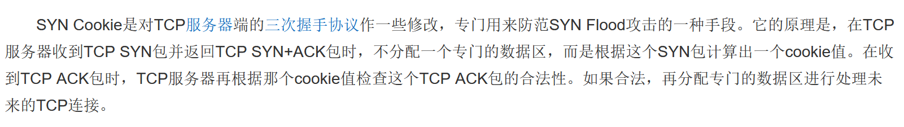

      - 使用tls加密tcp流量

        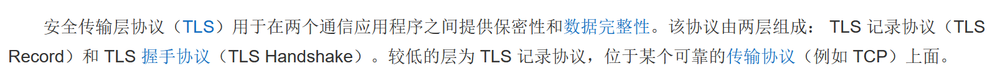

    - IP安全性

      - 在路由时对IP源地址不做任何检查，存在IP欺骗攻击
        - 例如smurf攻击利用了路由器不检查源地址不属于该网段
      - 某些网络应用基于IP地址建立信任关系，容易被攻击者利用IP源地址欺骗造成威胁
      - 攻击者可以填入伪造的IP隐藏自己真实的IP地址

    - IP改进

      - 抛弃基于IP地址的信任策略
      - 进行包过滤，丢弃源地址不是本网段的数据包
      - 采用ipsec(书P315)等安全协议，对IP数据包进行高强度的数据处理

### PPT 问题

1. ==不在一个子网中的tcp劫持(欺骗手法)==

   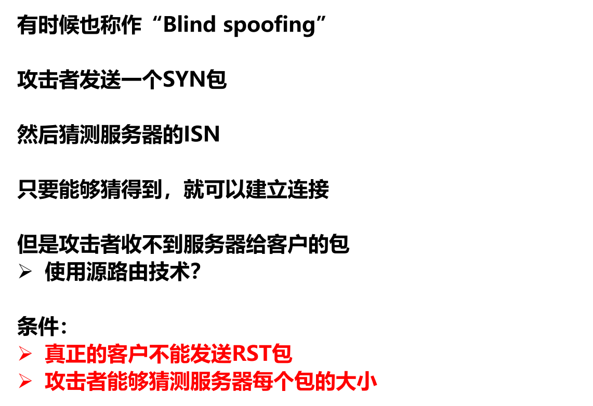

   - 猜测服务器ISN和每个包的大小

   - 采用源路由欺骗

     - 解释一

     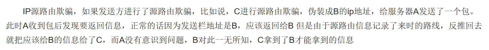

     - 解释二

     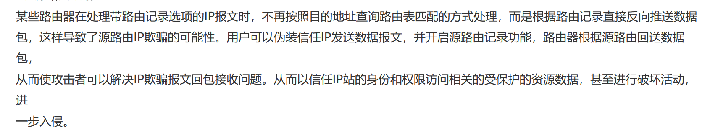

   

## 第八章 利用处理程序错误攻击

暂略

## 第九章 访问控制技术

### 课后习题

1. ==访问控制包含哪些内容？举例==

   > 书P207

   * 用户身份的识别和认证
   * 对访问的控制
   * 审计跟踪

2. ==身份认证包含哪些信息？这些认证信息主要用于什么方面？==

   > 书P208

   * 用户所知道的——密码认证过程PAP
   * 用户所拥有的——智能卡认证
   * 用户本身的特征——生物信息识别
   * 特定地点或时间——bellcore
   * 通过信任的第三方——kerberos

3. ==简述口令认证技术的认证方法。用哪些方法可以提高口令认证技术的安全性？==

   > 书P209-212

   - 认证方法
     - 通行字、通行短语、询问法
   - 提高安全性方法(书P210)
     - 采用随时间变化的通行字
     - 将通行字划分成两部分，每部分仅包含半个通行字，分两次发给用户，减少暴露危险
     - 附上业务流水号和时间戳防止重放攻击
     - 加密存放通行字
     - 以可以拼读的字节为基础构造通行字
     - 采用通行短语
     - 在通行字后填充随机数
     - 采用询问法

4. ==网络的物理隔离技术包含哪几方面？他们各自采用了什么技术？==

   > 书P212-214

   * 物理隔离
     * 客户端的物理隔离——隔离卡（硬盘物理隔离为两个区）
     * 集线器级的物理隔离——物理隔离集线器
     * 服务器端的物理隔离
   * 网络安全隔离卡
   * 物理隔离网闸

5. ==什么叫自主访问控制？方法有哪些？有哪几种类型？==

   - 定义(书P218)
   - 方法(书P219)
   - 类型(书P220)

6. ==为什么自主访问控制无法抵御特洛伊木马攻击？请举例说明？==

   > 书P221

7. ==什么是强制访问控制方式？如何防止特洛伊木马的非法访问？==

   - 定义(书P221)
   - 如何防止
     - 木马攻击条件(书P222)
     - 如何防止(书P222)

8. ==简述BLP模型的安全策略，并举例说明==

   > 书P222

   - 规则(书P224)
     - 简单安全规则
     - 星规则

9. ==简述Biba模型的安全策略，并距离说明==

   > 书P224

   - 规则(书P224)
     - 简单完整规则
     - 完整性制约规则

10. ==什么是基于角色的访问控制技术？它与传统的访问控制技术有什么不同？==

    > 书P226顶部

    * 是一种策略无关的访问控制技术

    * 具有自管理能力

    * 使安全管理更贴近应用领域的机构或组织情况

11. ==简述4中RBAC模型技术。他们各自有什么特点？==

    > 书P226-P228

### PPT 问题

1. ==如何确保身份认证数据的真实性？==

   - 如何理解真实性

     > **消息来自于发送方，且中途没有被篡改**(例如本来A支付B 10元钱中途被C改成A支付B 100元破坏了真实性)

   - 方式

     - 消息认证码

       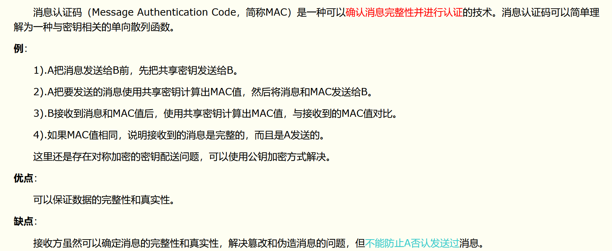

     - 数字签名

       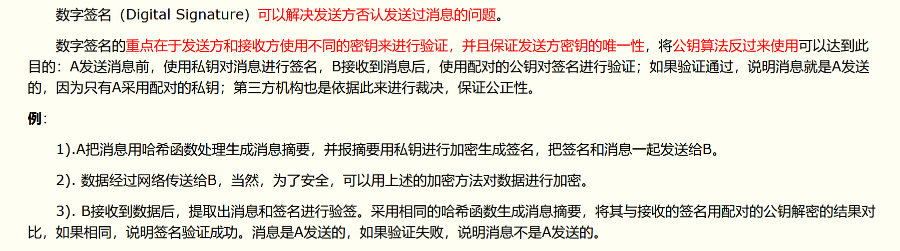

2. ==如何结合MAC和DAC？==

   > 书P222

3. ==BLA不足==

   > 书P224

4. ==网络安全隔离卡如何交换数据？==

   > 书P215

5. ==网卡、隔离卡的区别==

   > 书P215

## 第十章 防火墙技术

### 课后习题

1. ==经典安全模型中的参考监视器的基本功能是？==

   > 书P231

   * 参考功能
   * 控制对授权数据库改变的授权功能

2. ==防火墙规则的处理过程中，“REJECT”和“DROP“的区别是什么？==

   > 书P231底部

3. ==防火墙产品的两条基本原则是？==

   > 书P232

   - 默认允许和默认拒绝

4. =="IP源地址 = 192.168.1.1 and IP目的地址 = 192.168.2.1 and 协议 = TCP and 源端口 > 1024 and 目的端口 = 80 and" 表示什么样的数据包？==

   - 访问WWW服务的数据包

5. ==数据包过滤规则向内向外之分？==

   > 书P256

6. ==访问某些经典网站的响应速度加快，而其它站点响应速度较慢？==

   > 书P236

   - cache机制

7. ==如果防火墙**允许周边网络上的主机访问内部网络上的任何基于TCP协议的服务**，而**禁止外部网络访问周边网络上的任何基于TCP协议的服务**，给出实现的具体思路==

   > 参考书P242和P262

   - 采用被屏蔽子网体系结构
   - 路由器配置如下

| 序号 | 路由器 | 接口 | 方向 | 源地址          | 目的地址        | 协议 | 源端口 | 目的端口 | 动作   |
| ---- | ------ | ---- | ---- | --------------- | --------------- | ---- | ------ | -------- | ------ |
| 1    | 外部   | 外网 | 向内 | 0.0.0.0/0.0.0.0 | 周边网段        | TCP  | ANY    | ANY      | REJECT |
| 2    | 外部   | 内网 | 向内 | 周边网段        | 0.0.0.0/0.0.0.0 | TCP  | ANY    | ANY      | REJECT |
| 3    | 内部   | 外网 | 向内 | 周边网段        | 内部网段        | TCP  | ANY    | ANY      | ACCEPT |
| 4    | 内部   | 外网 | 向内 | 内部网段        | 周边网段        | TCP  | ANY    | ANY      | ACCEPT |

### PPT 问题

1. ==防火墙的体系结构==

   > 书P239-250

2. ==构建防火墙步骤==

   > 书P250-262

## 第十一章 入侵检测技术

### 课后习题

1. ==入侵检测系统的入侵内容主要是什么？==

   > 书P288

   - 外部攻击检测
   - 内部特权滥用检测

2. ==入侵检测系统按引擎类别分，可以划分为几种类型？这些引擎的实现方式是什么？==

   > 书P290

   - 异常检测
   - 模式匹配(误用检测)

3. ==商业IDS系统主要采用的技术有哪些？这些技术的特点是什么？==

   > 书P292

## 第十二章 VPN技术

1. ==VPN的定义==

   > 书P305

2. ==VPN的组成==

   > 书P306

3. ==VPN的类型==

   > 书P307

4. ==VPN使用了哪些安全协议，处于OSI的哪些层？==

   > 书P310表格

   - SOCKSv5/SSL——会话/传输层
   - IPsec——网络层
   - PPTP/L2F/LT2P——数据链路层

5. ==什么是隧道？==

   > 书P310

6. ==隧道协议有哪些？==

   > 书P311-318

7. ==隧道协议的功能==

   - 隧道的功能(同定义，书P310)
   - 协议的功能(结合书P318表格回答)

8. ==比较PPTP和L2TP==

   > 书P315 + P318

9. ==简述IPSec中AH协议功能==

   > 书P317

   - 保证信息源的可靠性和数据的完整性

10. ==简述IPSec中ESP协议的功能==

    > 书P318

    - 保证数据的完整性和可靠性

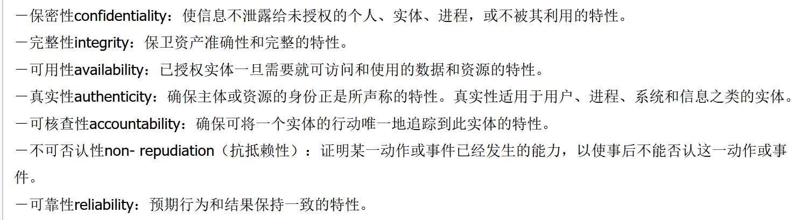
