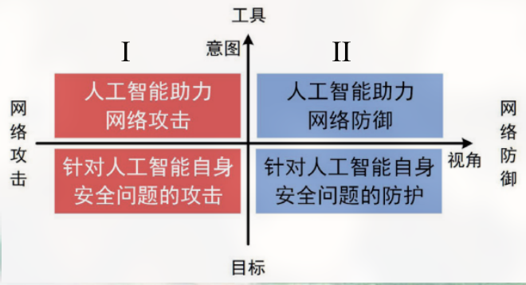
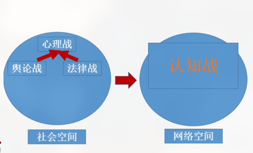
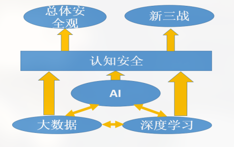

# 大数据与 AI 😿

<!-- vim-markdown-toc GFM -->

* [大数据与AI 😭](#大数据与ai-)
    * [大数据 😭](#大数据-)
    * [人工智能 😭](#人工智能-)
    * [大数据与人工智能 😭](#大数据与人工智能-)
* [大数据、AI 和网络安全 😭](#大数据ai-和网络安全-)
    * [人工智能助力网络攻击 😭](#人工智能助力网络攻击-)
    * [人工智能助力网络防御 😭](#人工智能助力网络防御-)
* [大数据、AI和国家总体安全观 😭](#大数据ai和国家总体安全观-)
    * [认知对抗概念 😭](#认知对抗概念-)
    * [认知对抗定位 😭](#认知对抗定位-)
    * [认知对抗技术 😭](#认知对抗技术-)
    * [总结 😭](#总结-)

<!-- vim-markdown-toc -->

## 大数据与AI 😭

### 大数据 😭

-   数据：可以储存和获取的信息，人类的一切语言文字、图形图画、音像记录都是数据。
-   大数据：具有 4V 特征的数据集（Volume（体量）、Velocity（速度、速率）、Variety（多样性）、Value（价值密度））

大量新数据出现导致了飞结构化的、半结构化数据的爆发式增长。

-   大数据典型类别：
    > -   人类在线交互行为
    > -   数字化信息
    > -   设备运行监测数据

大数据面临的问题

### 人工智能 😭

-   图灵测试：图灵测试是测试人在与被测试者(一个人和一台机器)隔开的情况下，通过一些装置（如键盘）向被测试者随意提问。问过一些问题后，如果被测试者超过 30%的答复不能使测试人确认出哪个是人、哪个是机器的回答，那么这台机器就通过了测试，并被认为具有人类智能。

-   中文房间：根据塞尔的设计，假设存在一个房间，房间内有一个完全不懂中文的人，而他与外界的唯一连接通道是房间的一个窗口，允许其通过递纸条的方式与外界沟通。同时房间内还有一套中文汉字卡片和一本中文规则书，告诉房内的人如何使用和组合汉字卡片。此时屋外的人开始向屋内人传递纸条，上面是用中文写的问题。由于屋内人有一本完美的规则书，他可以在保持丝毫不懂任何中文的状态下按照规则书的指导正确选择并组合汉字卡片，并流畅地回答该问题。由此，屋外的人有足够的理由相信屋内所住的是一个通晓中文的人。

-   人工智能 70-80 年代跌入低谷的原因：人工智能专家低估思想和语言的复杂性，当时计算机的计算能力和存储容量不足以将理论和设想付诸现实

-   1997 年深蓝击败国际象棋冠军。
-   2011 年 IBM 的沃森超级计算机在问答节目中击败人类。

现状：

> -   老龄对话机器人
> -   儿童对话机器人
> -   情感机器人
> -   作画
> -   写诗

-   人工智能未来

> -   类人智能
> -   仿真大脑
> -   心灵模型
> -   知识推理
> -   情感模拟
> -   意识力
> -   创造力

### 大数据与人工智能 😭

-   大数据为人工智能提供了数据基础
-   人工智能为大数据提供了分析模型
-   算力为人工智能提供了计算基础
-   大数据证实和加强了经验主义人工智能的路线，理性主义应融入经验主义的框架

大数据与人工智能安全

-   威胁物理环境安全：攻击用于生产的智能系统（农、工、核）
-   威胁人身财产安全：自动驾驶、无人车、医疗机器人、智慧金融
-   威胁国家社会安全：AI 换脸伪造政治领袖

大数据与人工智能自身安全

-   数据安全性：指人工智能算法所依赖的数据的安全性
-   模型安全性：指人工智能算法或者模型自身的安全性
-   环境安全性：指人工智能算法或模型在训练、实现、运行时所依赖的外部环境的安全性。

人工智能数据安全

-   人工智能本身面临的数据安全
-   人工智能应用导致的数据安全
-   人工智能应用加剧的数据治理

人工智能本身面临的数据安全

-   训练阶段数据污染
-   运行阶段数据异常
-   模型窃取攻击还原训练数据
-   开源框架导致数据泄漏

人工智能应用导致的数据安全

-   个人数据过度采集
-   放大数据偏见，导致社会歧视
-   数据资源滥用，加大治理风险
-   数据智能窃取风险

人工智能应用加剧的数据治理

-   数据权属：个人和行业
-   数据违规跨境风险

人工智能模型安全

-   对抗样本
-   后门攻击
-   深度伪造
-   可解释性

## 大数据、AI 和网络安全 😭

### 人工智能助力网络攻击 😭

1. 恶意代码免杀

2. 基于生成对抗网络框架 IDSGAN 生成恶意流量

3. 智能口令猜解

4. 新型文本验证码求解器

5. 自动化高级鱼叉式钓鱼

6. 网络钓鱼电子邮件生成

7. DeepLocker 新型恶意软件

8. DeepExploit 全自动渗透测试工具

9. 基于深度学习的 DeepDGA 算法

10. 基于人工智能的漏洞扫描工具

### 人工智能助力网络防御 😭

1. 恶意软件检测

2. 未知加密恶意流量检测

3. 恶意网络流量检测

4. 基于人工智能检测恶意域名的方法

5. 运用机器学习检测恶意 URL

6. 新型网络钓鱼电子邮件检测

7. 基于人工智能的网络安全平台 AI2

8. 基于机器学习的通用漏洞检测方法

9. 基于深度学习的威胁情报知识图谱构建技术

10. 基于混合词向量新的学习模型的 DGA 域名检测方法

## 大数据、AI和国家总体安全观 😭

### 认知对抗概念 😭

+ 网络空间的情感对抗
>+ 情感博弈：针对特定人群对于特定对象的特定观点
>+ 对象：国家、领导人、战略决策
>+ 人群：意见领袖、Z-时代、普通网民

挑战：

1. 舆论抹黑
2. 威胁利诱
3. 法律制裁
4. 心理震慑
5. 谣言散播

### 认知对抗定位 😭

+ 博弈空间
+ 网络安全
+ 网络空间治理
+ 总体安全观

### 认知对抗技术 😭

+ 话题分析
+ 属性分析
+ 观点分析
+ 意见分析
+ 诱因分析
+ 情绪分析
+ 知识图谱
+ 深层表示
+ 用户画像
+ 情报生成
+ 情感对话

### 总结 😭

+ 大数据和AI在安全方面的应用包括：信息安全、内容安全和认知安全
+ 大数据和AI在安全方面的应用：前景广阔但面临众多挑战（数据、模型、鲁棒性、可解释性等）kkk
+ 大数据和AI在安全方面的应用反过来促进AI在认知领域的进展

