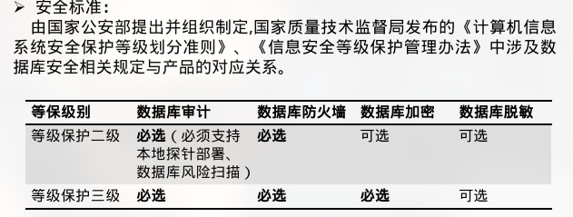
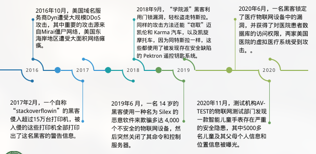

# 系统安全 😢

<!-- vim-markdown-toc GFM -->

* [系统安全 😠](#系统安全-)
* [物理安全 :cry:](#物理安全-cry)
* [硬件与芯片安全 🙋](#硬件与芯片安全-)
* [可信计算 😭](#可信计算-)
* [操作系统安全 😭](#操作系统安全-)
* [软件安全 👿](#软件安全-)
* [数据库安全 😿](#数据库安全-)
* [大数据安全 🙉](#大数据安全-)
* [云计算安全 🌧️](#云计算安全-)
* [系统安全热点 😒](#系统安全热点-)
    * [物联网](#物联网)
    * [车联网](#车联网)

<!-- vim-markdown-toc -->

## 系统安全 😠

1. 系统安全基本要求

-   系统安全：确保以电磁信号为主要形式的、在计算机网络化系统进行自动通信、处理和利用的信息内容，在各个物理位置、逻辑区域、存贮和传输介质中，处于动态和静态过程中的机密性、完整性、可用性、可审查性和抗抵赖性的，与人、网络、环境有关的技术安全、结构安全和管理安全的总和。
-   基本要求：

    > -   可用性：保证授权用户对系统信息的可访问和使用。
    > -   完整性：保护信息不被未经授权的实体更改和破坏。
    > -   机密性：保护信息不受未经授权的访问和泄漏。

安全＝ Security + Safety.

-   Security 是指阻止人为恶意地对安全的危害。
-   Safety 是指阻止非人为对安全的危害。

2. 系统安全的定义

-   物理安全：计算机与网络的设备硬件自身的安全，就是信息系统硬件的稳定性运行状态。
-   运行安全：运行过程中的系统安全，就是信息系统软件的稳定性运行状态。
-   信息安全（数据安全）：信息自身的安全问题，包括对信息系统中所加工、存储和网络中所传递数据的泄露、仿冒、篡改以及抵赖过程所涉及的安全问题。

案例：

-   CPU 底层芯片设计漏洞
-   乱序执行和推测执行会引起 CPU 缓存的污染，从而攻击者可以发起基于 cache 的测信道攻击偷取数据。
-   攻击范围广，近 20 年的 Intel、AMD、ARM 等处理器都有影响，其中对 Intel 处理器的影响尤为严重

3. 系统安全措施

-   法律措施
    > -   信息安全的各种法律法规
-   教育措施
    > -   对人的思想道德、安全意识教育、安全法规教育
-   管理措施
    > -   三分技术，七分管理
    > -   对设备、机房的管理、对人的管理（对人的管理最重要）

注：不能低估教育、法律、管理的作用

-   技术措施
    > -   硬件系统安全、操作系统安全、密码技术、网络通信安全、数据库安全、病毒防治技术，防电磁辐射技术，信息隐藏技术，电子对抗技术，容错技术

注：硬件系统和操作系统安全是基础，密码、网络安全是关键技术。

## 物理安全 :cry:

1. 物理安全主要包括：

-   环境安全：系统所在环境的安全
-   设备安全：防盗、防毁、防电磁辐射泄露、防止线路截获、抗电磁干扰、电源保护
-   介质安全：包括介质数据的安全以及介质本身的安全

实例：

硬盘忽然掉电不会损伤硬盘

> 一般操作情况下，盘片在主轴的带动下，以每分钟数千转的速度飞速旋转。传动轴在程序指令下，带着磁头来到指定位置开始读取/写入数据。正常断电的时候，硬盘控制芯片会收到 SATA 控制器传来的 STANDBY IMMEDIATE 命令。这时控制器会把磁头归位到磁头停泊区（Parking Zone），停在该区域避免了和磁盘接触。在意外断电的时候，磁盘控制器会利用空气动力和一些电容的余电，将磁头移到着陆区里面降落，从而保证不会划伤盘片。着陆区也是硬盘没事干时，磁头的休息区。

SSD 放着不动，数据就有可能丢失。

通信线路安全技术：可以获得通信线路上的物理安全。通信电缆密封在塑料套管中，并在线缆的两端充气加压。线上连接了带有报警器的监示器，用来测量压力。如果压力下降，则意味电缆可能被破坏了，技术人员还可以进一步检测出破坏点的位置，以便及时进行修复。

2. 容错与可靠性

-   失效：是指硬件物理特性异变，或者软件不能完成规定功能的能力
-   故障：是指硬件或软件的错误状态，是失效在逻辑上的等效。
-   错误：是程序或者数据结构中的故障表现形式，是故障和失效所造成的后果。

容错设计的软件可以有某些规定数目的故障但不导致失效， 但对无容错的软件而言，故障即失效。

-   可靠性：
    > 广义：一切旨在避免、减少、处理、度量软件/硬件故障（错误、缺陷、失效）的分析、设计、测试等方法、技术和实践活动。
    > 狭义：指软件/硬件无效运行的定量度量。
-   可靠度：在规定的运行环境中和规定的时间内软件无失效运行的机会
-   容错：容忍故障，考虑故障一旦发生时能够自动检测出来并使系统能够自动恢复正常运行。
-   容错主要依靠冗余设计来实现，增加资源换取可靠性。
-   冗余技术：硬件冗余、软件冗余、信息冗余、时间冗余

-   硬件容错实现方法
    > 硬件备份、数据备份、双机容错系统、双机热备份、三机表决系统、集群系统
-   软件冗余的实现
    > 恢复块方法、N 版本程序设计、防卫式程序设计

## 硬件与芯片安全 🙋

1. ARM

关于安全性方面，Armv9 引入 Realms 机密计算模块，将敏感应用和操作系统隔离在 Realm 中；Realm 比机密虚拟机更加通用，既支持机密虚拟机形态，也支持机密操作系统形态。

2. x86

SGX：Intel SGX 是 Intel 在原有架构上增加了一组新的指令集和内存访问机制，它允许应用程序实现一个被称为 enclave 的容器, 在应用程序的地址空间中划分出一块被保护的区域, 为容器内的代码和数据提供机密性和完整性的保护, 免受拥有特殊权限的恶意软件的破坏。

3. 实例

-   硬件木马：硬件术马是指在 IC 设计或制造过程中被蓄意植入或更改的特殊电路模块、或者是设计者无意留下的设计缺陷。当其以某种方式被激活后,可能改变 IC 的功能或规格,泄漏敏感信息,造成 IC 的性能下降、失去控制,甚至是不可逆的破坏。

     

-   CPU 漏洞：
    > -   2018 年 1 月，Google Project Zero 团队对外公布了熔断(Meltdown)漏洞,该漏洞影响了所有采用了乱序执行技术的 intel 处理器，除了 Itanium 系列及 2013 以前的 Atom 外几乎 1995 年以来所有 Intel 处理器均受影响，部分 ARM 处理器也不例外。利用此漏洞，普通用户可以读取计算机中所有的内存信息，会导致口令及敏感信息的泄露，同时对虚拟化技术下的云平台各租户的敏感信息也造成威胁。
    > -   Meltdown 漏洞出现的同时，Google Project Zero 团队公布了幽灵(Spectre)漏洞，此漏洞几乎影响了所有的现代处理器，涉及的厂商包括 Intel. AMD 以及 ARM。利用此漏洞，普通用户可以读取计算机中所有的内存信息，会导致口令以及敏感信息的泄露，同时威胁到虚拟化下云平台各租户的敏感信息的安全性。Spectre 漏洞和 Meltdown 漏洞同样是基于侧信道的信息泄露型漏洞，区别在于 Spectre 漏洞在于现代处理器中采用的用于提升处理器效能的分支预测机制存在缺陷所致。

## 可信计算 😭

-   可信 ≈ 可靠+安全

-   可信计算机系统是能够提供可信计算服务的计算机软硬件实体，它能够提供系统的可靠性、可用性、主体行为与信息的安全性。

-   可信测度技术
    > -   可信的测量
    > -   度量的储存
    > -   度量的报告

## 操作系统安全 😭

-   安全操作系统(Secure Operating System)是指对所管理的数据与资源提供适当的保护级，有效地控制硬件与软件功能的操作系统。安全操作系统在开发完成后，在正式投入使用之前,一般都要求通过相应的安全性评测。
-   操作系统安全(Operating System Security) 是指操作系统无错误配置、无漏洞、无后门、无特洛伊木马等，能防止非法用户对计算机资源的非法存取，一般用来表达对操作系统的安全需求。

-   安全威胁是指这样一种可能性,即对于一定的输入，经过系统处理，产生了危害系统安全的输出。威胁大多是通过利用操作系统和应用服务程序的弱点或缺陷实现的。
    > 不合理的授权机制, 不恰当的代码执行, 不恰当的主体控制, 服务的不当配置, 网络协议的安全漏洞, 不安全的进程间通信(IPC)

实例：方德方舟操作系统

-   Windows10 的主要安全机制:

    > -   安全登陆
    > -   权限保护
    > -   bootlocker 加密
    > -   组策略
    > -   防火墙
    > -   UEFI 安全启动机制(Secure Boot)
    > -   Windows Defender 机制

-   Linux 的主要安全机制:
    > -   PAM(Pluggable Authentication Modules)认证机制
    > -   文件系统加密
    > -   入侵检测机制
    > -   安全日志文件机制
    > -   访问控制
    > -   防火墙机制

*   Android 系统主要的安全机制：
    > -   Android 进程沙箱隔离机制
    > -   应用程序签名机制
    > -   权限声明机制
    > -   访问控制机制
    > -   高效进程间通信机制 Binder
    > -   内存管理机制

## 软件安全 👿

计算机病毒、恶意软件、软件漏洞、软件后门。

软件漏洞分析: 漏洞挖掘、漏洞分析、漏洞利用

-   漏洞挖掘
    > -   传统：静态、动态
    > -   基于学习的智能漏洞挖掘技术

## 数据库安全 😿

-   物理数据库的完整性
-   逻辑数据库的完整性
-   元素安全性
-   可审计性
-   访问控制
-   身份认证
-   可用性
-   推理控制
-   多级保护
-   推理消除隐通道

数据库安全实例

-   数据库漏洞：

2019 年，某实验室在数据库漏洞挖掘方面又有重要新发现。这一次发现了新类型的国际数据库漏洞——Oracle Database Server 高危漏洞，目前已经得到 Oracle 确认，并分配 CVE 编号（CVE-2019-2444）。

CVE-2019-2444 是一个使用符号链接攻击手段，达到本地提权效果的漏洞，攻击者可由 oracle 用户权限提升至 root 用户权限该漏洞属于提权漏洞，一旦利用了漏洞，能够使得非权限用户获得权限提升，从而通过一台机器看到数据库里的所有数据，包含实例。

-   数据库安全解决方案：
    > -   数据库审计
    > -   数据库防火墙(sql 注入、后门)
    > -   数据库加密
    > -   数据库动态、静态脱敏

数据库技术发展

-   数据库密文检索
-   同态加密

## 大数据安全 🙉

-   安全问题:

    > -   受到攻击风险高
    > -   隐私信息泄露风险
    > -   数据传输过程的安全隐患
    > -   大数据储存管理隐患

-   数据安全治理

《中华人民共和国数据安全法》第四条 维护数据安全，应当坚持总体国家安全观，建立健全数据安全治理体系，提高数据安全保障能力。

-   大数据安全解决方案
    > -   大数据脱敏系统
    > -   大数据安全审计

## 云计算安全 🌧️

定义：云计算是一种可以方便地通过网络对共享的可配置计算资源池进行按需访问的模型，池中资源只需要很少的管理付出或服务提供者帮助就能快速供应和释放。

安全问题：

-   产品漏洞（GMAIL）
-   隐私权限泄露（Coogle docs）
-   黑客攻击（Amazon）
-   服务中断（Google cloud）

安全解决实例：

-   VMVare 安全虚拟机流量清洗方案

## 系统安全热点 😒

### 物联网

>+ 物联网安全定义 物联网安全指物联网硬件、软件及其系统中的数据收到保护，不受偶然的或者恶意的原因而遭到破坏、更改、泄露，物联网系统可连续可靠正常地运行。
>+ 根据其层次架构分为：感知层安全、网络层安全、应用层安全。
>+ 作为基于互联网的新兴信息技术模式，物联网安全上升至国家安全。
>+ 安全威胁：感知层（物理攻击、伪造、假冒信号攻击...）、网络层（Dos、网络协议漏洞...）、应用层安全威胁（病毒、木马、广告软件、间谍软件）

+ 物联网安全实例

+ 物联网安全防护
>+ 感知层：操作系统安全、统一安全管理、物理安全、插入安全、硬件安全
>+ 网络层：通用网络防护、网络入侵防护、网络安全审计防护、加密传输、安全路由协议
>+ 应用层：身份访问控制、外部攻击防护、隐私保护

+ 研究方向：去中心化(区块链)、边缘计算

### 车联网

